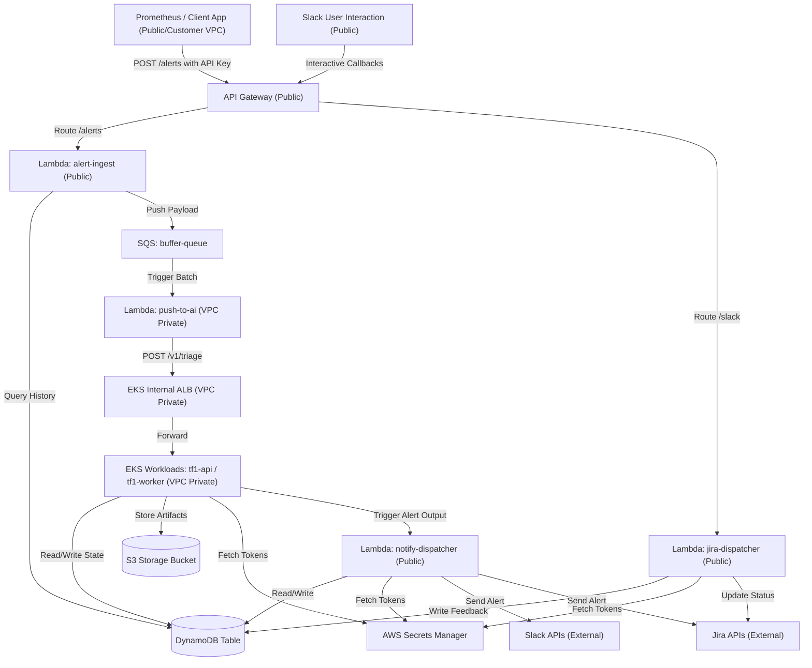

# Triage Hub Infrastructure Architecture & Connections

Tài liệu này mô tả chi tiết luồng kết nối, môi trường mạng (VPC/Internet), và các quyền IAM giữa các thành phần hạ tầng trong hệ thống Triage Hub.

---

## 1. Sơ đồ luồng dữ liệu (Data Flow)

---

## 2. Chi tiết cấu hình kết nối mạng & phân quyền (IAM)

### 2.1. API Gateway Endpoint & Ingestion
* **API Gateway (`/alerts`)**
  * **Network**: Public Endpoint.
  * **Auth**: Yêu cầu Header `x-api-key`.
  * **Target**: Tích hợp trực tiếp với Lambda `alert-ingest`.
* **Lambda `alert-ingest`**
  * **Network**: Chạy ngoài VPC (**Public**) để giảm cold-start và gọi AWS SQS qua endpoint public.
  * **IAM Permissions**:
    * `sqs:SendMessage` tới SQS `buffer-queue`.
    * `dynamodb:Query`, `dynamodb:GetItem` tới DynamoDB Table.
  * **Environment**:
    * `SQS_QUEUE_URL`
    * `DYNAMODB_TABLE`

### 2.2. SQS Queue & Processing
* **SQS `buffer-queue`**
  * Đóng vai trò làm đệm chứa alert thô.
  * Trigger Lambda `push-to-ai` theo lô (Batch size = 10).
* **Lambda `push-to-ai`**
  * **Network**: Nằm **trong VPC (Private Subnets)**. Gắn Security Group `lambda_sg` để có thể phân giải tên miền nội bộ và gọi trực tiếp tới Internal ALB của EKS.
  * **IAM Permissions**:
    * `sqs:ReceiveMessage`, `sqs:DeleteMessage`, `sqs:GetQueueAttributes` cho `buffer-queue`.
  * **Environment**:
    * `SQS_QUEUE_URL`
    * `AI_ENGINE_URL` (Trỏ đến DNS của EKS Internal ALB).

### 2.3. EKS Workloads (Internal API & Worker)
* **EKS Pods (`tf1-api` / `tf1-worker`)**
  * **Network**: Hoàn toàn riêng tư trong VPC Private Subnet, nhận traffic từ Internal ALB.
  * **VPC Endpoints**: Truy cập trực tiếp các AWS services qua Gateway/Interface Endpoint trong VPC:
    * **S3 Gateway Endpoint**
    * **DynamoDB Gateway Endpoint**
    * **Secrets Manager Interface Endpoint** (Mở port `443` nội bộ cho VPC CIDR).
  * **IAM IRSA Roles (IAM Roles for Service Accounts)**:
    * **Role `tf1-api-sa`**:
      * `dynamodb:GetItem`, `dynamodb:PutItem`, `dynamodb:UpdateItem`, `dynamodb:Query` (DynamoDB Table).
      * `secretsmanager:GetSecretValue` (Secrets: `jira_api_token`, `slack_bot_token`).
    * **Role `tf1-worker-sa`**:
      * `s3:PutObject`, `s3:GetObject`, `s3:ListBucket` (S3 Artifact Bucket).
      * `dynamodb:GetItem`, `dynamodb:PutItem`, `dynamodb:UpdateItem`, `dynamodb:Query` (DynamoDB Table).
      * `secretsmanager:GetSecretValue` (Secrets: `jira_api_token`, `slack_bot_token`).
      * `lambda:InvokeFunction` tới Lambda `notify-dispatcher`.

### 2.4. Slack / Jira Outbound & Feedback
* **Lambda `notify-dispatcher`**
  * **Network**: Chạy ngoài VPC (**Public**) để gọi trực tiếp tới Slack API và Jira API ngoài Internet (tiết kiệm chi phí NAT Gateway).
  * **IAM Permissions**:
    * `dynamodb:PutItem`, `dynamodb:GetItem`, `dynamodb:UpdateItem`.
    * `secretsmanager:GetSecretValue` cho `jira_api_token` và `slack_bot_token`.
* **API Gateway (`/slack`)**
  * **Network**: Public Endpoint. Không yêu cầu API Key (cho Slack Callback).
  * **Target**: Tích hợp trực tiếp tới Lambda `jira-dispatcher`.
* **Lambda `jira-dispatcher`**
  * **Network**: Chạy ngoài VPC (**Public**) để xử lý tương tác từ Slack gửi về Jira.
  * **IAM Permissions**:
    * `dynamodb:PutItem`, `dynamodb:GetItem`.
    * `secretsmanager:GetSecretValue` cho `jira_api_token`.
