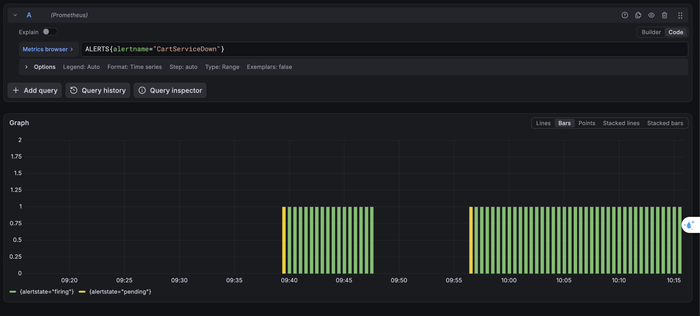
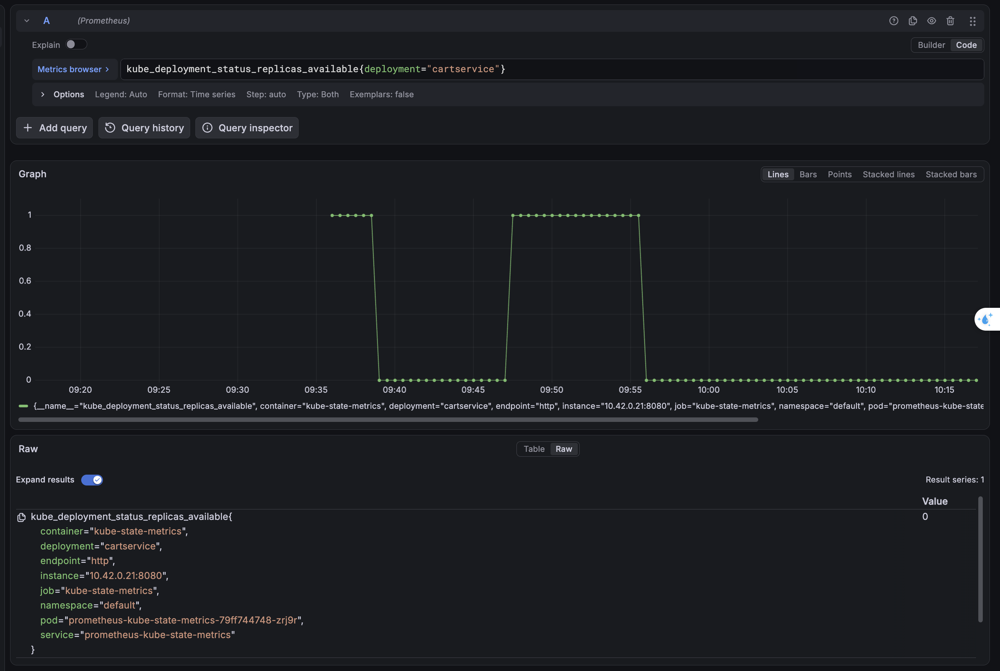
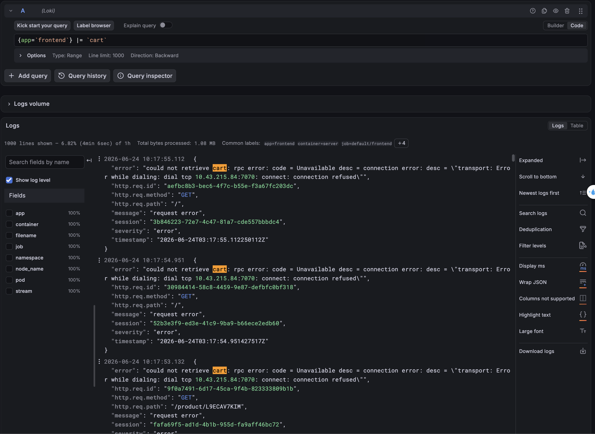
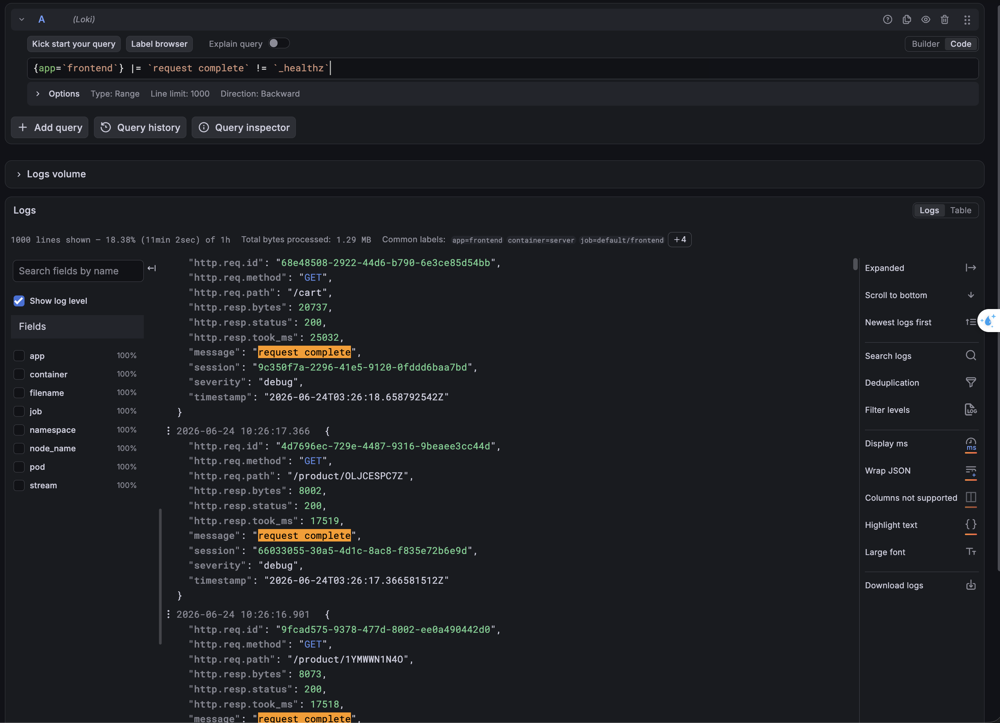
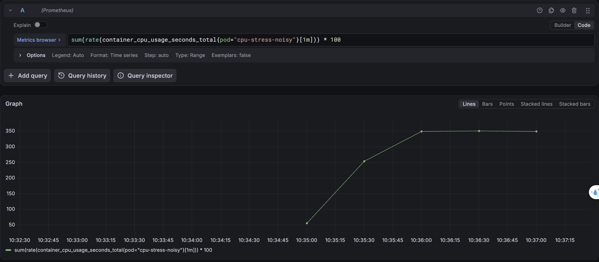
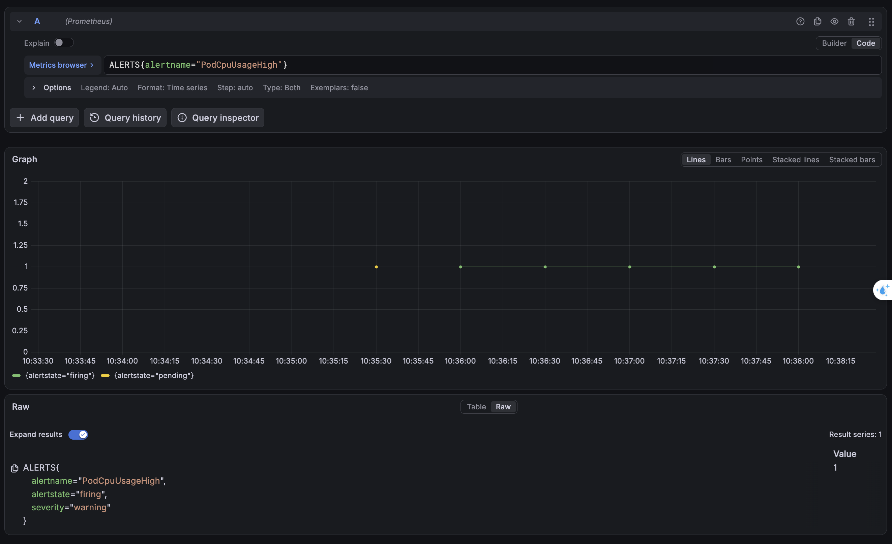

# Kết quả kiểm thử môi trường giả lập (Deployment Test Results)

Tài liệu này ghi lại thông tin cấu hình, câu lệnh truy vấn và hình ảnh/nhật ký lỗi thực tế (logs/metrics) của 3 kịch bản lỗi (Fault Injection Cases) đã thực hiện trên cụm giả lập EC2.

---

## 1. Test sập dịch vụ (Critical Service Down)

Giả lập dịch vụ giỏ hàng (`cartservice`) bị sập hoàn toàn.

### Kiểm tra cảnh báo (Prometheus Metrics)

- **Câu lệnh truy vấn trạng thái cảnh báo**:

  ```promql
  ALERTS{alertname="CartServiceDown"}
  ```

  

- **Dữ liệu thô khi Alert ở trạng thái Firing**:

  ```promql
  ALERTS{alertname="CartServiceDown",alertstate="firing",container="kube-state-metrics",deployment="cartservice",endpoint="http",instance="10.42.0.21:8080",job="kube-state-metrics",namespace="default",pod="prometheus-kube-state-metrics-79ff744748-zrj9r",service="prometheus-kube-state-metrics",severity="critical"}
  ```

- **Câu lệnh truy vấn số lượng Pod hoạt động**:

  ```promql
  kube_deployment_status_replicas_available{deployment="cartservice"}
  ```

  

  _(Giá trị trả về bằng `0`)_

---

### Kiểm tra nhật ký lỗi (Loki Logs)

- **Câu lệnh truy vấn logs trên Loki**:

  ```logql
  {app=`frontend`} |= `cart`
  ```

  

- **Log lỗi thực tế từ Frontend báo mất kết nối gRPC**:
  ```json
  {
    "error": "could not retrieve cart: rpc error: code = Unavailable desc = connection error: desc = \"transport: Error while dialing: dial tcp 10.43.215.84:7070: connect: connection refused\"",
    "http.req.id": "aefbc8b3-bec6-4f7c-b55e-f3a67fc203dc",
    "http.req.method": "GET",
    "http.req.path": "/",
    "message": "request error",
    "session": "3b846223-72e7-4c47-81a7-cde557bbbdc4",
    "severity": "error",
    "timestamp": "2026-06-24T03:17:55.112250112Z"
  }
  ```

---

## 2. Test phản hồi chậm (Latency Degradation)

Giả lập dịch vụ danh mục sản phẩm (`productcatalogservice`) bị chậm 2.5 giây.

### Kiểm tra nhật ký hiệu năng (Loki Logs)

- **Câu lệnh truy vấn logs trên Loki (đã lọc bỏ health check)**:

  ```logql
  {app=`frontend`} |= `request complete` != `_healthz`
  ```

  

- **Logs thực tế ghi nhận độ trễ lan truyền**:
  - **Trang chủ (`/`) trễ ~2.5 giây**:
    ```json
    {
      "http.req.id": "7c3c6208-488f-4333-b8df-4d6669b49033",
      "http.req.method": "GET",
      "http.req.path": "/",
      "http.resp.bytes": 10499,
      "http.resp.status": 200,
      "http.resp.took_ms": 2519,
      "message": "request complete",
      "session": "fafa69f5-ad1d-4b1b-955d-fa9aff46bc72",
      "severity": "debug",
      "timestamp": "2026-06-24T03:26:15.677222828Z"
    }
    ```
  - **Trang chi tiết sản phẩm (`/product/*`) trễ tích lũy ~17.5 giây**:
    ```json
    {
      "http.req.id": "9fcad575-9378-477d-8002-ee0a490442d0",
      "http.req.method": "GET",
      "http.req.path": "/product/1YMWWN1N4O",
      "http.resp.bytes": 8073,
      "http.resp.status": 200,
      "http.resp.took_ms": 17518,
      "message": "request complete",
      "session": "52b3e3f9-ed3e-41c9-9ba9-b66ece2edb60",
      "severity": "debug",
      "timestamp": "2026-06-24T03:26:16.901504033Z"
    }
    ```
  - **Trang giỏ hàng (`/cart`) trễ tích lũy ~25 giây**:
    ```json
    {
      "http.req.id": "68e48508-2922-44d6-b790-6e3ce85d54bb",
      "http.req.method": "GET",
      "http.req.path": "/cart",
      "http.resp.bytes": 20737,
      "http.resp.status": 200,
      "http.resp.took_ms": 25032,
      "message": "request complete",
      "session": "9c350f7a-2296-41e5-9120-0fddd6baa7bd",
      "severity": "debug",
      "timestamp": "2026-06-24T03:26:18.658792542Z"
    }
    ```

---

## 3. Test cảnh báo nhiễu (Noisy Alert - CPU Spike)

Giả lập Pod độc lập chạy stress test tiêu hao tài nguyên CPU nhưng không ảnh hưởng trực tiếp tới các dịch vụ chính.

- **Lệnh kích hoạt stress CPU trên EC2**:

  ```bash
  kubectl run cpu-stress-noisy --image=alpine --restart=Never -- /bin/sh -c "while true; do true; done & while true; do true; done & while true; do true; done & while true; do true; done"
  ```

  
  

- **Kiểm tra trạng thái cảnh báo trên Prometheus**:
  ```promql
  ALERTS{alertname="PodCpuUsageHigh",alertstate="firing",severity="warning"}
  ```
  _(Ứng dụng vẫn chạy nhanh mượt, Loki sạch hoàn toàn log lỗi từ các dịch vụ chính)_
