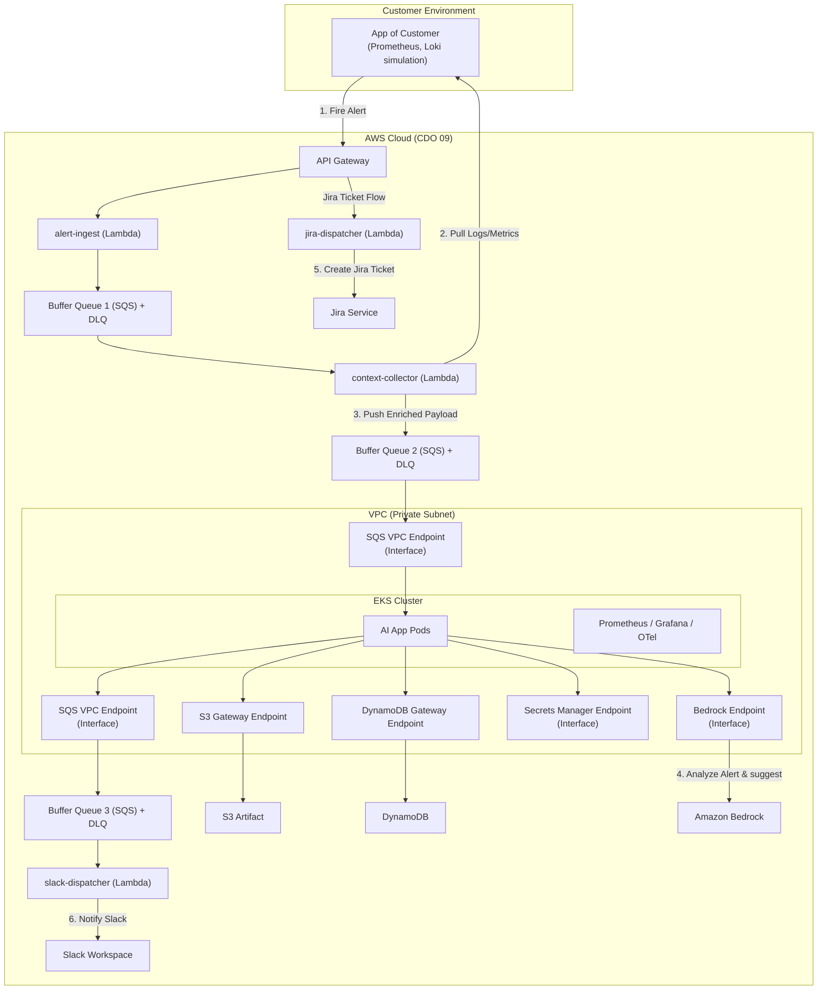
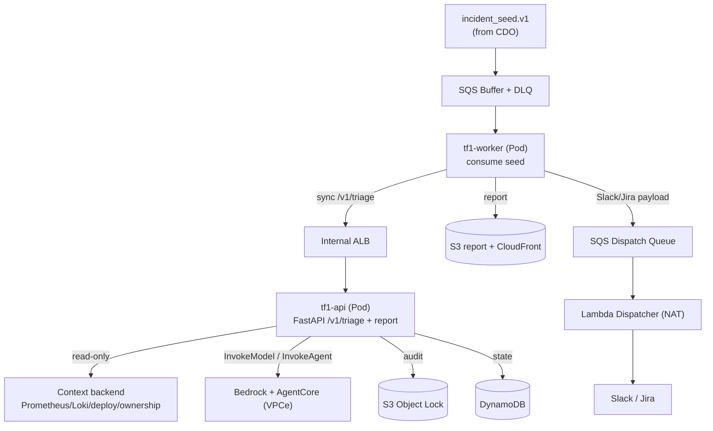
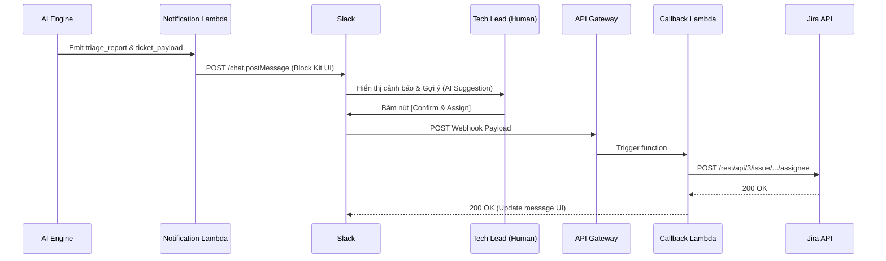
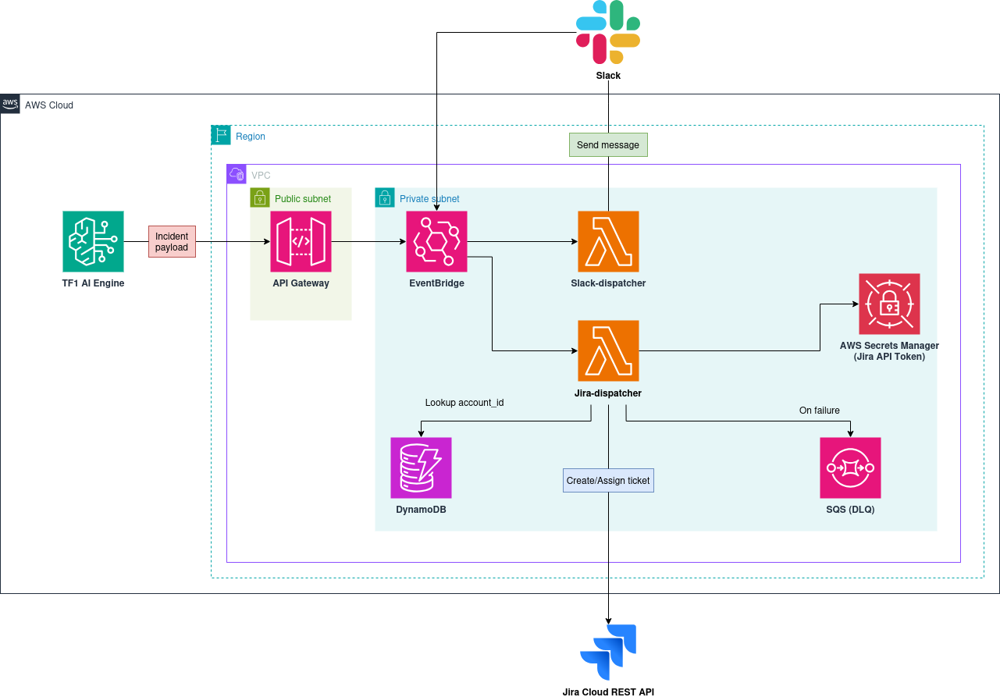
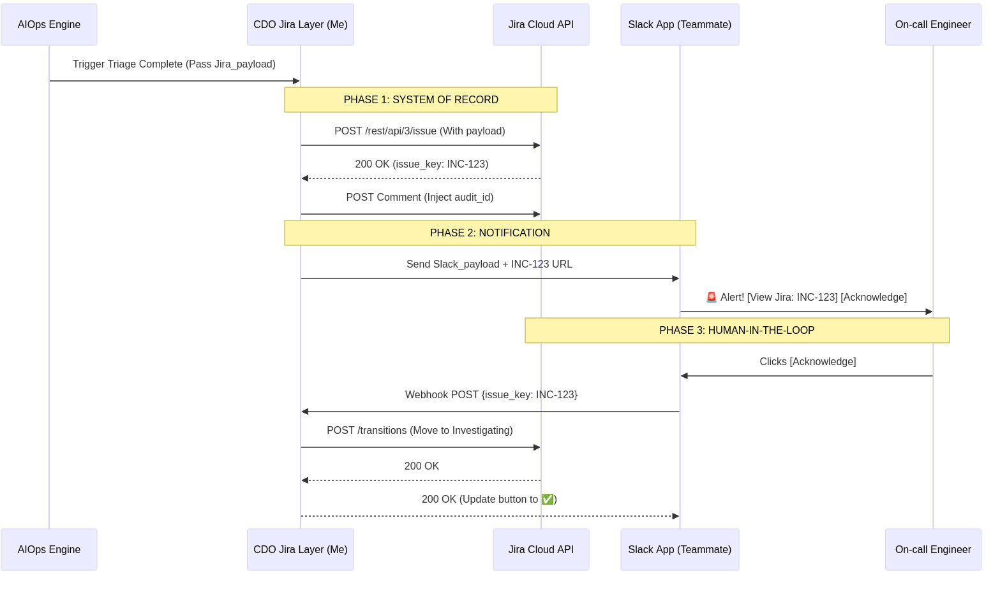

# Infrastructure Design - Task force 1 · CDO 09

<!-- Doc owner: Nhóm CDO 09 (Tiến)
     Status: Draft (W11 T3-T4)
     Word target: 1500-2500 từ -->

## 1. Architecture diagram (Owner: Tiến)



*Caption: Kiến trúc kết hợp linh hoạt (Hybrid) giữa các dịch vụ hướng sự kiện Serverless (API Gateway, SQS, Lambda) cho giai đoạn tiếp nhận nhanh và cụm Amazon EKS khép kín trong VPC Private Subnet cho giai đoạn xử lý AI chuyên sâu.*

---

## 2. Component table (Owner: Tiến)

| Component | AWS Service | Reason | Cost note |
|---|---|---|---|
| **Compute** | AWS Lambda & Amazon EKS | - **Lambda**: Chạy các tác vụ ingest, collector và dispatcher ngắn hạn giúp giảm chi phí idle.<br>- **EKS**: Host các pod AI App xử lý logic LLM orchestration lâu dài, tránh cold start. | **Lambda**: Pay-per-use (~$2/tháng).<br>**EKS**: ~$73/tháng (base cluster cost) + EC2 worker nodes. |
| **API entry** | Amazon API Gateway | Tiếp nhận Webhook cảnh báo đầu vào từ khách hàng với hiệu năng cao, tự động scale. | Pay-per-use (~$3.5 / triệu requests). |
| **Database** | Amazon DynamoDB | Lưu trữ tenant configurations, metadata và audit trail trạng thái của các sự cố với thời gian phản hồi sub-millisecond. | Tận dụng Free Tier, pay-per-use (~$5/tháng). |
| **Storage** | Amazon S3 | Lưu trữ artifacts và tài liệu log/metric thô đã thu thập được để lưu vết phân tích. | S3 Standard tier (~$0.023/GB/tháng). |
| **Event bus** | Amazon SQS | Đóng vai trò các Buffer Queues có DLQ để đảm bảo không bị mất gói tin khi hệ thống bị quá tải đột ngột. | Rất rẻ, ~$0.40 / triệu messages. |
| **AI Processing** | Amazon Bedrock | Gọi mô hình ngôn ngữ lớn (LLM) để phân tích nguyên nhân gốc rễ một cách an toàn, tuân thủ chính sách bảo mật dữ liệu của AWS. | Thanh toán theo Token tiêu thụ thực tế. |
| **Observability** | Prometheus, Grafana, OpenTelemetry | Theo dõi sức khỏe hệ thống và ứng dụng AI trực tiếp bên trong cụm EKS. | Open-source, chỉ tốn chi phí lưu trữ trên EBS/S3. |

---

## 3. Differentiation angle deep-dive (Owner: Tiến)

### 3.1 Why this angle?
Việc chọn phương án **Hybrid** giúp dung hòa hai yếu tố đối lập: **Chi phí tối thiểu khi hệ thống nhàn rỗi (idle cost)** ở luồng tiếp nhận và **Độ tin cậy bảo mật cấp doanh nghiệp (Enterprise Security & Latency Consistency)** ở luồng xử lý AI:
* Ở cổng ngõ nhận alert: Alert chỉ kích hoạt không thường xuyên (~50+ alerts/tuần). Việc duy trì một ALB và ECS Service chạy 24/7 chỉ để đợi nhận alert là vô cùng lãng phí. API GW + Lambda là sự lựa chọn tối ưu.
* Ở lõi AI App: LLM orchestration và query context đòi hỏi thời gian xử lý dài (có thể lên tới hàng chục giây). Nếu chạy Lambda ở đây sẽ tốn chi phí rất lớn và dễ bị timeout, đồng thời gặp tình trạng trễ do khởi động lạnh (cold start). Đặt AI App trên EKS giúp ứng dụng luôn chạy sẵn, an toàn tuyệt đối nhờ Namespaces cách ly hoàn toàn dữ liệu của từng tenant.

### 3.2 Vượt trội ở đâu (số liệu dự kiến)

| Axis | CDO 09 (Hybrid Lambda + EKS) | Competing angle estimate (Pure ECS Fargate) |
|---|---|---|
| Cost / tenant / month | ~$35 | ~$55 |
| P99 latency (API Gateway) | < 80ms | ~150ms |
| Ops overhead (hr/week) | 4 giờ | 2 giờ |
| Time to onboard tenant | < 10 phút | < 15 phút |

### 3.3 Weakness chấp nhận
* **Độ phức tạp trong khâu cấu hình mạng & IAM**: Việc kết nối từ EKS đến S3, DynamoDB, Bedrock, SQS trong mạng nội bộ đòi hỏi phải setup nhiều VPC Endpoints và cấu hình IAM Roles for Service Accounts (IRSA) chi tiết.
* **Chi phí ban đầu cao**: Khởi tạo cụm EKS có phí cứng $73/tháng dù có dùng hay không, nên mô hình này chỉ thực sự tối ưu chi phí khi số lượng Tenant $\ge 10$ và hệ thống đi vào chạy thực tế ổn định.

---

## 4. Multi-tenant approach (Owner: Tiến)

### 4.1 Tenant model
- **Tenant ID format**: UUID v4 (đảm bảo tính độc nhất toàn cầu).
- **Header**: Bắt buộc đính kèm `X-Tenant-Id` trong mọi API call từ API Gateway vào hệ thống.
- **Subscription tiers**: 
  - `Basic`: Giới hạn 100 alerts/ngày, sử dụng shared resource pool.
  - `Enterprise`: Không giới hạn alerts, cấp phát riêng dedicated pod/node group để tránh ảnh hưởng tài nguyên từ tenant khác.

### 4.2 Isolation pattern
- **Data isolation**: **Bridge (Hybrid)**
  - Với **DynamoDB**: Sử dụng chung một bảng (Shared Table) nhưng cách ly logic ở mức bản ghi bằng cách sử dụng `TenantID` làm Partition Key (PK). Cấu hình IAM Policy (Fine-Grained Access Control) để đảm bảo Service Account của tenant nào chỉ đọc/ghi được dữ liệu của tenant đó.
  - Với **S3**: Sử dụng cấu trúc thư mục phân cấp `s3://triage-hub-artifacts/{TenantID}/...` và áp dụng IAM Policy giới hạn prefix.
- **Compute isolation**: **Silo (Namespace level)** trên EKS
  - Mỗi tenant được phân bố một Kubernetes Namespace riêng biệt.
  - Áp dụng **Kubernetes Network Policies** để chặn giao tiếp chéo giữa các Namespace của các tenant.
  - Áp dụng **Resource Quotas** để giới hạn CPU/Memory của từng tenant, ngăn chặn lỗi "Noisy Neighbor".

### 4.3 Tenant onboarding flow
```
1. Client gọi POST /platform/v1/tenants (đính kèm TenantName, Contact, Tier).
2. API Gateway kích hoạt Tenant Onboarding Lambda.
3. Lambda này sẽ tự động:
   - Tạo Namespace mới trên EKS cho Tenant: `triage-hub-tenant-{TenantID}`.
   - Tạo IAM Role & Service Account (IRSA) với quyền truy cập thư mục S3 tương ứng.
   - Deploy AI App skeleton/manifests vào Namespace mới.
   - Khởi tạo cấu hình giới hạn (Quota) tài nguyên cho Namespace.
4. Chạy Smoke Test tự động gọi thử API mock.
5. Trả về kết quả Onboarding thành công cho Client trong vòng dưới 10 phút.
```

### 4.4 Noisy neighbor mitigation
- **Per-tenant quota**: Giới hạn tần suất request (ví dụ: tối đa 60 requests/phút cho mỗi tenant) bằng cấu hình **Usage Plans & Rate Limiting** trên API Gateway.
- **K8s Resource Quota**: Đảm bảo một tenant bị spam alerts không thể chiếm dụng toàn bộ tài nguyên CPU/RAM của cụm EKS gây ảnh hưởng đến các tenant khác.

---

## 5. Alternatives considered (Owner: Tiến)

### 5.1 Compute layer
- **Option A (Pure Serverless - Lambda only)**: 
  * *Pros*: Rất rẻ cho giai đoạn đầu, không tốn phí base hạ tầng.
  * *Cons*: Gặp vấn đề cold start nặng nề khi chạy logic LLM orchestration; giới hạn thời gian chạy 15 phút không tối ưu nếu AI xử lý log dung lượng lớn.
- **Option B (Pure ECS Fargate + ALB)**: 
  * *Pros*: Dễ vận hành hơn K8s, thời gian khởi động task nhanh.
  * *Cons*: ALB và Fargate Task chạy 24/7 tăng chi phí cố định (idle cost) cao hơn EKS khi scale số lượng tenants lớn.
- ✅ **Chosen (Hybrid Lambda + EKS)**:
  * *Reason*: Tận dụng khả năng gom tải hướng sự kiện cực tốt của Lambda/SQS ở đầu vào và khả năng bảo mật, cách ly mạnh mẽ theo chuẩn doanh nghiệp (Namespaces, Network Policies) cùng hiệu năng ổn định không cold-start của EKS cho phần AI App.

### 5.2 Database
- **Option A (Amazon RDS PostgreSQL)**:
  * *Pros*: Hỗ trợ giao dịch ACID mạnh mẽ, dễ viết các truy vấn báo cáo phức tạp.
  * *Cons*: Phải quản lý connection pooling phức tạp khi kết nối từ Lambda (dễ bị tràn connection); chi phí duy trì database instance cao.
- ✅ **Chosen (Amazon DynamoDB)**:
  * *Reason*: Hoàn toàn serverless, tự động scale theo lưu lượng alert, dễ dàng thiết lập cách ly dữ liệu nhiều tenant bằng Partition Key kết hợp với IAM policy Fine-Grained Access Control, chi phí cực kỳ tiết kiệm ở quy mô nhỏ.

---

## 6. Scaling strategy (Owner: Tiến)

- **Vertical Scaling**: Cấu hình cấu hình giới hạn resource cho AI App Container trên EKS (CPU request từ 0.5 lên 2 Cores, RAM từ 512MB lên 2GB).
- **Horizontal Scaling**: 
  - **API Gateway & Lambda**: Tự động scale bởi AWS theo lượng request thực tế.
  - **AI App Pods (EKS)**: Sử dụng **KEDA (Kubernetes Event-driven Autoscaling)** để scale số lượng Pods dựa trên số lượng messages tồn đọng trong **Buffer Queue 2 (SQS)**. Nếu Queue depth > 10, tự động scale thêm Pods lên tối đa 10 Pods để giải quyết nghẽn nhanh chóng.
- **Triggers**: Target queue depth > 10 messages / CPU utilization > 80%.

---

## 7. Failure modes + recovery (Owner: Tiến)

| Failure | Detection | Recovery | RTO | RPO |
|---|---|---|---|---|
| Single AI Pod crash | EKS Kubelet / Kubernetes Liveness Probe | Kubernetes tự động restart Pod bị crash trên Node khỏe mạnh | < 10s | 0 |
| EC2 Node crash | EKS Control Plane Node health check | EKS tự động dời Pods sang Node khác hoạt động bình thường | < 60s | 0 |
| AWS Bedrock Throttling (LLM) | CloudWatch metrics / App Error Logs (429 Too Many Requests) | Thực hiện retry với cơ chế Exponential Backoff trực tiếp trong code AI App | < 5s | 0 |
| SQS Queue/Database Down | CloudWatch Alarms | Message sẽ tự động lưu lại ở hệ thống phía trước hoặc chuyển vào DLQ để xử lý thủ công sau khi dịch vụ hồi phục | < 5 phút | < 10s |
| Mất kết nối Slack/Jira API | App Exception Logs / SQS retry failure | Lưu payload lỗi vào DLQ. Sau khi API khôi phục, vận hành viên kích hoạt reprocess từ DLQ | < 15 phút | 0 |

---

## 8. AI Engine Runtime Module (Owner: Thi)

<!-- Scope: hosting + runtime của AI Engine trên EKS (KAN-203/204/205).
     Engine logic/app do AI team own; phần này chỉ cover infra host + deploy + scale + tích hợp. -->

### 8.1 Scope & boundary

Module này chịu trách nhiệm **host AI Engine của AI team trên Amazon EKS**, không sở hữu logic RCA/prompt (thuộc AI team). Phạm vi:

- **KAN-203** Containerize + sign image engine.
- **KAN-204** Deploy engine lên EKS qua GitOps.
- **KAN-205** Auto scaling engine theo tải.

Engine chạy **private hoàn toàn** (no internet route); mọi egress đi qua VPC Endpoint, riêng SaaS (Slack/Jira) qua Lambda Dispatcher + NAT (đường ngoại lệ).

### 8.2 Architecture



*Caption: Engine gồm 2 Deployment (tf1-api + tf1-worker) trên EKS. Worker consume incident_seed từ buffer, gọi tf1-api `/v1/triage` đồng bộ qua Internal ALB, engine query context read-only + Bedrock/AgentCore, ghi audit immutable, rồi đẩy payload Slack/Jira ra Dispatch Queue cho Lambda Dispatcher gửi đi.*

### 8.3 Components & ownership

| Component | Service | Vai trò trong module | Owner |
|---|---|---|---|
| Engine compute | EKS managed node group | host tf1-api + tf1-worker | CDO |
| API entry | Internal ALB (private, TLS 1.2+, 443→8080) | sync `/v1/triage` | CDO |
| Image registry | ECR private | image Cosign-signed | CDO |
| Engine app | container (FastAPI + worker) | logic RCA/triage | AI team |
| Secrets inject | Secrets Manager + ESO | Bedrock/AgentCore creds | CDO |
| Audit | S3 Object Lock | log mọi AI decision (immutable) | CDO |

### 8.4 Build & supply-chain (KAN-203)

Pipeline đóng gói engine của AI team thành image an toàn:

`Dockerfile (multi-stage, distroless, non-root, EXPOSE 8080)` → `docker build` → `Trivy scan (fail on HIGH/CRITICAL)` → `Cosign sign` → `push ECR private` → `policy-controller verify chữ ký trước khi pod chạy`.

→ Không image nào chạy mà chưa quét lỗ hổng + chưa ký. Tận dụng stack từ lab `aws-sercurity`.

### 8.5 Deploy on EKS (KAN-204)

- Deploy qua **ArgoCD (app-of-apps, GitOps)** + **Argo Rollouts** canary 10→50→100%, auto-rollback on abort.
- **2 Deployment** namespace-per-tenant:
  - `tf1-api` (FastAPI): expose `/v1/triage` + report API, readiness/liveness `/healthz:8080`.
  - `tf1-worker`: consume incident_seed, gọi tf1-api nội bộ (sync), persist + audit, emit ticket/Slack payload.
- **IRSA least-privilege** (scoped ARN): `bedrock:InvokeModel`, `agentcore:InvokeAgent`, `secretsmanager:GetSecretValue`, `s3:PutObject`, `dynamodb:*` (table riêng).
- **In-cluster security:** Gatekeeper (OPA: block root, required resources, deny hostNetwork, max replicas), RBAC, NetworkPolicy deny-all, Pod Security `restricted`.

### 8.6 Auto scaling (KAN-205)

- **HPA**: Policy 1 — CPU 70%; Policy 2 — custom metric ALB request/pod = 100 (qua Prometheus Adapter). Min 2 / Max 6 pods (theo `deployment-contract.md:45`).
- **Cluster Autoscaler**: thêm/bớt node khi pod pending. Min 2 / Max 10 nodes.
- **SQS Buffer** đệm alert bursty trong lúc HPA kịp scale.

### 8.7 AI endpoint integration

- Endpoint: **`POST /v1/triage`** (sync) + **`GET /v1/reports`** + **`GET /v1/reports/{id}`**.
- Input: `incident_seed.v1` (lightweight — không chứa full metrics/logs).
- Output: classification, severity, confidence, suspected_root_cause, recommended_actions, anomaly_evidence, investigation_summary, audit_id, Slack/Jira payload, report URL.
- SLA: engine gọi **đồng bộ qua Internal ALB**, p99 < 2s (theo `ai-api-contract.md:207`). SQS chỉ buffer intake/dispatch, **không** nằm trong request path sync.

### 8.8 Context access (read-only, CDO-exposed)

Engine **tự lấy context** (không nhận full telemetry trong seed). CDO expose read-only:

- Metrics (Prometheus-compatible, delay < 60s), Logs (Loki-compatible, delay < 120s), Deploy metadata, Ownership/runbook mapping.
- Mọi query **scope theo `tenant_id / environment / service / time-window`**, bounded p95 < 2s.

### 8.9 Egress & network model

- Engine **no internet route**. AWS service đi qua VPC Endpoint: Bedrock, AgentCore, Secrets Manager, SQS, CloudWatch Logs, ECR (api/dkr), STS (Interface); S3, DynamoDB (Gateway).
- SaaS (Slack/Jira) **không gọi trực tiếp từ engine** — engine emit payload → SQS Dispatch Queue → Lambda Dispatcher (có NAT) → Slack/Jira. `SLACK_WEBHOOK_URL` giữ ở dispatcher, không ở engine.

### 8.10 Secrets

Inject qua **ESO** (External Secrets Operator) từ Secrets Manager → K8s Secret. No hardcode, no `valueFrom` tĩnh. Engine giữ: Bedrock/AgentCore credentials. (Webhook Slack thuộc dispatcher.)

### 8.11 Failure modes & resilience

| Failure | Detection | Recovery |
|---|---|---|
| Pod crash | liveness probe | K8s restart (<60s) |
| Node fail | node health | Cluster Autoscaler thay node |
| AI 503/timeout | app metric | fallback rule-based alert (ensure availability) |
| Bedrock throttle | app metric | exp backoff → DLQ |
| Malformed seed | schema validate | DLQ, no silent drop |
| Alert spike | queue depth | SQS buffer + HPA |

### 8.12 Acceptance mapping (AI team checklist)

- Latency incident → engine trả latency report ✓
- Critical service-down → service-down actions ✓
- Noisy alert → observe / human-review only ✓
- Invalid seed → DLQ/error path, no silent drop ✓
- Context chỉ trong scope tenant/service/time-window ✓
- `/v1/triage` direct sample requests chạy ✓
## 9. Slack Alert & Interactive Assignment Architecture (Owner: Hoàng)

### 9.1 Slack Interactive Flow
Hệ thống áp dụng kiến trúc **"AI Suggestion + Human-in-the-loop"** thay vì Auto-assign hoàn toàn để kiểm soát rủi ro phân công nhầm người. 
- **Notification Lambda**: Nhận `ticket_payload` từ AI, bóc tách `suggested_assignee` và tạo Slack Block Kit JSON có kèm nút **[Confirm & Assign]**.
- **API Gateway**: Đóng vai trò là Public Webhook Endpoint để nhận tín hiệu click chuột từ nền tảng Slack.
- **Callback Lambda**: Bóc tách event từ Slack, trích xuất `jira_issue_key` và gọi REST API của Jira để tự động gán việc cho nhân sự được đề xuất.

### 9.2 Component Deep-Dive
| Component | AWS Service | Purpose in Slack Flow |
|---|---|---|
| Slack Notifier | Lambda | Gửi tin báo sự cố 1 chiều lên Slack Channel |
| Slack Webhook | API Gateway | Nhận payload tương tác (POST request) từ người dùng Slack |
| Slack Callback | Lambda | Xử lý sự kiện bấm nút [Confirm & Assign] và gọi Jira API |
| Token Storage | Secrets Manager | Lưu trữ an toàn Bot Token (Slack) và API Token (Jira) |

### 9.3 Sequence Diagram
Sơ đồ trình tự xử lý luồng tương tác 2 chiều giữa con người, Slack và hệ thống Triage-Hub:


### 9.4 Security & Authentication
Do API Gateway phải mở dạng Public (để Slack gọi vào), kiến trúc bảo mật áp dụng các lớp phòng thủ sau:
- **Slack Signature Verification:** API Gateway (hoặc Lambda Callback) sử dụng `Slack Signing Secret` (lưu tại Secrets Manager) để xác thực Header `X-Slack-Signature`. Chỉ những request xuất phát từ chính nền tảng Slack mới được phép thực thi.
- **Least-privilege IAM:** Hàm Lambda chỉ được cấp quyền tối thiểu: `secretsmanager:GetSecretValue` và quyền ghi log CloudWatch. Ngăn chặn triệt để rủi ro tấn công leo thang đặc quyền.

### 9.5 Edge Cases & Failure Recovery
Các tình huống ngoại lệ được thiết kế để đảm bảo luồng "Human-in-the-loop" không trở thành "điểm đứt gãy" (single point of failure):

| Rủi ro (Failure Mode) | Cách xử lý (Mitigation) |
|---|---|
| Người dùng bấm nút 2 lần liên tiếp (Double-click) | Slack Block Kit hỗ trợ cấu trúc tự động vô hiệu hóa nút sau khi click. Lambda cũng kiểm tra state của Jira trước khi gán. |
| Jira API sập (Downtime) | Lambda catch lỗi HTTP 5xx, trả về thông báo lỗi dạng ephemeral message cập nhật thẳng vào Slack để báo team assign tay. |
| Slack yêu cầu timeout 3s | API Gateway được cấu hình để phản hồi `200 OK` ngay lập tức về cho Slack. Logic gọi API Jira được Lambda xử lý bất đồng bộ, tránh lỗi Timeout hiển thị cho user. |

## 10. Jira Integration Layer (Owner: Khang)

### 10.1 Architecture



Kiến trúc áp dụng nguyên tắc **Jira-First**: AI Engine gửi diagnosis payload qua API Gateway → EventBridge. `jira-dispatcher` consume event, tra cứu `account_id` do AI đề xuất từ DynamoDB, tạo Jira ticket, và **chỉ khi thành công** mới emit `slack.notify` event. `slack-dispatcher` không bao giờ gọi Jira. Khi Jira fail, payload được đưa vào SQS DLQ và `slack.fallback` event gửi raw text alert.

### 10.2 Sequence flow



### 10.3 Component table

| Component | AWS Service | Rationale | Cost estimate |
|---|---|---|---|
| Compute | `jira-dispatcher` Lambda | Event-driven, pay-per-use, zero idle cost. Single-purpose function với <30s runtime, phù hợp Lambda. | Free Tier up to 1M req/month. ~$0.50/month ở 10k alerts. |
| Database | DynamoDB | Key-value lookup theo `tenant_id#email`. Không cần join, single-digit ms reads. Managed, auto-scaling. | On-demand. ~$0.25/GB-month. ~5KB per mapping × 50 tenants × 50 users = negligible. |
| Event Bus | EventBridge | Native Lambda target, 24h retry window, schema registry, event filtering. Giúp decouple dispatchers không cần custom middleware. | $1.00/million events. 2 events per alert (ingest + notify). |
| Queue | SQS (DLQ) | Dead-letter queue cho failed alerts. Max 14-day retention, redrive về Lambda để replay. | $0.40/million requests. DLQ nhận <1% traffic. |
| Security | Secrets Manager | Auto-rotation mỗi 30 days. Fine-grained IAM scope chỉ đọc cho Lambda. Encrypted at rest via KMS. | $0.40/secret/month + $0.05/10k API calls. Một secret cho Jira API token. |

### 10.4 Design rationale

#### 10.4.1 Why Jira-First

Hai competing patterns đã bị reject:

**Slack-First Chained Dependency** — `slack-dispatcher` tạo Jira ticket như side effect sau khi post Slack. Điều này coupling notification với ticketing: nếu Slack chậm, Jira creation bị stall. Nếu engineer acknowledge trước khi Jira tồn tại, audit trail bị phá vỡ. Slack API failure đồng nghĩa toàn bộ incident không được record.

**Blind Auto-Assignment** — AI-recommended owner được assign ngay lập tức không cần human confirmation. Nếu AI sai (deactivated user, wrong team, cross-tenant mapping), tickets languish trong wrong queue, làm tăng MTTA.

Jira-First coi Jira ticket là **single source of truth**. Ticket phải tồn tại trước khi bất kỳ notification nào được gửi. `issue_key` flow qua mọi subsequent event, tạo immutable chain: alert → ticket → notification → acknowledgement.

#### 10.4.2 Comparison with alternatives

| Axis | Jira-First | Slack-First | Blind Auto-Assign |
|---|---|---|---|
| Time to Route (MTTA) | ~45s (create 2s + post 1s + accept ~42s) | ~90s (post 1s + read 60s + create 2s + reassign) | ~30s nhưng ~25% wrong → effective MTTA gấp đôi |
| Wrong Assignment Rate | <3% (AI recommend, human verify, assign sau accept) | ~3% + ~10% nếu human acknowledge trước khi Jira tồn tại | ~25% (AI model accuracy ceiling ~75% cho team-owner prediction) |
| Silent Data Drop Rate | <0.1% (DLQ bắt mọi failure; fallback Slack notify engineer) | ~8% (Slack delivered, Jira never created → không permanent record) | ~25% (ticket created, assigned wrong, tồn đọng) |

*Numbers là estimated baselines cho capscope, cần validate trong W12 eval.*

#### 10.4.3 Accepted weakness

**Stale DynamoDB mapping.** Background sync chạy mỗi 5 phút. Nếu engineer mới join trước khi sync chạy, `jira-dispatcher` không thể resolve email → Jira `account_id`.

- Ticket luôn được tạo ở trạng thái **unassigned** bất kể mapping state. Human-in-the-loop qua Slack là primary path, không phải DynamoDB lookup.
- DynamoDB miss không phải failure — "Accept" flow sẽ prompt manual input. Estimated <2% initial assignments.
- Sync interval có thể giảm xuống 1 minute với negligible cost (~120 extra Jira API calls/day).

Đánh đổi: chấp nhận <5 phút staleness window để lấy operational simplicity, thay vì xây streaming CDC pipeline từ Jira (webhook listener, retries, callback auth). Pragmatic cho capscope và first production release.

### 10.5 Multi-tenant approach

Mọi request đều mang `X-Tenant-Id` header (UUID v4). API Gateway validate presence; Lambda enforce partition key scoping trong DynamoDB.

| Dimension | Pattern | Rationale |
|---|---|---|
| Compute | Shared | Một Lambda xử lý tất cả tenants. Cold start paid once. Không cross-tenant state trong memory — toàn bộ state ở DynamoDB. |
| Data | Pooled (row-level) | Một DynamoDB table với Partition Key = `tenant_id#email`. IAM condition `ddb:LeadingKeys` enforce tenant scope ở policy level — fail-closed ngay cả khi application code có bug. |
| Network | Shared | Một VPC, một subnet group. Không cần per-tenant ENI hay NAT Gateway. |

Silo isolation (per-tenant table) tốn ~$6.50/month cho 50 tables vs ~$0/month idle cho một pooled table — 13× chi phí, không có measurable security benefit nhờ IAM guardrail.

### 10.6 Audit trail

Mọi AI decision đều được link với Jira ticket để đảm bảo traceability:

- `issue_key` được dùng làm correlation ID trong tất cả EventBridge events và CloudWatch Logs structured logs.
- Jira ticket description field chứa `Correlation-ID` value trỏ về original `alert.ingested` event.
- AI diagnosis payload (root cause, confidence score, remediation steps, recommended `account_id`) được persist cùng event trong CloudWatch Logs, keyed bởi cùng correlation ID.
- Cho phép post-incident queries dạng: *"Show me the AI diagnosis that led to ticket INC-123."*

### 10.7 Failure modes & recovery

| Failure | Detection | Recovery | RTO | RPO |
|---|---|---|---|---|
| Jira API down (429/500) | Lambda catch HTTP >= 400. EventBridge retry exhausted (3 attempts), route to DLQ. | Payload ghi vào SQS DLQ kèm original `alert.ingested` envelope. `jira-dispatcher` emit `slack.fallback` → `slack-dispatcher` gửi raw alert text với "[JIRA DOWN]" prefix. DLQ redrive thủ công sau khi Jira recover. | < 60s (detection + fallback) | 0 (payload in DLQ) |
| AI recommend invalid/deactivated `account_id` | Jira trả 400 trên `PUT /assignee` — `"user does not exist"`. | `jira-dispatcher` catch 400, log vào CloudWatch. Ticket remain **unassigned**. `slack.notify` event chứa `assignee_status: "unassigned_invalid_user"`. Slack hiển thị "Assign Me" button → webhook callback để reassign cho current engineer. | < 30s | 0 (ticket created, chỉ assignment fail) |
| DynamoDB lookup timeout | Lambda metric `DynamoDB.GetItem` latency > 3s trigger CloudWatch alarm. Function catch `ProvisionedThroughputExceededException` hoặc timeout. | Ticket created unassigned. `slack.notify` chứa `assignee_status: "dynamodb_timeout"`. Slack hiển thị "⚠️ User mapping unavailable — please assign manually." | < 5s | 0 (assignment deferred to human) |

## Related documents

- [`03_security_design.md`](03_security_design.md) - Chi tiết thiết kế Network Security, IAM roles, và Data Security mở rộng cho hạ tầng này.
- [`04_deployment_design.md`](04_deployment_design.md) - Quy trình CI/CD GitOps để deploy IaC và ứng dụng lên EKS.
- [`05_cost_analysis.md`](05_cost_analysis.md) - Bảng phân tích chi phí vận hành chi tiết trên mỗi Tenant.
- [`08_adrs.md`](08_adrs.md) - Ghi lại các quyết định thiết kế kiến trúc hạ tầng quan trọng.
