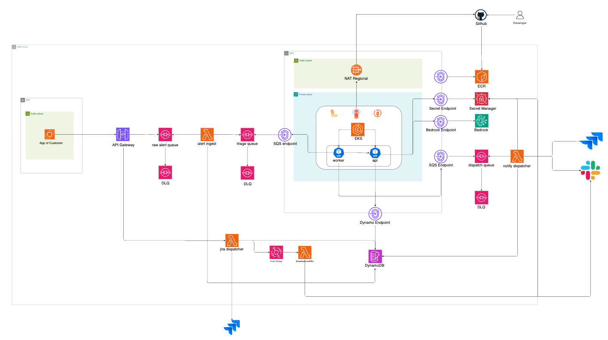
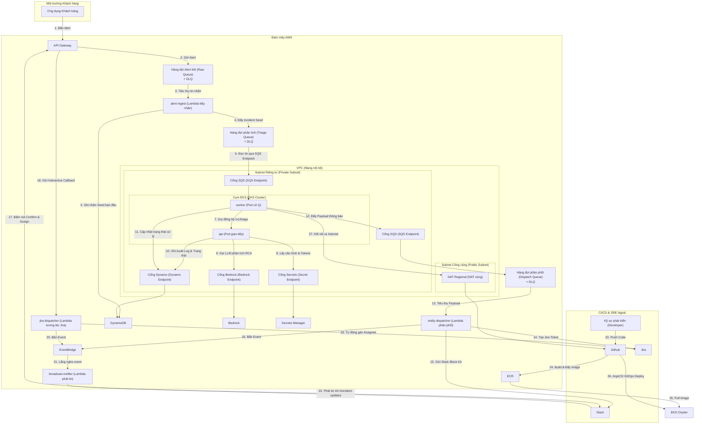
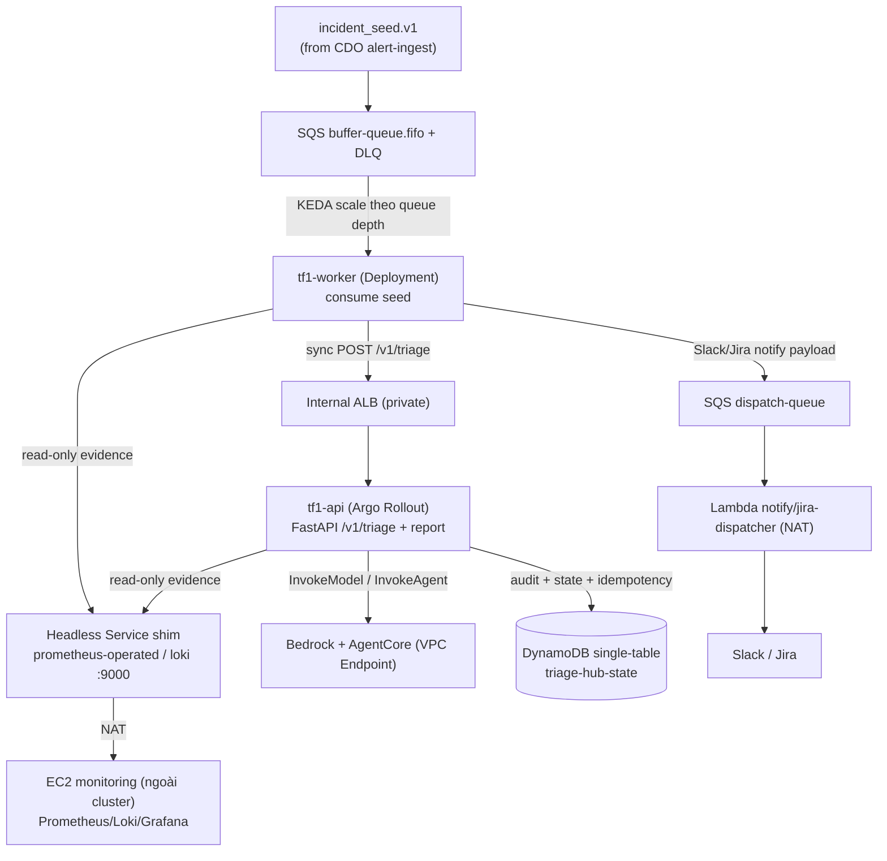
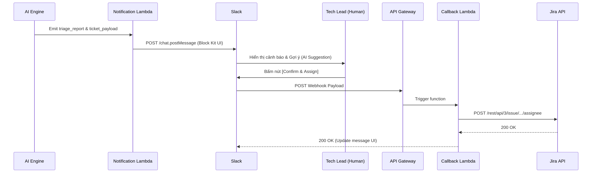

# Infrastructure Design - Task force 1 · CDO 09

<!-- Doc owner: Nhóm CDO 09 (Tiến)
     Status: Approved (W12)
     Word target: 1500-2500 từ -->

## 1. Architecture diagram (Owner: Tiến)





_Caption: Kiến trúc kết hợp linh hoạt (Hybrid) giữa các dịch vụ hướng sự kiện Serverless (API Gateway, SQS, Lambda) cho giai đoạn tiếp nhận nhanh và cụm Amazon EKS khép kín trong VPC Private Subnet cho giai đoạn xử lý AI chuyên sâu (AI App Pods tự động thu thập Logs/Metrics từ Customer App)._

### 1.5 Bảng Thành phần Lambda (Lambda Component Table)

| Lambda               | Kích hoạt (Trigger)                                   | Trách nhiệm (Responsibility)                                                                                                                                                      | Đầu ra (Output)                                   |
| -------------------- | ----------------------------------------------------- | --------------------------------------------------------------------------------------------------------------------------------------------------------------------------------- | ------------------------------------------------- |
| `alert-ingest`       | Hàng đợi SQS Raw Queue (FIFO)                         | Xác thực tenant + schema của alert, tạo cấu trúc `incident_seed.v1`, đẩy vào hàng đợi triage queue                                                                                | Hàng đợi SQS Triage Queue (FIFO)                  |
| `notify-dispatcher`  | Hàng đợi SQS Dispatch Queue (Standard)                | Tạo ticket Jira qua `POST /rest/api/3/issue`, gửi Slack Block Kit qua `chat.postMessage`, ghi log audit vào DynamoDB, bắn sự kiện `assign-requested` lên EventBridge              | Sự kiện `alert.assign.requested` trên EventBridge |
| `jira-dispatcher`    | API Gateway `POST /slack` (Slack interactive payload) | Xác thực chữ ký Slack, trích xuất `jira_issue_key` + `account_id`, gọi Jira API `PUT /rest/api/3/issue/{key}/assignee` để gán người xử lý, bắn sự kiện `assigned` lên EventBridge | Sự kiện `alert.assigned` trên EventBridge         |
| `broadcast-notifier` | EventBridge Rule lắng nghe sự kiện `alert.assigned`   | Định dạng tin nhắn xác nhận phân công, gửi tin nhắn ẩn (ephemeral) và tin nhắn thông báo công khai tới kênh `#incident-updates`                                                   | Tin nhắn Slack                                    |

_Chú thích: Bốn Lambda trong hệ thống. Chỉ có `jira-dispatcher` nhận webhook trực tiếp từ API Gateway Public. `alert-ingest` được trigger bởi SQS Raw Queue. `notify-dispatcher` tiêu thụ tin nhắn từ SQS Dispatch Queue. `broadcast-notifier` chạy hoàn toàn hướng sự kiện từ EventBridge._

---

## 2. Component table (Owner: Tiến)

| Component         | AWS Service                        | Reason                                                                                                                                                                                                                                 | Cost note                                                                                           |
| ----------------- | ---------------------------------- | -------------------------------------------------------------------------------------------------------------------------------------------------------------------------------------------------------------------------------------- | --------------------------------------------------------------------------------------------------- |
| **Compute**       | AWS Lambda & Amazon EKS            | - **Lambda**: Chạy các tác vụ ingest và dispatcher ngắn hạn giúp giảm chi phí idle.<br>- **EKS**: Host các pod AI App xử lý logic LLM orchestration và tự động thu thập context lâu dài, tránh cold start.                             | **Lambda**: Pay-per-use (~$2/tháng).<br>**EKS**: ~$73/tháng (base cluster cost) + EC2 worker nodes. |
| **API entry**     | Amazon API Gateway                 | Tiếp nhận Webhook cảnh báo đầu vào từ khách hàng với hiệu năng cao, tự động scale.                                                                                                                                                     | Pay-per-use (~$3.5 / triệu requests).                                                               |
| **Database**      | Amazon DynamoDB                    | Lưu trữ tenant configurations, metadata, trạng thái sự cố và toàn bộ audit trail của các phân tích AI với thời gian phản hồi sub-millisecond (mô hình Single-Table).                                                                   | Tận dụng Free Tier, pay-per-use (~$5/tháng).                                                        |
| **Event bus**     | Amazon SQS + Amazon EventBridge    | **SQS**: Buffer Queue (FIFO) cho alert intake + Dispatch Queue (Standard) cho dispatcher. Cả hai kèm DLQ chống mất gói tin.<br>**EventBridge**: Decouple `jira-dispatcher` khỏi `broadcast-notifier`, routing event giữa các Lambda. | SQS ~$0.40/triệu messages.<br>EventBridge ~$1.00/triệu events.                                      |

| **AI Processing** | Amazon Bedrock                     | Gọi mô hình ngôn ngữ lớn (LLM) để phân tích nguyên nhân gốc rễ một cách an toàn, tuân thủ chính sách bảo mật dữ liệu của AWS.                                                                                                          | Thanh toán theo Token tiêu thụ thực tế.                                                             |
| **Observability** | Prometheus, Grafana, OpenTelemetry | Theo dõi sức khỏe hệ thống và ứng dụng AI thông qua các EC2 monitoring độc lập (được truy cập qua shim Headless Service).                                                                                                              | Open-source, chỉ tốn chi phí EC2 instances & EBS.                                                   |

---

## 3. Differentiation angle deep-dive (Owner: Tiến)

### 3.1 Why this angle?

Việc chọn phương án **Hybrid** giúp dung hòa hai yếu tố đối lập: **Chi phí tối thiểu khi hệ thống nhàn rỗi (idle cost)** ở luồng tiếp nhận và **Độ tin cậy bảo mật cấp doanh nghiệp (Enterprise Security & Latency Consistency)** ở luồng xử lý AI:

- **Ở cổng ngõ nhận alert (Ingestion DMZ)**: Sử dụng API Gateway + Lambda + SQS đóng vai trò làm lớp đệm công cộng độc lập, giúp cô lập cụm EKS hoàn toàn trong Subnet Private (không lộ IP hay route public). Luồng này giúp hấp thụ tức thì các đợt bão cảnh báo (alert storms) nhờ hàng đợi SQS làm buffer mà không gây quá tải cho EKS. Đồng thời, nếu EKS có downtime ngắn (do deploy/rolling update), cổng tiếp nhận vẫn chạy độc lập và giữ alert trong SQS, đảm bảo độ tin cậy tuyệt đối (zero-loss).
- **Ở lõi AI App (Processing)**: LLM orchestration và query context từ Prometheus/Loki đòi hỏi thời gian xử lý dài (lên tới hàng chục giây). Đặt AI App trên EKS giúp loại bỏ hoàn toàn trễ khởi động lạnh (cold start) của Lambda, đồng thời tận dụng cơ chế cách ly cứng giữa các tenant (K8s Namespace, Network Policies) và hệ sinh thái giám sát (OTel, Prometheus) chuẩn doanh nghiệp.

### 3.2 Vượt trội ở đâu (số liệu dự kiến)

| Axis                      | CDO 09 (Hybrid Lambda + EKS) | Competing angle estimate (Pure ECS Fargate) |
| ------------------------- | ---------------------------- | ------------------------------------------- |
| Cost / tenant / month     | ~$35                         | ~$55                                        |
| P99 latency (API Gateway) | < 80ms                       | ~150ms                                      |
| Ops overhead (hr/week)    | 4 giờ                        | 2 giờ                                       |
| Time to onboard tenant    | < 1 phút                     | < 15 phút                                   |

### 3.3 Weakness chấp nhận

- **Độ phức tạp trong khâu cấu hình mạng & IAM**: Việc kết nối từ EKS đến DynamoDB, Bedrock, SQS trong mạng nội bộ đòi hỏi phải setup nhiều VPC Endpoints và cấu hình IAM Roles for Service Accounts (IRSA) chi tiết.
- **Chi phí ban đầu cao**: Khởi tạo cụm EKS có phí cứng $73/tháng dù có dùng hay không, nên mô hình này chỉ thực sự tối ưu chi phí khi số lượng Tenant $\ge 10$ và hệ thống đi vào chạy thực tế ổn định.

---

## 4. Multi-tenant approach (Owner: Tiến)

### 4.1 Tenant model

- **Tenant ID format**: UUID v4 (đảm bảo tính độc nhất toàn cầu).
- **Header**: Bắt buộc đính kèm `X-Tenant-Id` trong mọi API call từ API Gateway vào hệ thống.
- **Subscription tiers**:
  - `Basic`: Giới hạn 100 alerts/ngày, sử dụng shared resource pool.
  - `Enterprise`: Không giới hạn alerts, cấp phát riêng dedicated pod/node group để tránh ảnh hưởng tài nguyên từ tenant khác.

### 4.2 Isolation pattern

- **Data isolation**: **Pooled (Row-level)**
  - Với **DynamoDB**: Sử dụng chung một bảng (Shared Table) nhưng cách ly logic ở mức bản ghi bằng cách sử dụng `TenantID` làm một phần của Partition Key (PK). Cấu hình IAM Policy (Fine-Grained Access Control) để đảm bảo Service Account của tenant nào chỉ đọc/ghi được dữ liệu của tenant đó. Không sử dụng S3 nhằm giảm thiểu chi phí và độ phức tạp vận hành.
- **Compute isolation**: **Pooled (Namespace level)** trên EKS
  - Tất cả các tenant sử dụng chung một Namespace `triage-hub` (mô hình Pooled) để tối ưu hóa tài nguyên compute (tránh lãng phí tài nguyên khi scale số lượng tenant).
  - Sử dụng **Kubernetes Resource Quotas** và limit ranges để khống chế tài nguyên của Pod, ngăn chặn lỗi "Noisy Neighbor" giữa các workloads.
  - Phân tách logic và rate-limit trực tiếp trong ứng dụng `tf1-api` dựa trên `X-Tenant-Id` header.

### 4.3 Tenant onboarding flow (Dự kiến - Chưa triển khai)

> [!NOTE]
> Luồng onboarding dưới đây là **thiết kế dự kiến** cho tương lai, hiện tại chưa được triển khai trong mã nguồn và hạ tầng Terraform. Hiện tại, tenant được cấu hình thủ công trực tiếp trong cơ sở dữ liệu DynamoDB.

```
1. Client gọi POST /platform/v1/tenants (đính kèm TenantName, Contact, Tier).
2. API Gateway kích hoạt Tenant Onboarding Lambda.
3. Lambda này sẽ tự động:
   - Ghi cấu hình tenant mới vào bảng DynamoDB.
   - Gán tenant mới vào API Gateway Usage Plan tương ứng để kích hoạt giới hạn tần suất (Rate Limiting).
4. Chạy Smoke Test tự động gọi thử API mock.
5. Trả về kết quả Onboarding thành công cho Client trong vòng dưới 1 phút.
```

### 4.4 Noisy neighbor mitigation

- **Per-tenant quota**: Giới hạn tần suất request (ví dụ: tối đa 60 requests/phút cho mỗi tenant) bằng cấu hình **Usage Plans & Rate Limiting** trên API Gateway.
- **K8s Resource Quota & Limits**: Quy định cấu hình `requests` và `limits` CPU/RAM cho từng container, đảm bảo một tenant bị spam alerts không thể chiếm dụng toàn bộ tài nguyên CPU/RAM của cụm EKS gây ảnh hưởng đến các tenant khác.
- **KEDA ScaledObject**: Tự động scale out `tf1-worker` pods dựa trên hàng đợi SQS để giải phóng tin nhắn của các tenant một cách kịp thời.

---

## 5. Alternatives considered (Owner: Tiến)

### 5.1 Compute layer

- **Option A (Pure Serverless - Lambda only)**:
  - _Pros_: Rất rẻ cho giai đoạn đầu, không tốn phí base hạ tầng.
  - _Cons_: Gặp vấn đề cold start nặng nề khi chạy logic LLM orchestration; giới hạn thời gian chạy 15 phút không tối ưu nếu AI xử lý log dung lượng lớn.
- **Option B (Pure ECS Fargate + ALB)**:
  - _Pros_: Dễ vận hành hơn K8s, thời gian khởi động task nhanh.
  - _Cons_: ALB và Fargate Task chạy 24/7 tăng chi phí cố định (idle cost) cao hơn EKS khi scale số lượng tenants lớn.
- ✅ **Chosen (Hybrid Lambda + EKS)**:
  - _Reason_: Tận dụng khả năng gom tải hướng sự kiện cực tốt của Lambda/SQS ở đầu vào và khả năng bảo mật, cách ly mạnh mẽ theo chuẩn doanh nghiệp (Namespaces, Network Policies) cùng hiệu năng ổn định không cold-start của EKS cho phần AI App.

### 5.2 Database

- **Option A (Amazon RDS PostgreSQL)**:
  - _Pros_: Hỗ trợ giao dịch ACID mạnh mẽ, dễ viết các truy vấn báo cáo phức tạp.
  - _Cons_: Phải quản lý connection pooling phức tạp khi kết nối từ Lambda (dễ bị tràn connection); chi phí duy trì database instance cao.
- ✅ **Chosen (Amazon DynamoDB)**:
  - _Reason_: Hoàn toàn serverless, tự động scale theo lưu lượng alert, dễ dàng thiết lập cách ly dữ liệu nhiều tenant bằng Partition Key kết hợp với IAM policy Fine-Grained Access Control, chi phí cực kỳ tiết kiệm ở quy mô nhỏ.

---

## 6. Scaling strategy (Owner: Tiến)

- **Vertical Scaling**: Định nghĩa mức tài nguyên cho các container trong manifest:
  - **`tf1-api`**: CPU requests `512m` / limits `1000m` (1 Core); Memory requests `1Gi` / limits `2Gi`.
  - **`tf1-worker`**: CPU requests `100m` / limits `500m`; Memory requests `256Mi` / limits `1Gi`.
- **Horizontal Scaling**:
  - **API Gateway & Lambda**: Tự động scale bởi AWS theo lượng request thực tế.
  - **`tf1-api` (EKS)**: Sử dụng **Horizontal Pod Autoscaler (HPA)** tự động scale dựa trên CPU utilization (ngưỡng 70%) hoặc custom metric `http_requests_per_second` (ngưỡng 100 requests/giây per pod). Min 2 / Max 10 pods.
  - **`tf1-worker` (EKS)**: Sử dụng **KEDA (Kubernetes Event-driven Autoscaling)** để scale số lượng Pods dựa trên số lượng messages tồn đọng trong **Buffer Queue (SQS FIFO)**. Cấu hình tự động scale thêm pod khi độ sâu queue vượt quá 5 messages (`queueLength = 5`). Min 1 / Max 10 pods.
- **Triggers**: Target queue depth > 5 messages (cho Worker) / CPU utilization > 70% hoặc request rate > 100/pod (cho API).

---

## 7. Failure modes + recovery (Owner: Tiến)

| Failure                      | Detection                                                   | Recovery                                                                                                        | RTO       | RPO   |
| ---------------------------- | ----------------------------------------------------------- | --------------------------------------------------------------------------------------------------------------- | --------- | ----- |
| Single AI Pod crash          | EKS Kubelet / Kubernetes Liveness Probe                     | Kubernetes tự động restart Pod bị crash trên Node khỏe mạnh                                                     | < 10s     | 0     |
| EC2 Node crash               | EKS Control Plane Node health check                         | EKS tự động dời Pods sang Node khác hoạt động bình thường                                                       | < 60s     | 0     |
| AWS Bedrock Throttling (LLM) | CloudWatch metrics / App Error Logs (429 Too Many Requests) | Thực hiện retry với cơ chế Exponential Backoff trực tiếp trong code AI App                                      | < 5s      | 0     |
| SQS Queue/Database Down      | CloudWatch Alarms                                           | Message sẽ tự động lưu lại ở hệ thống phía trước hoặc chuyển vào DLQ để xử lý thủ công sau khi dịch vụ hồi phục | < 5 phút  | < 10s |
| Mất kết nối Slack/Jira API   | App Exception Logs / SQS retry failure                      | Lưu payload lỗi vào DLQ. Sau khi API khôi phục, vận hành viên kích hoạt reprocess từ DLQ                        | < 15 phút | 0     |

---

## 8. AI Engine Runtime Module (Owner: Thi)

<!-- Scope: hosting + runtime của AI Engine trên EKS.
     Engine logic/app do AI team own; phần này chỉ cover infra host + deploy + scale + tích hợp + observability wiring. -->

### 8.1 Scope & boundary

Module này chịu trách nhiệm **host AI Engine của AI team trên Amazon EKS**, không sở hữu logic RCA/prompt (thuộc AI team). Phạm vi CDO:

- Containerize + sign image engine (supply-chain security).
- Deploy engine lên EKS qua GitOps (ArgoCD + Argo Rollouts canary).
- Auto scaling engine theo tải (HPA cho API, KEDA cho worker, Cluster Autoscaler cho node).
- **Wiring observability**: expose Prometheus/Loki (chạy ngoài cluster) cho engine query evidence.
- Runtime persistence (DynamoDB), secrets (ESO/IRSA), network isolation.

Engine chạy trong **private subnet**. Truy cập AWS service nhạy cảm (Bedrock, Secrets Manager) qua **VPC Endpoint** — traffic ở lại trong AWS. Egress ra ngoài (observability EC2, Sigstore, GitHub) đi qua **NAT Gateway**. SaaS (Slack/Jira) **không** gọi trực tiếp từ engine — qua Lambda Dispatcher.

### 8.2 Architecture


_Hình 8.1 — AI Engine Runtime Module trên Amazon EKS (private subnet, us-east-1). Ba luồng: **Build & Sign** (GitHub Action → Trivy fail-on HIGH/CRITICAL → Cosign keyless → ECR private → Sigstore policy-controller verify chữ ký trước khi pod chạy), **Deploy & Runtime** (ArgoCD GitOps + Argo Rollouts canary → EKS; `POST /v1/triage` → Internal ALB → tf1-api ↔ tf1-worker; secrets qua ESO + IRSA; egress Bedrock/Secrets qua VPC Endpoint, egress observability/Sigstore qua NAT), và **Auto Scaling** (HPA pod 2–10 cho API + KEDA cho worker + Cluster Autoscaler node 2–4)._

<details>
<summary>Sơ đồ logic (Mermaid) — luồng dữ liệu chi tiết</summary>



_Caption: Engine gồm `tf1-api` (Argo Rollout, FastAPI) + `tf1-worker` (Deployment, SQS consumer). Worker consume `incident_seed` từ buffer (KEDA scale theo độ sâu queue), gọi `tf1-api /v1/triage` đồng bộ qua Internal ALB. Engine query evidence read-only từ Prometheus/Loki qua shim Headless Service, gọi Bedrock/AgentCore qua VPC Endpoint, ghi audit/state vào DynamoDB, rồi worker đẩy payload Slack/Jira ra Dispatch Queue cho Lambda Dispatcher._

</details>

### 8.3 Components & ownership

| Component             | Service                                        | Vai trò trong module                                           | Owner      |
| --------------------- | ---------------------------------------------- | -------------------------------------------------------------- | ---------- |
| Engine compute        | EKS managed node group (private)               | host tf1-api + tf1-worker                                      | CDO        |
| API entry             | Internal ALB (private, 443→8080)               | sync `/v1/triage`                                              | CDO        |
| Image registry        | ECR private                                    | image Cosign-signed                                            | CDO        |
| Engine app            | container (FastAPI + worker)                   | logic RCA/triage                                               | AI team    |
| Secrets inject        | Secrets Manager + ESO                          | Bedrock/AgentCore config, service token                        | CDO        |
| Runtime state + audit | **DynamoDB single-table** (`triage-hub-state`) | audit metadata-only, idempotency, incident state, jira_history | CDO        |
| Evidence source       | Prometheus/Loki trên EC2 (qua shim)            | metrics/logs read-only cho RCA                                 | CDO wiring |

### 8.4 Build & supply-chain

Pipeline đóng gói engine của AI team thành image an toàn (`ci-ai-engine.yml`):

`Dockerfile (multi-stage, non-root user 1000, healthcheck, PSS Restricted)` → `docker build` → `Trivy scan (exit-code=1, fail on HIGH/CRITICAL)` → `Cosign keyless sign (Sigstore/Fulcio/Rekor)` → `push ECR private` → `Sigstore policy-controller verify chữ ký trước khi pod chạy`.

→ Không image nào chạy mà chưa quét lỗ hổng + chưa ký. `ClusterImagePolicy` chỉ chấp nhận image ký bởi workflow `ci-ai-engine.yml` của repo này (subject/issuer regexp).

### 8.5 Deploy on EKS

- Deploy qua **ArgoCD (app-of-apps, GitOps)**. AppProject `triage-hub` + root-app sync toàn bộ manifest; `selfHeal=true` nên mọi thay đổi thủ công trên cluster bị revert về git.
- **`tf1-api` = Argo Rollout** (canary 10%→50%→100%, background AnalysisRun, auto-rollback on abort — xem 8.13). **`tf1-worker` = Deployment thường**.
- **1 namespace `triage-hub` dùng chung cho mọi tenant** (mô hình _pooled_), cô lập bằng `tenant_id` trong khoá dữ liệu + NetworkPolicy — **KHÔNG** namespace-per-tenant. Namespace gắn label Pod Security `restricted` (enforce/audit/warn).
- **IRSA least-privilege (scoped ARN)** — đã verify với terraform:
  - `tf1-api`: `dynamodb:GetItem/PutItem/UpdateItem/Query` (chỉ table ARN, không `*`) · `secretsmanager:GetSecretValue` · `bedrock:InvokeModel/InvokeModelWithResponseStream` (foundation-model) · `bedrock:InvokeAgent` + `bedrock-agentcore:InvokeAgentRuntime` (runtime ARN). _(Không có `s3:PutObject` — audit ghi DynamoDB.)_
  - `tf1-worker`: `dynamodb:*` (table) · `secretsmanager:GetSecretValue`.
  - `keda-operator`: `sqs:GetQueueAttributes` (đọc độ sâu queue để scale worker).
- **In-cluster governance:** Gatekeeper (OPA), RBAC (developer/sre/viewer RoleBindings), NetworkPolicy deny-all default + allow-list tường minh, Pod Security Standard `restricted`.

### 8.6 Auto scaling (3 lớp độc lập)

**8.6a — HPA cho `tf1-api`** (`hpa.yaml`, scaleTargetRef = Rollout):

- Policy 1: CPU utilization 70%.
- Policy 2: custom metric `http_requests_per_second = 100`/pod (qua Prometheus Adapter).
- Min **2** / Max **10** pods.

**8.6b — KEDA cho `tf1-worker`** (`scaledobject.yaml`):

- Trigger `aws-sqs-queue` theo **độ sâu buffer-queue** (`queueLength=5` → ~5 message/replica trước khi scale thêm).
- Min **1** / Max **10** replica.
- Auth qua `TriggerAuthentication` + IRSA của keda-operator (`identityOwner=operator`).
- Đây là điểm khác HPA: worker scale theo **backlog công việc thật**, không phải CPU — phản ứng nhanh với alert storm.

**8.6c — Cluster Autoscaler** (node group): thêm/bớt node khi pod `Pending`. Min **2** / Max **4** nodes (`t3.large`).

**SQS buffer** đệm alert bursty trong lúc KEDA/HPA kịp scale.

### 8.7 AI endpoint integration

- Endpoint: **`POST /v1/triage`** (sync) + **`GET /v1/reports`**, **`GET /v1/reports/{id}`**, **`GET /v1/audit/{audit_id}`**, **`/healthz`**, **`/readyz`**, **`/metrics`**.
- Input: `TriageRequest` (envelope `tenant_id/correlation_id/incident_id/environment` + `alert` + optional `metrics/logs/traces/recent_deploys/ownership`). Header bắt buộc `X-Tenant-Id` (khớp body), `X-Correlation-Id`, `Authorization`.
- Output: `TriageResponse` (classification, severity, confidence, `suspected_root_cause`, `recommended_actions`, `ticket_payload`, optional `suggested_assignee_account_id` + `suggestion_reason`, `audit_id`).
- SLA: gọi **đồng bộ qua Internal ALB**, mục tiêu **p99 < 2s** cho `/v1/triage` (theo `ai-api-contract.md` SLA table). SQS chỉ nằm ở intake/dispatch, **không** trong request path sync.
- Guardrails engine-side: rate-limit **60 req/min/tenant** (429), payload ≤ **512KB** (413), idempotency theo `audit_id` (replay cùng response).

### 8.8 Observability connectivity (evidence access — CDO wiring)

Engine **tự query evidence read-only** (metrics/logs) để làm RCA. Prometheus/Loki **không chạy trong EKS** mà trên **EC2 monitoring riêng** (mô phỏng observability của customer). CDO wiring đường truy cập:

- **Shim Headless Service** (`prometheus-operated`, `loki` trong ns `monitoring`, `clusterIP: None`, port **9000**): DNS trả **thẳng IP EC2**, bỏ qua kube-proxy iptables DNAT — tránh lỗi intermittent timeout khi route ClusterIP tới Endpoints ngoài VPC.
- **IP EC2 tự cập nhật**: IP đổi mỗi lần recreate → lưu ở SSM `/triage-hub/sandbox/prometheus_ip`; `ci-infra` render lại Service/Endpoints từ SSM và commit vào git (ArgoCD sync).
- **nginx proxy trên EC2 (cổng 9000)** gộp: `/` → Prometheus (9090), `/loki/` → Loki (3100) — engine dùng chung 1 host:port, phân luồng theo path.
- **NetworkPolicy egress**: `tf1-api`/`tf1-worker` mở egress tới DNS (cổng 53), HTTPS (cổng 443) và các cổng truy vấn telemetry `9090` (Prometheus) / `3100` (Loki) (lưu ý: manifest đang sử dụng cổng `9090`/`3100` cho egress, mặc dù thực tế Headless Service đã chuyển sang cổng `9000`). Mọi egress khác đều mặc định bị deny.
- Query **scope theo `tenant_id/environment/service/time-window`**, bounded (evidence budget cap trong engine). Metrics gắn nhãn `tenant_id`, `service` để cô lập.
- **SG EC2** chỉ mở cổng proxy cho **NAT EIP** của platform VPC (least-exposure).

### 8.9 Egress & network model

- **VPC Endpoint** (traffic ở lại AWS): Bedrock, AgentCore, Secrets Manager, SQS, CloudWatch Logs, ECR (api/dkr), STS (Interface); S3, DynamoDB (Gateway).
- **NAT Gateway** (internet egress có kiểm soát): GitHub (ArgoCD/CI), EC2 monitoring (Prometheus/Loki), Sigstore (Cosign keyless sign/verify).
- SaaS (Slack/Jira) **không** gọi trực tiếp từ engine — engine/worker emit payload → SQS dispatch-queue → Lambda Dispatcher (NAT) → Slack/Jira. `SLACK_WEBHOOK_URL`/Slack bot token giữ ở dispatcher.

### 8.10 Secrets

Inject qua **ESO (External Secrets Operator)** từ Secrets Manager → K8s Secret (`ai-engine-secrets`). No hardcode, no static `valueFrom`. Engine giữ: `BEDROCK_MODEL_ID`, `AGENTCORE_RUNTIME_ARN`, `PROMETHEUS_URL`/`LOKI_URL` (shim), `AIOPS_DYNAMODB_TABLE`, SQS URLs, `SERVICE_AUTH_TOKEN`. Bedrock **không dùng API key** — auth bằng IAM/IRSA (`bedrock:InvokeModel`). Slack webhook thuộc dispatcher, không ở engine.

### 8.11 Runtime persistence (DynamoDB single-table)

Engine dùng **1 bảng DynamoDB** `triage-hub-state-<env>` (`PK`/`SK`, `PAY_PER_REQUEST`, TTL trên `ttl`) cho mọi state runtime — **không** S3 Object Lock:

| Loại record      | PK / SK pattern                                        | Mục đích                                                             |
| ---------------- | ------------------------------------------------------ | -------------------------------------------------------------------- |
| Audit            | audit record theo `audit_id`                           | log mọi AI decision (metadata-only, retention TTL)                   |
| Idempotency      | keyed by `audit_id`                                    | replay cùng response cho cùng `correlation_id`, chống double-process |
| Incident state   | `TENANT#{tenant}#INCIDENT#{id}` / `AUDIT#{ts}`         | mapping incident ↔ Jira, audit callback                              |
| Assignee mapping | `JIRA_HISTORY#{tenant}#{env}#{service}` / `SUGGESTION` | nguồn `suggested_assignee_account_id` (do resolver seed)             |

Cô lập tenant: `tenant_id` nằm trong Partition Key → query 1 tenant không chạm tenant khác.

### 8.12 Failure modes & resilience

| Failure                     | Detection                 | Recovery                                                                           |
| --------------------------- | ------------------------- | ---------------------------------------------------------------------------------- |
| Pod crash                   | liveness probe `/healthz` | K8s restart (<60s)                                                                 |
| Node fail                   | node health               | Cluster Autoscaler thay node                                                       |
| AI 503/timeout              | app metric                | worker giữ message trong SQS → retry sau visibility timeout; 500 → fallback ticket |
| Bedrock throttle            | app metric                | fallback compute-only (deterministic RCA)                                          |
| Malformed seed              | schema validate           | DLQ (maxReceiveCount), no silent drop                                              |
| Alert spike                 | queue depth               | SQS buffer + KEDA scale worker                                                     |
| Evidence source unreachable | analysis query error      | canary AnalysisRun tolerant (`failureLimit`); `or vector(0)` fallback              |

### 8.13 Canary analysis & auto-rollback

`tf1-api` deploy dạng **Argo Rollout canary**: `setWeight 10 → pause → 50 → pause → 100`, với **background AnalysisRun** (`AnalysisTemplate tf1-api-latency`) đo qua shim Prometheus (`prometheus-operated:9000`):

- **p99-latency**: `histogram_quantile(0.99, ...{job="tf1-api"})` — fail nếu **> 800ms**.
- **error-rate**: tỉ lệ 5xx — fail nếu **> 1%**.
- Tham số: `initialDelay 3m` (warm-up), `interval 1m`, `count 5`, `failureLimit 2`, `timeout 60`, `or vector(0)` graceful fallback khi chưa có data.
- Vượt ngưỡng liên tiếp → **Rollout tự abort + rollback** về stable (RTO < 60s), không cần can thiệp tay.

### 8.14 In-cluster policy enforcement (Gatekeeper)

Ngoài Sigstore (image signing) + NetworkPolicy + PSS, cluster enforce **7 Gatekeeper ConstraintTemplate** (OPA) áp cho ns `triage-hub`:

`K8sRequiredSecurityContext` (runAsNonRoot, no privilege-escalation, drop ALL caps, chặn hostNetwork/PID/IPC/hostPath) · `K8sAllowedRepos` (chỉ ECR project) · `K8sRequiredResources` (bắt buộc cả requests LẪN limits — chống noisy-neighbor multi-tenant) · `K8sRequiredProbes` · `K8sRequiredLabels` · `K8sDisallowedTags` (chặn `:latest`/untagged) · `K8sRequireNetworkPolicy` (referential — mọi namespace phải có NetworkPolicy).

Rollout an toàn: khởi đầu `enforcementAction=dryrun` (audit-only), chuyển `deny` theo từng constraint sau khi xác nhận zero-violation.

---

## 9. Slack Alert & Interactive Assignment Architecture (Owner: Hoàng)


### 9.1 Slack Interactive Flow

Hệ thống áp dụng kiến trúc **"AI Suggestion + Human-in-the-loop"** thay vì Auto-assign hoàn toàn để kiểm soát rủi ro phân công nhầm người.

- **`notify-dispatcher`**: Nhận `ticket_payload` từ Dispatch Queue, tạo Jira ticket, bóc tách `suggested_assignee` và tạo Slack Block Kit JSON có kèm nút **[Confirm & Assign]** để gửi lên kênh Slack.

- **API Gateway**: Đóng vai trò là Public Webhook Endpoint để nhận tín hiệu click chuột từ nền tảng Slack (tích hợp Slack Request Verification).
- **`jira-dispatcher`**: Bóc tách event từ Slack, xác thực chữ ký, trích xuất `jira_issue_key` và gọi REST API của Jira để tự động gán việc cho nhân sự được đề xuất.

### 9.2 Component Deep-Dive

| Component           | AWS Service     | Purpose in Slack Flow                                                                              |
| ------------------- | --------------- | -------------------------------------------------------------------------------------------------- |
| `notify-dispatcher` | Lambda          | Gửi Block Kit có nút [Confirm & Assign] lên Slack (xem §1.5)                                       |
| Slack Webhook       | API Gateway     | Nhận payload tương tác (POST request) từ người dùng Slack (với Slack Request Verification)         |
| `jira-dispatcher`   | Lambda          | Xử lý sự kiện bấm nút [Confirm & Assign], verify Slack signature và gọi Jira assign API (xem §1.5) |
| Token Storage       | Secrets Manager | Lưu trữ an toàn Bot Token (Slack) và API Token (Jira)                                              |

### 9.3 Sequence Diagram

Sơ đồ trình tự xử lý luồng tương tác 2 chiều giữa con người, Slack và hệ thống Triage-Hub:



### 9.4 Security & Authentication

Do API Gateway phải mở dạng Public (để Slack gọi vào), kiến trúc bảo mật áp dụng các lớp phòng thủ sau:

- **Slack Signature Verification:** `jira-dispatcher` sử dụng `Slack Signing Secret` (lưu tại Secrets Manager) để xác thực Header `X-Slack-Signature`. Chỉ những request xuất phát từ chính nền tảng Slack mới được phép thực thi.
- **Least-privilege IAM:** Mỗi Lambda chỉ được cấp quyền tối thiểu cho tác vụ của nó:
  - `jira-dispatcher`: `secretsmanager:GetSecretValue` (Slack Signing Secret, Jira API token, Slack Bot Token), `lambda:InvokeFunction` (async self-invoke), `eventbridge:PutEvents`, `dynamodb:PutItem` (audit trail), CloudWatch logs.
  - `notify-dispatcher`: `secretsmanager:GetSecretValue` (Slack Bot Token, Jira API token), `dynamodb:GetItem` + `PutItem` (Jira mapping, notification audit), CloudWatch logs.
  - Các Lambda khác có scope tương ứng (xem §1.5). Ngăn chặn leo thang đặc quyền nếu một function bị compromise.

### 9.5 Edge Cases & Failure Recovery

Các tình huống ngoại lệ được thiết kế để đảm bảo luồng "Human-in-the-loop" không trở thành "điểm đứt gãy" (single point of failure):

| Rủi ro (Failure Mode)                             | Cách xử lý (Mitigation)                                                                                                                                          |
| ------------------------------------------------- | ---------------------------------------------------------------------------------------------------------------------------------------------------------------- |
| Người dùng bấm nút 2 lần liên tiếp (Double-click) | Slack Block Kit hỗ trợ cấu trúc tự động vô hiệu hóa nút sau khi click. Lambda cũng kiểm tra state của Jira trước khi gán.                                        |
| Jira API sập (Downtime)                           | `jira-dispatcher` catch lỗi HTTP 5xx, trả về thông báo lỗi dạng ephemeral message cập nhật thẳng vào Slack để báo team assign tay.                               |
| Slack yêu cầu timeout 3s                          | API Gateway được cấu hình để phản hồi `200 OK` ngay lập tức về cho Slack. Logic gọi API Jira được Lambda xử lý bất đồng bộ, tránh lỗi Timeout hiển thị cho user. |

---

## 10. Jira Integration Layer (Owner: Phong)

### 10.1 Architecture

_(Sơ đồ kiến trúc tổng thể tại [§9 Slack Architecture](#9-slack-alert--interactive-assignment-architecture) — biểu đồ này bao gồm cả luồng Jira.)_

Kiến trúc áp dụng nguyên tắc **Jira-First**: AI Engine gửi `ticket_payload` vào **SQS Dispatch Queue**. `notify-dispatcher` consume event này và thực hiện đồng thời: tạo Jira ticket (`POST /rest/api/3/issue`) và post Slack Block Kit. Khi người dùng bấm **[Confirm & Assign]** trên Slack, API Gateway nhận interactive payload và gọi `jira-dispatcher`, Lambda này xác thực Slack signature rồi gọi `PUT /rest/api/3/issue/{key}/assignee` để gán người. Sau đó `jira-dispatcher` publish sự kiện `IncidentAssigned` qua EventBridge cho `broadcast-notifier` để gửi broadcast tin nhắn xác nhận về kênh `#incident-updates`. **Luồng tạo Jira ticket không đi qua API Gateway** — nó nằm trong `notify-dispatcher`. `jira-dispatcher` chỉ handle assignment, không tạo ticket. Khi Jira fail, payload được đưa vào SQS DLQ và fallback text được gửi qua Slack.

### 10.2 Sequence flow


### 10.3 Component table

| Component | AWS Service                                    | Rationale                                                                                                                                                | Cost estimate                                                          |
| --------- | ---------------------------------------------- | -------------------------------------------------------------------------------------------------------------------------------------------------------- | ---------------------------------------------------------------------- |
| Compute   | `notify-dispatcher` + `jira-dispatcher` Lambda | `notify-dispatcher` tạo Jira ticket + post Slack (SQS-triggered). `jira-dispatcher` assign Jira (API GW-triggered). Cả hai single-purpose, <30s runtime. | Free Tier up to 1M req/month. ~$1.00/month ở 10k alerts.               |
| Database  | DynamoDB                                       | Key-value lookup với `PK = TENANT#{tenantId}#INCIDENT#{incidentId}` cho audit records. Không cần join, single-digit ms reads. Managed, auto-scaling.     | On-demand. ~$0.25/GB-month. ~1KB per record × 10k alerts = negligible. |
| Event Bus | EventBridge                                    | Native Lambda target (`broadcast-notifier`), 24h retry, event filtering. Decouple `jira-dispatcher` khỏi `broadcast-notifier`.                           | $1.00/million events. 1 event per alert (`alert.assigned`).            |

| Queue | SQS Dispatch Queue (Standard) + DLQ | Standard queue giữa Dispatch Queue và `notify-dispatcher`. DLQ cho failed alerts, max 14-day retention, redrive manual. | $0.40/million requests. DLQ nhận <1% traffic. |
| Security | Secrets Manager | Auto-rotation mỗi 30 days. Fine-grained IAM scope chỉ đọc cho Lambda. Encrypted at rest via KMS. | $0.40/secret/month × 2 secrets (Slack Bot Token + Jira API Token). |

### 10.4 Design rationale

#### 10.4.1 Why Jira-First

Hai competing patterns đã bị reject:

**Slack-First Chained Dependency** — Một Lambda duy nhất post Slack trước, sau đó tạo Jira ticket như side effect. Điều này coupling notification với ticketing: nếu Slack chậm, Jira creation bị stall. Nếu engineer acknowledge trước khi Jira tồn tại, audit trail bị phá vỡ. Slack API failure đồng nghĩa toàn bộ incident không được record.

**Blind Auto-Assignment** — AI-recommended owner được assign ngay lập tức không cần human confirmation. Nếu AI sai (deactivated user, wrong team, cross-tenant mapping), tickets languish trong wrong queue, làm tăng MTTA.

Jira-First coi Jira ticket là **single source of truth**. Ticket phải tồn tại trước khi bất kỳ notification nào được gửi. `issue_key` flow qua mọi subsequent event, tạo immutable chain: alert → ticket → notification → acknowledgement.

#### 10.4.2 Comparison with alternatives

| Axis                  | Jira-First                                                  | Slack-First                                                        | Blind Auto-Assign                                               |
| --------------------- | ----------------------------------------------------------- | ------------------------------------------------------------------ | --------------------------------------------------------------- |
| Time to Route (MTTA)  | ~45s (create 2s + post 1s + accept ~42s)                    | ~90s (post 1s + read 60s + create 2s + reassign)                   | ~30s nhưng ~25% wrong → effective MTTA gấp đôi                  |
| Wrong Assignment Rate | <3% (AI recommend, human verify, assign sau accept)         | ~3% + ~10% nếu human acknowledge trước khi Jira tồn tại            | ~25% (AI model accuracy ceiling ~75% cho team-owner prediction) |
| Silent Data Drop Rate | <0.1% (DLQ bắt mọi failure; fallback Slack notify engineer) | ~8% (Slack delivered, Jira never created → không permanent record) | ~25% (ticket created, assigned wrong, tồn đọng)                 |

_Numbers là estimated baselines cho capscope, cần validate trong W12 eval._

#### 10.4.3 Accepted weakness

**AI-suggested `account_id` may be invalid.** `suggested_assignee_account_id` đến từ AI payload, không qua DynamoDB caching. Nếu AI đề xuất `account_id` đã deactivated, sai tenant, hoặc không tồn tại trên Jira, `jira-dispatcher` nhận 400 từ `PUT /assignee` và ticket remain **unassigned**.

- Ticket luôn ở trạng thái **unassigned** — assignment chỉ xảy ra khi human bấm nút và Jira accept. Không có auto-assign rủi ro.
- "Assign Me" / manual dropdown là primary path, không phải AI suggestion.
- DynamoDB mapping (`TENANT#{tenantId}#INCIDENT#{incidentId}`) chỉ dùng cho idempotency — tránh tạo duplicate Jira tickets khi Lambda retry.

**No user-mapping cache.** `jira-dispatcher` resolve user bằng real-time API chain: Slack `users.info` → email → Jira `user/search`. Không có DynamoDB user-mapping table, không có background sync. Điều này đơn giản hóa vận hành (không stale cache, không sync pipeline) nhưng tăng latency cho self-assign/manual-assign flow (~1–2s cho 2 API calls) và phụ thuộc vào Slack API availability.

Đánh đổi: chấp nhận latency ~1–2s cho API chain thay vì xây DynamoDB user cache với CDC pipeline từ Jira (webhook listener, retries, callback auth). Pragmatic cho capscope — <5% interactions bị ảnh hưởng, phần còn lại dùng `suggested_assignee_account_id` từ AI payload không cần lookup.

### 10.5 Multi-tenant approach

Mọi request đều mang `X-Tenant-Id` header (UUID v4). API Gateway validate presence; Lambda enforce partition key scoping trong DynamoDB.

| Dimension | Pattern            | Rationale                                                                                                                                                                                                                  |
| --------- | ------------------ | -------------------------------------------------------------------------------------------------------------------------------------------------------------------------------------------------------------------------- |
| Compute   | Shared             | Một Lambda xử lý tất cả tenants. Cold start paid once. Không cross-tenant state trong memory — toàn bộ state ở DynamoDB.                                                                                                   |
| Data      | Pooled (row-level) | Một DynamoDB table với Partition Key = `TENANT#{tenantId}#INCIDENT#{incidentId}` cho audit records. IAM condition `ddb:LeadingKeys` enforce tenant scope ở policy level — fail-closed ngay cả khi application code có bug. |
| Network   | Shared             | Một VPC, một subnet group. Không cần per-tenant ENI hay NAT Gateway.                                                                                                                                                       |

Silo isolation (per-tenant table) tốn ~$6.50/month cho 50 tables vs ~$0/month idle cho một pooled table — 13× chi phí, không có measurable security benefit nhờ IAM guardrail.

### 10.6 Audit trail

Mọi AI decision đều được link với Jira ticket để đảm bảo traceability:

- `issue_key` được dùng làm correlation ID trong tất cả EventBridge events và CloudWatch Logs structured logs.
- Jira ticket description field chứa `Correlation-ID` value trỏ về original `alert.ingested` event.
- AI diagnosis payload (root cause, confidence score, remediation steps, recommended `account_id`) được persist cùng event trong CloudWatch Logs, keyed bởi cùng correlation ID.
- Cho phép post-incident queries dạng: _"Show me the AI diagnosis that led to ticket INC-123."_

### 10.7 Failure modes & recovery

| Failure                                       | Detection                                                                                                      | Recovery                                                                                                                                                                                                                                                             | RTO                          | RPO                                          |
| --------------------------------------------- | -------------------------------------------------------------------------------------------------------------- | -------------------------------------------------------------------------------------------------------------------------------------------------------------------------------------------------------------------------------------------------------------------- | ---------------------------- | -------------------------------------------- |
| Jira API down (429/500)                       | `notify-dispatcher` catch HTTP >= 400 when creating ticket. Explicit DLQ write + `console.error`.              | Payload ghi vào SQS DLQ kèm original `alert.ingested` envelope. `notify-dispatcher` gửi raw alert text với "[JIRA DOWN]" prefix. DLQ redrive thủ công sau khi Jira recover.                                                                                          | < 60s (detection + fallback) | 0 (payload in DLQ)                           |
| AI recommend invalid/deactivated `account_id` | Jira trả 400 trên `PUT /assignee` — `"user does not exist"`.                                                   | `jira-dispatcher` catch 400, log vào CloudWatch. Ticket remain **unassigned**. EventBridge `alert.assigned` chứa `assignee_status: "unassigned_invalid_user"`. `broadcast-notifier` hiển thị "Assign Me" ephemeral → Slack callback để current engineer self-assign. | < 30s                        | 0 (ticket created, chỉ assignment fail)      |
| DynamoDB audit save timeout                   | `notify-dispatcher` metric `DynamoDB.PutItem` latency > 3s trigger CloudWatch alarm. Function catch exception. | Audit skip logged to CloudWatch. Ticket + Slack vẫn thành công. Retry audit qua DLQ replay sau.                                                                                                                                                                      | < 5s                         | < 1s (audit gap, không ảnh hưởng assignment) |

---

## 11. Alert processing (Owner: Hiền)

Quy trình xử lý cảnh báo (Alert Processing Pipeline) được thiết kế theo mô hình hướng sự kiện (Event-driven Architecture), chia làm 3 giai đoạn chính để đảm bảo khả năng mở rộng, tính chịu lỗi và bảo mật thông tin.

### 11.1 Giai đoạn 1: Tiếp nhận và Phân luồng (Ingestion & Routing)

1. **Fire Alert:** Hệ thống của khách hàng (`CustApp`) phát tín hiệu cảnh báo dưới dạng Webhook Payload đến **API Gateway**.
2. **Xác thực & Định tuyến:** API Gateway thực hiện kiểm tra `X-Tenant-Id` và tự động ghi thẳng payload vào **Raw Alert Queue (SQS FIFO)** để hấp thụ tải tốt nhất.
3. **Validate & Ingest:** Lambda **`alert-ingest`** tiêu thụ tin nhắn từ Raw Alert Queue, thực hiện validate sơ bộ schema của alert rồi đẩy payload incident seed vào **Buffer Queue (SQS FIFO)** để chuẩn bị cho EKS xử lý.

### 11.2 Giai đoạn 2: Phân tích sâu bằng AI & Thu thập ngữ cảnh (AI Analysis & Context Retrieval)

1. **Consume & Process:** Các **AI App Pods** (`tf1-worker`) chạy trong EKS Cluster (Private Subnet) liên tục thăm dò và tiêu thụ dữ liệu từ **Buffer Queue (SQS)** thông qua **SQS VPC Endpoint (Interface)** để đảm bảo dữ liệu không đi qua mạng Internet công cộng.
2. **Context Collection (Self-retrieval):** AI App tự động sử dụng thông tin từ alert để gọi ngược lại APIs của `CustApp` nhằm truy vấn thêm dữ liệu Log (từ Loki) và Metrics (từ Prometheus) liên quan đến khoảng thời gian xảy ra sự cố, tự làm giàu ngữ cảnh (enrich context).
3. **AI Inference & Storage:**
   - Pods truy xuất các thông tin bảo mật và API key cần thiết từ **Secrets Manager** qua VPC Endpoint.
   - Thực hiện gửi yêu cầu phân tích và đề xuất giải pháp xử lý cảnh báo đến **Amazon Bedrock** qua Bedrock VPC Endpoint.
   - Ghi nhận trạng thái xử lý sự cố, log phân tích, bằng chứng (evidence) và audit log trực tiếp vào **DynamoDB** qua DynamoDB Gateway Endpoint để phục vụ tra cứu sau này (không sử dụng S3 nhằm tối ưu hóa chi phí).
4. **Emit Result:** Sau khi hoàn thành phân tích RCA, AI App đóng gói payload kết quả và đẩy vào **Dispatch Queue (SQS)** thông qua SQS VPC Endpoint.

### 11.3 Giai đoạn 3: Phân phối và Tương tác (Dispatch & Notification)

1. **Trigger Dispatcher:** Lambda **`notify-dispatcher`** tiêu thụ tin nhắn từ **Dispatch Queue (SQS)**, đồng thời tạo Jira ticket và gửi Slack Block Kit. Lambda **`jira-dispatcher`** nhận Slack interactive payload qua **API Gateway** để xử lý nút [Confirm & Assign].
2. **Broadcast:** Lambda **`broadcast-notifier`** lắng nghe EventBridge event `alert.assigned` để gửi broadcast về `#incident-updates`.

## Related documents

- [`03_security_design.md`](03_security_design.md) - Chi tiết thiết kế Network Security, IAM roles, và Data Security mở rộng cho hạ tầng này.
- [`04_deployment_design.md`](04_deployment_design.md) - Quy trình CI/CD GitOps để deploy IaC và ứng dụng lên EKS.
- [`05_cost_analysis.md`](05_cost_analysis.md) - Bảng phân tích chi phí vận hành chi tiết trên mỗi Tenant.
- [`08_adrs.md`](08_adrs.md) - Ghi lại các quyết định thiết kế kiến trúc hạ tầng quan trọng.
