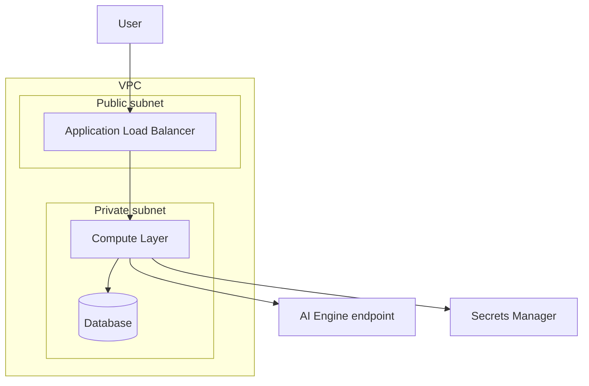
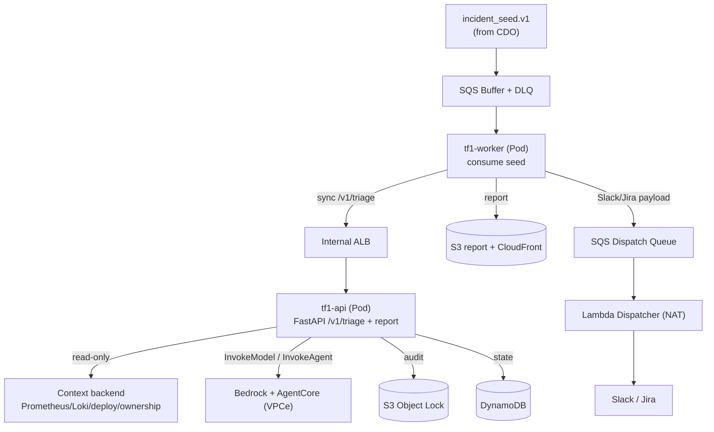

# Infrastructure Design - Task force <N> · CDO <M>

<!-- Doc owner: <Nhóm CDO>
     Status: Draft (W11 T3-T4) → Final (W11 T6 Pack #1) → Updated (W12 T4 Pack #2)
     Word target: 1500-2500 từ -->

## 1. Architecture diagram (Owner: Tiến)



*Caption: <giải thích flow + tại sao layout này>*

## 2. Component table (Owner: Tiến)

| Component | AWS Service | Reason | Cost note |
|---|---|---|---|
| Compute | <Lambda / Fargate / EKS> | <why> | $X |
| API entry | <API GW / ALB> | <why> | $X |
| Database | <DynamoDB / RDS / Aurora> | <why> | $X |
| Storage | <S3 + tier> | <why> | $X |
| Event bus | <EventBridge / Kinesis / SQS> | <why> | $X |
| Observability | <CloudWatch / Grafana> | <why> | $X |

## 3. Differentiation angle deep-dive (Owner: Tiến)

### 3.1 Why this angle?

<!-- Tại sao chọn serverless-first / K8s-heavy / managed-services / hybrid? -->

### 3.2 Vượt trội ở đâu (số liệu)

| Axis | My number | Competing angle estimate |
|---|---|---|
| Cost / tenant / month | $X | $Y |
| P99 latency | Xms | Yms |
| Ops overhead (hr/week) | X | Y |
| Time to onboard tenant | X min | Y min |

### 3.3 Weakness chấp nhận

<!-- Honest về trade-off. Reviewer thích honesty hơn là "everything is great" -->

## 4. Multi-tenant approach (Owner: Tiến)

### 4.1 Tenant model

- **Tenant ID format**: UUID v4
- **Header**: `X-Tenant-Id` mandatory all API calls
- **Subscription tiers**: basic / pro / enterprise (impact: quota, feature flags)

### 4.2 Isolation pattern

- **Data isolation**: <silo (per-tenant DB) / pool (shared with row-level) / bridge (hybrid)> - justify
- **Compute isolation**: <shared / per-tenant container / per-tenant account>
- **Why this pattern**: <cost vs isolation strength trade-off>

### 4.3 Tenant onboarding flow

```
1. POST /platform/v1/tenants (tenant_name, contact, tier)
2. IaC trigger (Terraform module or Step Function)
3. Provision: IAM role + namespace + DB schema + initial config
4. Smoke test
5. Webhook callback: tenant ready (< 30 min total)
```

### 4.4 Noisy neighbor mitigation

- **Per-tenant quota**: <vd 1000 req/min / tenant>
- **Rate limiting**: API Gateway usage plan / custom Lambda
- **Resource reservation**: <vd dedicated Fargate task for enterprise tier>

## 5. Alternatives considered (Owner: Tiến)

### 5.1 Compute layer

- **Option A**: Lambda + API GW - Pros: cost-tight, ops-light · Cons: cold start, 15min limit
- **Option B**: ECS Fargate + ALB - Pros: longer runtime, predictable latency · Cons: higher fixed cost
- ✅ **Chosen**: ... - Reason: ...

### 5.2 Database

- **Option A**: ... 
- **Option B**: ...
- ✅ **Chosen**: ...

## 6. Scaling strategy (Owner: Tiến)

- **Vertical**: <CPU/memory bump triggers>
- **Horizontal**: <auto-scaling rules>
- **Triggers**: target CPU 70% / request count / queue depth

## 7. Failure modes + recovery (Owner: Tiến)

| Failure | Detection | Recovery | RTO | RPO |
|---|---|---|---|---|
| Single task crash | ECS health check | Auto-restart | < 60s | 0 |
| AZ outage | CloudWatch alarm | Multi-AZ failover | < 5min | < 1min |
| DB primary fail | RDS event | Read replica promotion | < 5min | < 1min |
| Region outage | External monitor | Manual region switch (post-capstone) | TBD | TBD |

## 8. AI Engine Runtime Module (Owner: Thi)

<!-- Scope: hosting + runtime của AI Engine trên EKS (KAN-203/204/205).
     Engine logic/app do AI team own; phần này chỉ cover infra host + deploy + scale + tích hợp. -->

### 8.1 Scope & boundary

Module này chịu trách nhiệm **host AI Engine của AI team trên Amazon EKS**, không sở hữu logic RCA/prompt (thuộc AI team). Phạm vi:

- **KAN-203** Containerize + sign image engine.
- **KAN-204** Deploy engine lên EKS qua GitOps.
- **KAN-205** Auto scaling engine theo tải.

Engine chạy **private hoàn toàn** (no internet route); mọi egress đi qua VPC Endpoint, riêng SaaS (Slack/Jira) qua Lambda Dispatcher + NAT (đường ngoại lệ).

### 8.2 Architecture



*Caption: Engine gồm 2 Deployment (tf1-api + tf1-worker) trên EKS. Worker consume incident_seed từ buffer, gọi tf1-api `/v1/triage` đồng bộ qua Internal ALB, engine query context read-only + Bedrock/AgentCore, ghi audit immutable, rồi đẩy payload Slack/Jira ra Dispatch Queue cho Lambda Dispatcher gửi đi.*

### 8.3 Components & ownership

| Component | Service | Vai trò trong module | Owner |
|---|---|---|---|
| Engine compute | EKS managed node group | host tf1-api + tf1-worker | CDO |
| API entry | Internal ALB (private, TLS 1.2+, 443→8080) | sync `/v1/triage` | CDO |
| Image registry | ECR private | image Cosign-signed | CDO |
| Engine app | container (FastAPI + worker) | logic RCA/triage | AI team |
| Secrets inject | Secrets Manager + ESO | Bedrock/AgentCore creds | CDO |
| Audit | S3 Object Lock | log mọi AI decision (immutable) | CDO |

### 8.4 Build & supply-chain (KAN-203)

Pipeline đóng gói engine của AI team thành image an toàn:

`Dockerfile (multi-stage, distroless, non-root, EXPOSE 8080)` → `docker build` → `Trivy scan (fail on HIGH/CRITICAL)` → `Cosign sign` → `push ECR private` → `policy-controller verify chữ ký trước khi pod chạy`.

→ Không image nào chạy mà chưa quét lỗ hổng + chưa ký. Tận dụng stack từ lab `aws-sercurity`.

### 8.5 Deploy on EKS (KAN-204)

- Deploy qua **ArgoCD (app-of-apps, GitOps)** + **Argo Rollouts** canary 10→50→100%, auto-rollback on abort.
- **2 Deployment** namespace-per-tenant:
  - `tf1-api` (FastAPI): expose `/v1/triage` + report API, readiness/liveness `/healthz:8080`.
  - `tf1-worker`: consume incident_seed, gọi tf1-api nội bộ (sync), persist + audit, emit ticket/Slack payload.
- **IRSA least-privilege** (scoped ARN): `bedrock:InvokeModel`, `agentcore:InvokeAgent`, `secretsmanager:GetSecretValue`, `s3:PutObject`, `dynamodb:*` (table riêng).
- **In-cluster security:** Gatekeeper (OPA: block root, required resources, deny hostNetwork, max replicas), RBAC, NetworkPolicy deny-all, Pod Security `restricted`.

### 8.6 Auto scaling (KAN-205)

- **HPA**: Policy 1 — CPU 70%; Policy 2 — custom metric ALB request/pod = 100 (qua Prometheus Adapter). Min 2 / Max 6 pods (theo `deployment-contract.md:45`).
- **Cluster Autoscaler**: thêm/bớt node khi pod pending. Min 2 / Max 10 nodes.
- **SQS Buffer** đệm alert bursty trong lúc HPA kịp scale.

### 8.7 AI endpoint integration

- Endpoint: **`POST /v1/triage`** (sync) + **`GET /v1/reports`** + **`GET /v1/reports/{id}`**.
- Input: `incident_seed.v1` (lightweight — không chứa full metrics/logs).
- Output: classification, severity, confidence, suspected_root_cause, recommended_actions, anomaly_evidence, investigation_summary, audit_id, Slack/Jira payload, report URL.
- SLA: engine gọi **đồng bộ qua Internal ALB**, p99 < 2s (theo `ai-api-contract.md:207`). SQS chỉ buffer intake/dispatch, **không** nằm trong request path sync.

### 8.8 Context access (read-only, CDO-exposed)

Engine **tự lấy context** (không nhận full telemetry trong seed). CDO expose read-only:

- Metrics (Prometheus-compatible, delay < 60s), Logs (Loki-compatible, delay < 120s), Deploy metadata, Ownership/runbook mapping.
- Mọi query **scope theo `tenant_id / environment / service / time-window`**, bounded p95 < 2s.

### 8.9 Egress & network model

- Engine **no internet route**. AWS service đi qua VPC Endpoint: Bedrock, AgentCore, Secrets Manager, SQS, CloudWatch Logs, ECR (api/dkr), STS (Interface); S3, DynamoDB (Gateway).
- SaaS (Slack/Jira) **không gọi trực tiếp từ engine** — engine emit payload → SQS Dispatch Queue → Lambda Dispatcher (có NAT) → Slack/Jira. `SLACK_WEBHOOK_URL` giữ ở dispatcher, không ở engine.

### 8.10 Secrets

Inject qua **ESO** (External Secrets Operator) từ Secrets Manager → K8s Secret. No hardcode, no `valueFrom` tĩnh. Engine giữ: Bedrock/AgentCore credentials. (Webhook Slack thuộc dispatcher.)

### 8.11 Failure modes & resilience

| Failure | Detection | Recovery |
|---|---|---|
| Pod crash | liveness probe | K8s restart (<60s) |
| Node fail | node health | Cluster Autoscaler thay node |
| AI 503/timeout | app metric | fallback rule-based alert (ensure availability) |
| Bedrock throttle | app metric | exp backoff → DLQ |
| Malformed seed | schema validate | DLQ, no silent drop |
| Alert spike | queue depth | SQS buffer + HPA |

### 8.12 Acceptance mapping (AI team checklist)

- Latency incident → engine trả latency report ✓
- Critical service-down → service-down actions ✓
- Noisy alert → observe / human-review only ✓
- Invalid seed → DLQ/error path, no silent drop ✓
- Context chỉ trong scope tenant/service/time-window ✓
- `/v1/triage` direct sample requests chạy ✓

## Related documents

- [`03_security_design.md`](03_security_design.md) - Network Security §4 + IAM §5 + Data Security §6 expand on infra concerns
- [`04_deployment_design.md`](04_deployment_design.md) - IaC + CI/CD + GitOps cho infra này
- [`05_cost_analysis.md`](05_cost_analysis.md) - Per-tenant cost model based on this infra
- [`08_adrs.md`](08_adrs.md) - Infra architecture decisions
