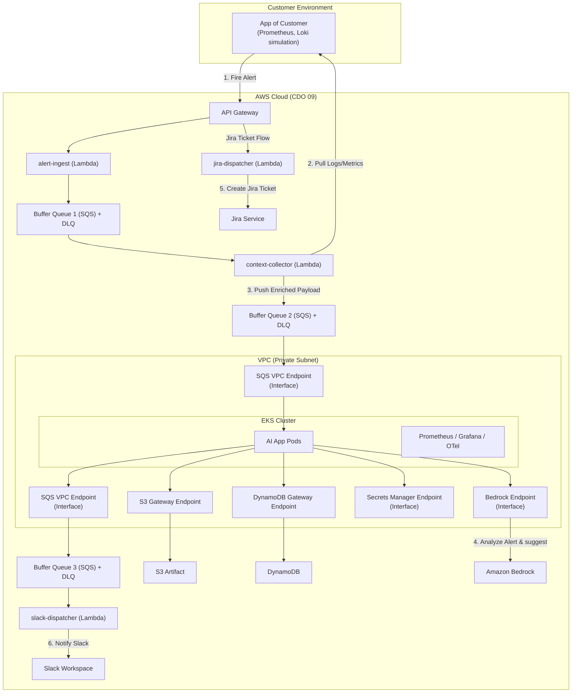

# Infrastructure Design - Task force 1 · CDO 09

<!-- Doc owner: Nhóm CDO 09 (Tiến)
     Status: Draft (W11 T3-T4)
     Word target: 1500-2500 từ -->

## 1. Architecture diagram (Owner: Tiến)



*Caption: Kiến trúc kết hợp linh hoạt (Hybrid) giữa các dịch vụ hướng sự kiện Serverless (API Gateway, SQS, Lambda) cho giai đoạn tiếp nhận nhanh và cụm Amazon EKS khép kín trong VPC Private Subnet cho giai đoạn xử lý AI chuyên sâu.*

---

## 2. Component table (Owner: Tiến)

| Component | AWS Service | Reason | Cost note |
|---|---|---|---|
| **Compute** | AWS Lambda & Amazon EKS | - **Lambda**: Chạy các tác vụ ingest, collector và dispatcher ngắn hạn giúp giảm chi phí idle.<br>- **EKS**: Host các pod AI App xử lý logic LLM orchestration lâu dài, tránh cold start. | **Lambda**: Pay-per-use (~$2/tháng).<br>**EKS**: ~$73/tháng (base cluster cost) + EC2 worker nodes. |
| **API entry** | Amazon API Gateway | Tiếp nhận Webhook cảnh báo đầu vào từ khách hàng với hiệu năng cao, tự động scale. | Pay-per-use (~$3.5 / triệu requests). |
| **Database** | Amazon DynamoDB | Lưu trữ tenant configurations, metadata và audit trail trạng thái của các sự cố với thời gian phản hồi sub-millisecond. | Tận dụng Free Tier, pay-per-use (~$5/tháng). |
| **Storage** | Amazon S3 | Lưu trữ artifacts và tài liệu log/metric thô đã thu thập được để lưu vết phân tích. | S3 Standard tier (~$0.023/GB/tháng). |
| **Event bus** | Amazon SQS | Đóng vai trò các Buffer Queues có DLQ để đảm bảo không bị mất gói tin khi hệ thống bị quá tải đột ngột. | Rất rẻ, ~$0.40 / triệu messages. |
| **AI Processing** | Amazon Bedrock | Gọi mô hình ngôn ngữ lớn (LLM) để phân tích nguyên nhân gốc rễ một cách an toàn, tuân thủ chính sách bảo mật dữ liệu của AWS. | Thanh toán theo Token tiêu thụ thực tế. |
| **Observability** | Prometheus, Grafana, OpenTelemetry | Theo dõi sức khỏe hệ thống và ứng dụng AI trực tiếp bên trong cụm EKS. | Open-source, chỉ tốn chi phí lưu trữ trên EBS/S3. |

---

## 3. Differentiation angle deep-dive (Owner: Tiến)

### 3.1 Why this angle?
Việc chọn phương án **Hybrid** giúp dung hòa hai yếu tố đối lập: **Chi phí tối thiểu khi hệ thống nhàn rỗi (idle cost)** ở luồng tiếp nhận và **Độ tin cậy bảo mật cấp doanh nghiệp (Enterprise Security & Latency Consistency)** ở luồng xử lý AI:
* Ở cổng ngõ nhận alert: Alert chỉ kích hoạt không thường xuyên (~50+ alerts/tuần). Việc duy trì một ALB và ECS Service chạy 24/7 chỉ để đợi nhận alert là vô cùng lãng phí. API GW + Lambda là sự lựa chọn tối ưu.
* Ở lõi AI App: LLM orchestration và query context đòi hỏi thời gian xử lý dài (có thể lên tới hàng chục giây). Nếu chạy Lambda ở đây sẽ tốn chi phí rất lớn và dễ bị timeout, đồng thời gặp tình trạng trễ do khởi động lạnh (cold start). Đặt AI App trên EKS giúp ứng dụng luôn chạy sẵn, an toàn tuyệt đối nhờ Namespaces cách ly hoàn toàn dữ liệu của từng tenant.

### 3.2 Vượt trội ở đâu (số liệu dự kiến)

| Axis | CDO 09 (Hybrid Lambda + EKS) | Competing angle estimate (Pure ECS Fargate) |
|---|---|---|
| Cost / tenant / month | ~$35 | ~$55 |
| P99 latency (API Gateway) | < 80ms | ~150ms |
| Ops overhead (hr/week) | 4 giờ | 2 giờ |
| Time to onboard tenant | < 10 phút | < 15 phút |

### 3.3 Weakness chấp nhận
* **Độ phức tạp trong khâu cấu hình mạng & IAM**: Việc kết nối từ EKS đến S3, DynamoDB, Bedrock, SQS trong mạng nội bộ đòi hỏi phải setup nhiều VPC Endpoints và cấu hình IAM Roles for Service Accounts (IRSA) chi tiết.
* **Chi phí ban đầu cao**: Khởi tạo cụm EKS có phí cứng $73/tháng dù có dùng hay không, nên mô hình này chỉ thực sự tối ưu chi phí khi số lượng Tenant $\ge 10$ và hệ thống đi vào chạy thực tế ổn định.

---

## 4. Multi-tenant approach (Owner: Tiến)

### 4.1 Tenant model
- **Tenant ID format**: UUID v4 (đảm bảo tính độc nhất toàn cầu).
- **Header**: Bắt buộc đính kèm `X-Tenant-Id` trong mọi API call từ API Gateway vào hệ thống.
- **Subscription tiers**: 
  - `Basic`: Giới hạn 100 alerts/ngày, sử dụng shared resource pool.
  - `Enterprise`: Không giới hạn alerts, cấp phát riêng dedicated pod/node group để tránh ảnh hưởng tài nguyên từ tenant khác.

### 4.2 Isolation pattern
- **Data isolation**: **Bridge (Hybrid)**
  - Với **DynamoDB**: Sử dụng chung một bảng (Shared Table) nhưng cách ly logic ở mức bản ghi bằng cách sử dụng `TenantID` làm Partition Key (PK). Cấu hình IAM Policy (Fine-Grained Access Control) để đảm bảo Service Account của tenant nào chỉ đọc/ghi được dữ liệu của tenant đó.
  - Với **S3**: Sử dụng cấu trúc thư mục phân cấp `s3://triage-hub-artifacts/{TenantID}/...` và áp dụng IAM Policy giới hạn prefix.
- **Compute isolation**: **Silo (Namespace level)** trên EKS
  - Mỗi tenant được phân bố một Kubernetes Namespace riêng biệt.
  - Áp dụng **Kubernetes Network Policies** để chặn giao tiếp chéo giữa các Namespace của các tenant.
  - Áp dụng **Resource Quotas** để giới hạn CPU/Memory của từng tenant, ngăn chặn lỗi "Noisy Neighbor".

### 4.3 Tenant onboarding flow
```
1. Client gọi POST /platform/v1/tenants (đính kèm TenantName, Contact, Tier).
2. API Gateway kích hoạt Tenant Onboarding Lambda.
3. Lambda này sẽ tự động:
   - Tạo Namespace mới trên EKS cho Tenant: `triage-hub-tenant-{TenantID}`.
   - Tạo IAM Role & Service Account (IRSA) với quyền truy cập thư mục S3 tương ứng.
   - Deploy AI App skeleton/manifests vào Namespace mới.
   - Khởi tạo cấu hình giới hạn (Quota) tài nguyên cho Namespace.
4. Chạy Smoke Test tự động gọi thử API mock.
5. Trả về kết quả Onboarding thành công cho Client trong vòng dưới 10 phút.
```

### 4.4 Noisy neighbor mitigation
- **Per-tenant quota**: Giới hạn tần suất request (ví dụ: tối đa 60 requests/phút cho mỗi tenant) bằng cấu hình **Usage Plans & Rate Limiting** trên API Gateway.
- **K8s Resource Quota**: Đảm bảo một tenant bị spam alerts không thể chiếm dụng toàn bộ tài nguyên CPU/RAM của cụm EKS gây ảnh hưởng đến các tenant khác.

---

## 5. Alternatives considered (Owner: Tiến)

### 5.1 Compute layer
- **Option A (Pure Serverless - Lambda only)**: 
  * *Pros*: Rất rẻ cho giai đoạn đầu, không tốn phí base hạ tầng.
  * *Cons*: Gặp vấn đề cold start nặng nề khi chạy logic LLM orchestration; giới hạn thời gian chạy 15 phút không tối ưu nếu AI xử lý log dung lượng lớn.
- **Option B (Pure ECS Fargate + ALB)**: 
  * *Pros*: Dễ vận hành hơn K8s, thời gian khởi động task nhanh.
  * *Cons*: ALB và Fargate Task chạy 24/7 tăng chi phí cố định (idle cost) cao hơn EKS khi scale số lượng tenants lớn.
- ✅ **Chosen (Hybrid Lambda + EKS)**:
  * *Reason*: Tận dụng khả năng gom tải hướng sự kiện cực tốt của Lambda/SQS ở đầu vào và khả năng bảo mật, cách ly mạnh mẽ theo chuẩn doanh nghiệp (Namespaces, Network Policies) cùng hiệu năng ổn định không cold-start của EKS cho phần AI App.

### 5.2 Database
- **Option A (Amazon RDS PostgreSQL)**:
  * *Pros*: Hỗ trợ giao dịch ACID mạnh mẽ, dễ viết các truy vấn báo cáo phức tạp.
  * *Cons*: Phải quản lý connection pooling phức tạp khi kết nối từ Lambda (dễ bị tràn connection); chi phí duy trì database instance cao.
- ✅ **Chosen (Amazon DynamoDB)**:
  * *Reason*: Hoàn toàn serverless, tự động scale theo lưu lượng alert, dễ dàng thiết lập cách ly dữ liệu nhiều tenant bằng Partition Key kết hợp với IAM policy Fine-Grained Access Control, chi phí cực kỳ tiết kiệm ở quy mô nhỏ.

---

## 6. Scaling strategy (Owner: Tiến)

- **Vertical Scaling**: Cấu hình cấu hình giới hạn resource cho AI App Container trên EKS (CPU request từ 0.5 lên 2 Cores, RAM từ 512MB lên 2GB).
- **Horizontal Scaling**: 
  - **API Gateway & Lambda**: Tự động scale bởi AWS theo lượng request thực tế.
  - **AI App Pods (EKS)**: Sử dụng **KEDA (Kubernetes Event-driven Autoscaling)** để scale số lượng Pods dựa trên số lượng messages tồn đọng trong **Buffer Queue 2 (SQS)**. Nếu Queue depth > 10, tự động scale thêm Pods lên tối đa 10 Pods để giải quyết nghẽn nhanh chóng.
- **Triggers**: Target queue depth > 10 messages / CPU utilization > 80%.

---

## 7. Failure modes + recovery (Owner: Tiến)

| Failure | Detection | Recovery | RTO | RPO |
|---|---|---|---|---|
| Single AI Pod crash | EKS Kubelet / Kubernetes Liveness Probe | Kubernetes tự động restart Pod bị crash trên Node khỏe mạnh | < 10s | 0 |
| EC2 Node crash | EKS Control Plane Node health check | EKS tự động dời Pods sang Node khác hoạt động bình thường | < 60s | 0 |
| AWS Bedrock Throttling (LLM) | CloudWatch metrics / App Error Logs (429 Too Many Requests) | Thực hiện retry với cơ chế Exponential Backoff trực tiếp trong code AI App | < 5s | 0 |
| SQS Queue/Database Down | CloudWatch Alarms | Message sẽ tự động lưu lại ở hệ thống phía trước hoặc chuyển vào DLQ để xử lý thủ công sau khi dịch vụ hồi phục | < 5 phút | < 10s |
| Mất kết nối Slack/Jira API | App Exception Logs / SQS retry failure | Lưu payload lỗi vào DLQ. Sau khi API khôi phục, vận hành viên kích hoạt reprocess từ DLQ | < 15 phút | 0 |

---

## Related documents

- [`03_security_design.md`](03_security_design.md) - Chi tiết thiết kế Network Security, IAM roles, và Data Security mở rộng cho hạ tầng này.
- [`04_deployment_design.md`](04_deployment_design.md) - Quy trình CI/CD GitOps để deploy IaC và ứng dụng lên EKS.
- [`05_cost_analysis.md`](05_cost_analysis.md) - Bảng phân tích chi phí vận hành chi tiết trên mỗi Tenant.
- [`08_adrs.md`](08_adrs.md) - Ghi lại các quyết định thiết kế kiến trúc hạ tầng quan trọng.
