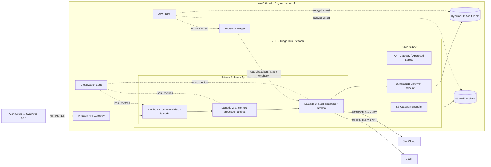

# Security Design - TF1 Triage Hub · CDO-09

<!--
Doc owner: CDO-09 - Security & Compliance - Nguyễn Tấn Huy
Status: Draft W11 → Final W11/W12
Scope: DevOps-level security for TF1 Triage Hub platform.
Focus: Network security, IAM, secrets, encryption, audit trail, compliance touchpoints.
-->

> File này là bản report Security Design cho phần được giao của Huy trong TF1 - Triage Hub.  
> Report tập trung chứng minh 3 task chính: **KAN-218 Tenant Isolation**, **KAN-219 Encryption**, **KAN-220 End-to-End Audit Trail**.

---

## 0. Security Scope for Assigned Jira Tasks

| Jira Task | Security Area | Design Coverage |
|---|---|---|
| KAN-218 | Multi-Tenant Isolation | Validate `tenant_id`, reject invalid tenant, tenant-scoped data model, no cross-tenant access |
| KAN-219 | Encryption for Data at Rest and In Transit | HTTPS/TLS, KMS encryption, Secrets Manager, no hardcoded secrets |
| KAN-220 | End-to-End Audit Trail | Audit AI decisions, Jira activities, Slack activities, incident history |

### Mục tiêu bảo mật

Khi một alert đi vào Triage Hub, hệ thống phải đảm bảo:

1. Alert bắt buộc có `tenant_id`.
2. Dữ liệu của tenant này không được lẫn với tenant khác.
3. Secret như Jira token, Slack webhook, AI credential không được hardcode.
4. Dữ liệu nhạy cảm được mã hóa khi lưu trữ và khi truyền qua mạng.
5. Mọi bước quan trọng từ alert đến Jira/Slack đều có audit trail để truy vết.

---

## 1. Network Security (Owner: Huy)

### 1.1 Network Diagram



### 1.2 Network Flow

Luồng chính:

```text
Alert Source
→ API Gateway
→ tenant-validator-lambda
→ ai-context-processor-lambda
→ audit-dispatcher-lambda
→ Jira / Slack
```

Luồng audit:

```text
audit-dispatcher-lambda
→ DynamoDB Gateway Endpoint
→ DynamoDB Audit Table
→ S3 Gateway Endpoint
→ S3 Audit Archive
```

Luồng secret:

```text
Secrets Manager
→ audit-dispatcher-lambda
```

Luồng encryption:

```text
KMS
→ Secrets Manager
KMS
→ DynamoDB
KMS
→ S3
```

### 1.3 Network Security Controls

| Control | Design |
|---|---|
| Public entrypoint | API Gateway nhận alert qua HTTPS/TLS |
| Private compute | Lambda xử lý logic nằm trong private subnet |
| Private AWS service access | DynamoDB và S3 được truy cập qua Gateway VPC Endpoint |
| External SaaS egress | Jira/Slack được gọi qua NAT Gateway hoặc approved outbound path |
| No direct public Lambda inbound | Lambda không expose public endpoint trực tiếp |
| Observability | CloudWatch Logs ghi log cho từng Lambda |

### 1.4 Security Groups / Network Boundary

| Component | Inbound | Outbound | Note |
|---|---|---|---|
| API Gateway | Public HTTPS | Invoke Lambda | AWS managed entrypoint |
| Lambda Security Group | None public inbound | HTTPS to VPC Endpoints, NAT Gateway, Secrets Manager/Bedrock if required | Không public trực tiếp |
| VPC Endpoints | 443 từ Lambda SG | AWS managed services | Dùng cho DynamoDB/S3/Secrets/Bedrock nếu cần |
| NAT Gateway | N/A | HTTPS đến Jira/Slack | Chỉ dùng cho external SaaS egress |

### 1.5 VPC Endpoints

| Endpoint | Type | Purpose |
|---|---|---|
| DynamoDB Gateway Endpoint | Gateway Endpoint | Cho Lambda ghi audit record vào DynamoDB qua private AWS network |
| S3 Gateway Endpoint | Gateway Endpoint | Cho Lambda archive audit sang S3 qua private AWS network |
| Secrets Manager Endpoint | Interface Endpoint | Cho Lambda đọc secret qua private AWS network nếu cấu hình |
| Bedrock Runtime Endpoint | Interface Endpoint | Cho Lambda gọi AI/Bedrock qua private AWS network nếu khả dụng |

---

## 2. IAM & Access Control (Owner: Huy)

### 2.1 Service Roles

| Role | Used by | Permissions |
|---|---|---|
| `tf1-cdo09-tenant-validator-role` | `tenant-validator-lambda` | Ghi validation audit event, ghi CloudWatch Logs, đọc tenant config nếu có |
| `tf1-cdo09-ai-context-processor-role` | `ai-context-processor-lambda` | Đọc context theo tenant, gọi AI/Bedrock endpoint, ghi CloudWatch Logs |
| `tf1-cdo09-audit-dispatcher-role` | `audit-dispatcher-lambda` | `dynamodb:PutItem`, `s3:PutObject`, `secretsmanager:GetSecretValue`, ghi CloudWatch Logs |
| `tf1-cdo09-deploy-role` | GitHub Actions / CI-CD | Deploy API Gateway, Lambda, IaC resources; không dùng quyền admin rộng |
| `tf1-cdo09-readonly-role` | Mentor/debug | Đọc CloudWatch Logs, describe resource, không có quyền chỉnh sửa |

### 2.2 Least Privilege Rules

- Không dùng policy dạng `*:*`.
- Không cấp quyền `iam:*` cho deploy role nếu không cần.
- Lambda chỉ được đọc secret đúng mục đích.
- `audit-dispatcher-lambda` chỉ được ghi audit record, không được xóa audit table.
- S3 audit bucket nên hạn chế `DeleteObject`.
- DynamoDB access nên giới hạn trên audit table của TF1 CDO-09.
- KMS access chỉ cấp cho role cần mã hóa/giải mã dữ liệu.

### 2.3 K8s RBAC

N/A - Thiết kế hiện tại của phần Security & Compliance dùng hướng serverless với API Gateway, Lambda, DynamoDB và S3, không dùng EKS/Kubernetes.

### 2.4 Cross-account Access

Hiện tại chưa xác nhận có cross-account access. Nếu task force dùng nhiều AWS account, pattern đề xuất là:

```text
CI/CD account
→ AssumeRole
→ Capstone workload account
```

Role được assume phải giới hạn quyền deploy đúng resource của TF1 CDO-09.

---

## 3. Secrets Management (Owner: Huy)

### 3.1 Secrets Inventory

| Secret | Storage | Rotation | Accessed by |
|---|---|---|---|
| `JIRA_API_TOKEN` | Secrets Manager `tf1/cdo09/jira/api-token` | Manual for capstone | `audit-dispatcher-lambda` |
| `SLACK_WEBHOOK_URL` | Secrets Manager `tf1/cdo09/slack/webhook` | Manual for capstone | `audit-dispatcher-lambda` |
| `AI_ENDPOINT_AUTH_TOKEN` | Secrets Manager `tf1/cdo09/ai/endpoint-token` | Manual for capstone | `ai-context-processor-lambda` |
| `BEDROCK_ACCESS_CONFIG` | Prefer IAM role / Secrets Manager if required | Manual for capstone | `ai-context-processor-lambda` |

### 3.2 Inject Pattern

- Lambda đọc secret runtime bằng `secretsmanager:GetSecretValue`.
- Không đưa secret trực tiếp vào source code.
- Không commit `.env`, `*.tfvars`, token file hoặc webhook URL lên GitHub.
- Nếu có local test, dùng `.env.example` thay vì `.env` thật.
- Nếu CI/CD có secret scan, dùng gitleaks hoặc trufflehog để phát hiện secret bị commit nhầm.

### 3.3 Anti-leak Controls

| Risk | Control |
|---|---|
| Commit nhầm token lên GitHub | `.gitignore`, secret scanning |
| Log in ra Jira token/Slack webhook | Redact sensitive pattern trước khi log |
| Lambda đọc quá nhiều secret | IAM policy giới hạn theo secret ARN |
| Secret bị dùng sai môi trường | Prefix rõ ràng theo `tf1/cdo09/...` |
| Credential nằm trong container/build artifact | Không bake secret vào image/package |

---

## 4. Encryption (Owner: Huy)

### 4.1 Encryption at Rest

| Data | Storage | KMS key | Notes |
|---|---|---|---|
| Incident audit record | DynamoDB `tf1-cdo09-audit-table` | AWS-managed KMS hoặc CMK | Partition key scoped by tenant |
| Long-term audit archive | S3 `tf1-cdo09-audit-archive` | SSE-KMS / CMK | Prefix theo tenant_id |
| Jira token | Secrets Manager | KMS | Không hardcode |
| Slack webhook | Secrets Manager | KMS | Không hardcode |
| AI endpoint token | Secrets Manager | KMS | Không hardcode |
| Lambda logs | CloudWatch Logs | AWS-managed encryption hoặc CMK | Retention policy cần được cấu hình |

### 4.2 Encryption in Transit

| Traffic | Protection |
|---|---|
| Alert Source → API Gateway | HTTPS/TLS |
| Lambda → AI/Bedrock endpoint | HTTPS/TLS |
| Lambda → Jira Cloud | HTTPS/TLS qua NAT Gateway hoặc approved egress |
| Lambda → Slack Webhook | HTTPS/TLS qua NAT Gateway hoặc approved egress |
| Lambda → DynamoDB/S3 | AWS private network qua VPC Endpoint nếu cấu hình |
| Lambda → Secrets Manager | HTTPS/TLS / Interface Endpoint nếu cấu hình |

### 4.3 Key Management

- KMS key dùng cho S3 audit archive và dữ liệu audit nhạy cảm.
- KMS key rotation bật nếu dùng customer-managed key.
- Key policy chỉ cho phép role của TF1 CDO-09 sử dụng.
- KMS usage nên được audit qua CloudTrail.
- Không cấp quyền `kms:*` cho Lambda nếu không cần.

---

## 5. Audit Logging (Owner: Huy)

### 5.1 What to Log

Audit trail cần ghi lại đầy đủ vòng đời incident:

| Event type | Description |
|---|---|
| `ALERT_RECEIVED` | Alert đi vào hệ thống qua API Gateway |
| `TENANT_VALIDATED` | `tenant_id` hợp lệ |
| `TENANT_REJECTED` | Request bị reject do thiếu/sai `tenant_id` |
| `CONTEXT_GATHERED` | Đã gom logs, metrics, deployment metadata |
| `AI_DECISION_CREATED` | AI tạo diagnosis, confidence score, suggested action |
| `JIRA_TICKET_CREATED` | Jira ticket được tạo và gắn với incident |
| `SLACK_NOTIFICATION_SENT` | Slack notification được gửi đến team owner |
| `ACKNOWLEDGED` | Engineer acknowledge incident |

### 5.2 Audit Record Schema

```json
{
  "tenant_id": "tenant-a",
  "incident_id": "inc-001",
  "trace_id": "trace-123",
  "event_type": "AI_DECISION_CREATED",
  "ai_decision_id": "decision-001",
  "confidence_score": 0.86,
  "jira_ticket_id": "KAN-999",
  "slack_message_id": "slack-123",
  "timestamp": "2026-06-24T10:00:00Z"
}
```

### 5.3 Storage + Retention

| Log type | Storage | Retention | Query interface |
|---|---|---|---|
| Incident audit trail | DynamoDB | During capstone demo / configurable | Query by `tenant_id` + `incident_id` |
| Long-term audit archive | S3 | 90 days demo policy | S3 prefix by tenant_id |
| Application logs | CloudWatch Logs | 14 days demo policy | Logs Insights |
| Infrastructure changes | CloudTrail | AWS default / configured | CloudTrail Console |

### 5.4 Tenant-scoped Audit Key

DynamoDB key design:

```text
PK = TENANT#<tenant_id>
SK = INCIDENT#<incident_id>#EVENT#<timestamp>
```

Example:

```text
PK = TENANT#tenant-a
SK = INCIDENT#inc-001#EVENT#2026-06-24T10:00:00Z
```

S3 archive prefix:

```text
s3://tf1-cdo09-audit-archive/tenant_id=<tenant_id>/incident_id=<incident_id>/
```

### 5.5 PII Handling

- Chỉ accept field đã định nghĩa trong telemetry contract.
- Nếu alert payload có email, phone, access token hoặc thông tin nhạy cảm, cần redact trước khi ghi audit.
- CloudWatch Logs không được chứa raw secret.
- Audit record có thể lưu input hash thay vì raw payload nếu dữ liệu quá nhạy cảm.

---

## 6. Container & K8s Security (Owner: Huy)

N/A cho thiết kế hiện tại nếu nhóm chọn serverless-first với API Gateway và Lambda.

Nếu W12 team bổ sung container/ECS/EKS, các control cần thêm:

- Image scan bằng Trivy trong CI.
- Không build image chứa credential.
- Nếu dùng EKS: Pod Security Standard restricted, NetworkPolicy deny-all default.
- Nếu dùng IRSA: service account chỉ được assume đúng IAM role cần thiết.

---

## 7. Compliance Touchpoints (Owner: Huy)

| Standard / Requirement | Relevant controls in this design |
|---|---|
| TF1 Client Requirement | Context isolation per tenant, audit trail cho mọi AI decision |
| SOC2 - Logical Access | IAM least privilege, no public Lambda inbound, tenant-scoped access |
| SOC2 - Monitoring | CloudWatch Logs, audit records, CloudTrail/KMS audit |
| GDPR Article 32 | Encryption at rest/in transit, access control, tenant isolation |
| PCI-DSS | Out of scope, no card data processed |

Document này chỉ mapping ở mức control → AWS service được dùng. Đây là capstone security design, không phải audit report enterprise đầy đủ.

---

## 8. Open Questions (Owner: Huy)

Các câu hỏi cần xác nhận thêm với PM/mentor/team:

1. Jira và Slack sẽ dùng token thật hay mock endpoint cho demo W11/W12?
2. Audit archive retention nên để 30 ngày, 90 ngày hay chỉ trong phạm vi capstone?
3. Tenant list dùng cho demo sẽ hardcode trong config, lưu trong DynamoDB hay SSM Parameter Store?
4. AI/Bedrock endpoint có yêu cầu VPC Endpoint không, hay gọi qua public HTTPS endpoint?
5. Alert payload có chứa PII không? Nếu có, field nào cần redact trước khi ghi audit?
6. Nếu `tenant_id` không hợp lệ, response chuẩn là `400 Bad Request` hay custom error code?
7. Có cần bật CloudTrail data events cho S3 audit bucket trong demo không?

---

## 9. Evidence Mapping for Jira

### KAN-218 - Multi-Tenant Isolation

Evidence file:

- `docs/reports/03_security_design.md`
- `diagrams/security-compliance.drawio` hoặc security diagram tương ứng
- Commit SHA: `<COMMIT_SHA>`
- Pull Request: `<PR_URL>`

Summary:

```text
Implemented tenant isolation design for Triage Hub. Every alert must include tenant_id. tenant-validator-lambda rejects missing or invalid tenant_id. Audit records are stored with tenant-scoped keys in DynamoDB and tenant-based prefixes in S3 to prevent cross-tenant access.
```

### KAN-219 - Encryption

Evidence file:

- `docs/reports/03_security_design.md`
- `diagrams/security-compliance.drawio` hoặc security diagram tương ứng
- Commit SHA: `<COMMIT_SHA>`
- Pull Request: `<PR_URL>`

Summary:

```text
Implemented encryption design for data at rest and in transit. API Gateway, AI endpoint, Jira and Slack calls use HTTPS/TLS. DynamoDB, S3 and Secrets Manager are encrypted using KMS or AWS-managed encryption. Jira token and Slack webhook are stored in Secrets Manager and must not be hardcoded.
```

### KAN-220 - End-to-End Audit Trail

Evidence file:

- `docs/reports/03_security_design.md`
- `diagrams/security-compliance.drawio` hoặc security diagram tương ứng
- Commit SHA: `<COMMIT_SHA>`
- Pull Request: `<PR_URL>`

Summary:

```text
Implemented end-to-end audit trail design. Audit Writer records ALERT_RECEIVED, TENANT_VALIDATED, AI_DECISION_CREATED, JIRA_TICKET_CREATED, SLACK_NOTIFICATION_SENT and ACKNOWLEDGED events. Audit records include tenant_id, incident_id, trace_id, confidence_score, ticket id and timestamp, stored in DynamoDB and archived to S3.
```

---

## 9. AI Engine Runtime Security — EKS angle (KAN-203 / KAN-204) (Owner: Thi)

<!-- Scope: security baseline cho AI Engine chạy trên EKS. Bổ sung cho §1/§2/§6, không ghi đè.
     Ground truth: ADR-003 (EKS angle), 02_infra_design.md §8, contracts của AI team. -->

> Engine chạy **private hoàn toàn, no internet route**. Mọi egress qua VPC Endpoint; SaaS (Slack/Jira) chỉ ra ngoài qua Lambda Dispatcher + NAT (đường ngoại lệ).

### 9.1 Supply-chain security (KAN-203)

Pipeline đóng gói image của AI team đảm bảo **không image nào chạy mà chưa quét + chưa ký**:

| Control | Tool | Gate |
|---|---|---|
| Image scan | Trivy | **fail-on HIGH/CRITICAL** trong CI |
| Image signing | Cosign (Sigstore keyless) | sign sau khi scan pass |
| Registry | ECR private, `IMMUTABLE` tag, `scan_on_push` | không overwrite tag |
| Admission verify | Sigstore `policy-controller` / Cluster Image Policy | **chặn pod** nếu chữ ký không hợp lệ trước khi chạy |
| Base image | distroless, non-root, `EXPOSE 8080` | giảm attack surface |

→ Tái dùng stack từ lab `aws-sercurity`.

### 9.2 IAM — IRSA least-privilege (KAN-204)

Mỗi ServiceAccount map 1 IAM Role (IRSA) qua STS, **không** static credential trong pod:

| Permission | Resource scope | Dùng bởi |
|---|---|---|
| `bedrock:InvokeModel` | specific model ARN | tf1-api (khi `AI_MODE=hybrid`) |
| `secretsmanager:GetSecretValue` | `tf1/ai-engine/*` ARN | ESO |
| `s3:PutObject` | audit bucket ARN only | tf1-api (ghi audit) |
| `dynamodb:GetItem/PutItem/Query` | state table ARN only | tf1-api/worker |

Evidence: `deployment-contract.md:61` (SERVICE_AUTH_TOKEN trong Secrets Manager), `ai-api-contract.md` (auth fallback).

### 9.3 Secrets injection — ESO (External Secrets Operator)

- Pull từ Secrets Manager qua **VPC Endpoint** → tạo K8s Secret. **No hardcode, no static `valueFrom`**.
- Engine giữ: `BEDROCK` credentials, `SERVICE_AUTH_TOKEN`.
- **`SLACK_WEBHOOK_URL` KHÔNG ở engine** — nằm ở Lambda Dispatcher (engine không có internet để gọi `hooks.slack.com`).

### 9.4 In-cluster guardrails

| Control | Cấu hình |
|---|---|
| **Gatekeeper (OPA)** | block root user, require resource limits, deny hostNetwork, max replicas |
| **RBAC** | `developer` / `sre` / `viewer` (xem §2.2) |
| **NetworkPolicy** | deny-all default + explicit ingress/egress allow |
| **Pod Security Standard** | `restricted`, enforce ở namespace level |
| **Multi-tenant isolation** | namespace-per-tenant + ResourceQuota + LimitRange |

### 9.5 Network egress model

- AWS service: **VPC Endpoint** — Bedrock, Secrets Manager, SQS, CloudWatch Logs, ECR (api/dkr), STS (Interface); S3, DynamoDB (Gateway, free).
- SaaS: engine emit payload → SQS Dispatch Queue → **Lambda Dispatcher (NAT)** → Slack/Jira. NAT **chỉ** cho dispatcher, không cho engine.

### 9.6 Audit immutability

- AI decision audit ghi vào **S3 Object Lock (Governance mode, 90 ngày, KMS-encrypted)** — immutable, khớp §5.2.
- DynamoDB **chỉ** giữ state/config/dedup/rate-limit, **không** dùng cho audit log.

---

## Related documents

- `docs/reports/02_infra_design.md` - infrastructure layout
- `docs/reports/04_deployment_design.md` - CI/CD pipeline security gates
- `docs/reports/08_adrs.md` - ADR cho security decisions
- `diagrams/security-compliance.drawio` - Security & Compliance architecture diagram

---

## Conclusion

Security design này chứng minh đủ 3 phần được giao:

1. **Tenant Isolation:** mọi alert và audit record được xử lý theo `tenant_id`, hạn chế cross-tenant access.
2. **Encryption:** dữ liệu được mã hóa khi truyền qua mạng bằng HTTPS/TLS và khi lưu trữ bằng KMS/AWS-managed encryption.
3. **Audit Trail:** mọi bước quan trọng từ alert đến AI decision, Jira ticket và Slack notification đều được ghi lại để truy vết end-to-end.

Thiết kế này phù hợp với phạm vi W11 của capstone: tài liệu rõ ràng, có thể build trong W12, không over-engineer và bám đúng scope Security & Compliance của TF1 Triage Hub.
