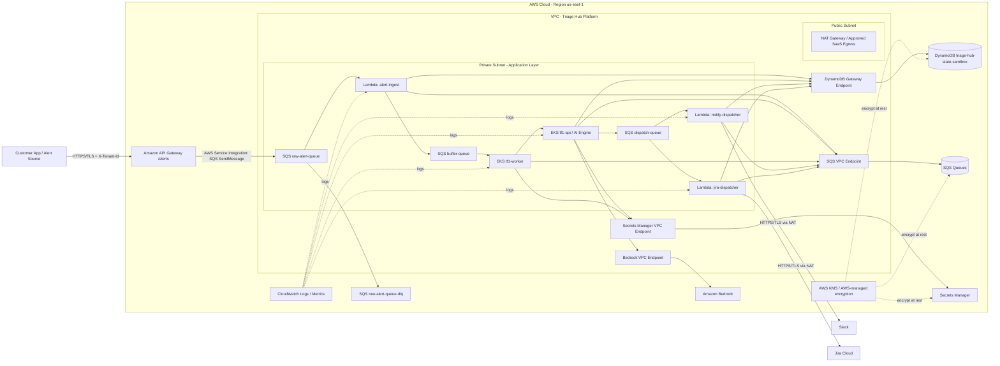

# Security Design - TF1 Triage Hub · CDO-09

<!--
Doc owner: CDO-09 - Security & Compliance - Nguyễn Tấn Huy
Status: Updated W12 - aligned with current API Gateway → SQS → Lambda → DynamoDB architecture
Scope: DevOps-level security for TF1 Triage Hub platform.
Focus: Network security, IAM, secrets, encryption, DynamoDB audit trail, queue-based alert ingestion, compliance touchpoints.
-->

> File này là bản report Security Design cho phần được giao của Huy trong TF1 - Triage Hub.  
> Report tập trung chứng minh 4 task chính: **KAN-218 Tenant Isolation**, **KAN-219 Encryption**, **KAN-220 End-to-End Audit Trail**, và **Secure Raw Alert Ingestion - API Gateway to SQS**.

---

## 0. Security Scope for Assigned Jira Tasks

| Jira Task        | Security Area                              | Design Coverage                                                                                                    |
| ---------------- | ------------------------------------------ | ------------------------------------------------------------------------------------------------------------------ |
| KAN-218          | Multi-Tenant Isolation                     | Validate `tenant_id`, reject invalid tenant, tenant-scoped DynamoDB records, no cross-tenant access                |
| KAN-219          | Encryption for Data at Rest and In Transit | API Gateway HTTPS/TLS, DynamoDB/SQS/Secrets Manager encryption, no hardcoded secrets, private AWS service access   |
| KAN-220          | End-to-End Audit Trail                     | DynamoDB-backed audit/state/idempotency/mapping for AI decisions, Jira activities, Slack activities, incident flow |
| New assigned task | Secure Raw Alert Ingestion                 | API Gateway `/alerts` → SQS `raw-alert-queue` → `alert-ingest` Lambda, DLQ, IAM least privilege, message attributes |

### Mục tiêu bảo mật

Khi một alert đi vào Triage Hub, hệ thống phải đảm bảo:

1. Alert bắt buộc có `tenant_id`.
2. Dữ liệu của tenant này không được lẫn với tenant khác.
3. Secret như Jira token, Slack webhook, service token, AI credential không được hardcode.
4. Dữ liệu nhạy cảm được mã hóa khi lưu trữ và khi truyền qua mạng.
5. Mọi bước quan trọng từ alert đến AI diagnosis, Jira/Slack đều có audit trail để truy vết.
6. API Gateway không gọi Lambda trực tiếp cho `/alerts`; alert raw được đưa vào SQS trước để có retry, DLQ và tách tầng xử lý.

---

## 1. Network Security (Owner: Huy)

### 1.1 Network Diagram



### 1.2 Network Flow

Luồng alert ingestion chính:

```text
Customer App / Alert Source
→ API Gateway /alerts
→ SQS raw-alert-queue
→ alert-ingest Lambda
→ SQS buffer-queue
→ EKS tf1-worker
→ EKS tf1-api /v1/triage
→ SQS dispatch-queue
→ notify-dispatcher / jira-dispatcher
→ Jira / Slack
```

Luồng audit/state hiện tại:

```text
alert-ingest / tf1-api / tf1-worker / dispatchers
→ DynamoDB Gateway Endpoint
→ DynamoDB triage-hub-state-sandbox
```

> **Important:** Current runtime audit/state/idempotency/mapping is stored in **DynamoDB**. S3 is no longer used as the primary runtime audit store in the current sandbox architecture.

Luồng secret:

```text
Secrets Manager
→ Lambda dispatchers / EKS AI Engine runtime
```

Luồng encryption:

```text
API Gateway HTTPS/TLS
DynamoDB server-side encryption
SQS AWS-managed/SSE encryption if enabled
Secrets Manager KMS/AWS-managed encryption
CloudWatch Logs AWS-managed/KMS encryption
```

### 1.3 Network Security Controls

| Control                         | Design                                                                                  |
| ------------------------------- | --------------------------------------------------------------------------------------- |
| Public entrypoint               | API Gateway nhận alert qua AWS-managed HTTPS/TLS execute-api endpoint                   |
| Queue-based ingestion           | `/alerts` route gửi message vào SQS `raw-alert-queue` thay vì invoke Lambda trực tiếp   |
| DLQ                             | `raw-alert-queue-dlq` giữ message lỗi sau retry để debug và audit evidence              |
| Private compute                 | Lambda/EKS workload xử lý logic trong private network boundary khi cấu hình             |
| Private AWS service access      | DynamoDB, SQS, Secrets Manager, Bedrock được ưu tiên qua VPC Endpoint                   |
| External SaaS egress            | Jira/Slack được gọi qua NAT Gateway hoặc approved outbound path                         |
| No direct public Lambda inbound | `alert-ingest` nhận event từ SQS trigger, không expose public endpoint trực tiếp         |
| Observability                   | CloudWatch Logs ghi log cho Lambda, EKS workload, queue depth, errors, execution traces |

### 1.4 Security Groups / Network Boundary

| Component             | Inbound                  | Outbound                                                             | Note                                                 |
| --------------------- | ------------------------ | -------------------------------------------------------------------- | ---------------------------------------------------- |
| API Gateway           | Public HTTPS             | SQS SendMessage integration                                          | AWS managed entrypoint, HTTPS/TLS mặc định           |
| SQS raw-alert-queue   | API Gateway integration  | Lambda event source mapping                                          | Buffer layer + DLQ                                   |
| Lambda Security Group | None public inbound      | HTTPS to VPC Endpoints, SQS, DynamoDB, Secrets Manager, NAT if needed | Không public trực tiếp                               |
| EKS workload          | Internal service traffic | SQS, DynamoDB, Secrets Manager, Bedrock via endpoints                | AI Engine private runtime                            |
| VPC Endpoints         | 443 từ workload SG       | AWS managed services                                                 | Dùng cho DynamoDB/SQS/Secrets/Bedrock/ECR nếu cấu hình |
| NAT Gateway           | N/A                      | HTTPS đến Jira/Slack                                                 | Chỉ dùng cho external SaaS egress                    |

### 1.5 VPC Endpoints

| Endpoint                  | Type               | Purpose                                                                  |
| ------------------------- | ------------------ | ------------------------------------------------------------------------ |
| DynamoDB Gateway Endpoint | Gateway Endpoint   | Cho Lambda/EKS truy cập DynamoDB audit/state/config qua private AWS path |
| SQS Interface Endpoint    | Interface Endpoint | Cho workload truy cập raw/buffer/dispatch queue qua private AWS path     |
| Secrets Manager Endpoint  | Interface Endpoint | Cho workload đọc secret qua private AWS network nếu cấu hình             |
| Bedrock Runtime Endpoint  | Interface Endpoint | Cho AI Engine gọi AI/Bedrock qua private AWS network nếu khả dụng        |
| ECR API/DKR Endpoint      | Interface Endpoint | Cho EKS pull image từ ECR private registry                               |
| CloudWatch Logs Endpoint  | Interface Endpoint | Cho workload gửi logs private nếu cấu hình                               |

---

## 2. IAM & Access Control (Owner: Huy)

### 2.1 Service Roles

| Role                                      | Used by                         | Permissions                                                                                       |
| ----------------------------------------- | ------------------------------- | ------------------------------------------------------------------------------------------------- |
| `api-gateway-sqs-role`                    | API Gateway `/alerts`           | `sqs:SendMessage` vào `raw-alert-queue` only                                                      |
| `alert-ingest-role`                       | `alert-ingest` Lambda           | `sqs:ReceiveMessage`, `sqs:DeleteMessage`, `sqs:GetQueueAttributes` trên raw queue; `sqs:SendMessage` vào buffer queue; DynamoDB tenant config access; CloudWatch Logs |
| `tf1-api-role` / IRSA                     | EKS `tf1-api`                   | Gọi Bedrock, đọc Secrets Manager, ghi/read DynamoDB audit/state/idempotency theo scope            |
| `tf1-worker-role` / IRSA                  | EKS `tf1-worker`                | Consume buffer queue, call tf1-api, ghi/read DynamoDB state nếu cần                               |
| `notify-dispatcher-role`                  | `notify-dispatcher` Lambda      | Đọc Slack secret, gửi Slack qua HTTPS, ghi notification/audit mapping vào DynamoDB                |
| `jira-dispatcher-role`                    | `jira-dispatcher` Lambda        | Đọc Jira secret, gọi Jira qua HTTPS, ghi Jira mapping/callback audit vào DynamoDB                 |
| `tf1-cdo09-deploy-role`                   | GitHub Actions / CI-CD          | Deploy API Gateway, Lambda, SQS, DynamoDB, EKS/IaC resources; không dùng quyền admin rộng         |
| `tf1-cdo09-readonly-role`                 | Mentor/debug                    | Đọc CloudWatch Logs, describe resource, không có quyền chỉnh sửa                                  |

### 2.2 Least Privilege Rules

- Không dùng policy dạng `*:*`.
- Không cấp quyền `iam:*`, `iam:PassRole`, `iam:AttachRolePolicy` nếu không cần.
- API Gateway chỉ được `sqs:SendMessage` vào đúng `raw-alert-queue`.
- `alert-ingest` Lambda chỉ được consume raw queue, gửi sang buffer queue và đọc/ghi DynamoDB theo nhu cầu thực tế.
- Dispatcher chỉ được đọc secret đúng mục đích và ghi mapping/audit record cần thiết.
- DynamoDB access nên giới hạn trên DynamoDB table `triage-hub-state-sandbox`.
- KMS access chỉ cấp cho role cần mã hóa/giải mã dữ liệu.
- Không cấp quyền xóa table (`dynamodb:DeleteTable`) cho runtime role.

### 2.3 K8s RBAC

Áp dụng cho AI Engine triển khai trên Amazon EKS:

- Phân quyền theo nguyên tắc least privilege sử dụng Kubernetes RBAC:
  - `developer`: Quyền deploy, update ứng dụng trong tenant/application namespace.
  - `sre`: Quyền manage, debug pods, services.
  - `viewer`: Chỉ xem log, check status.
- Tận dụng IAM Roles for Service Accounts (IRSA) để mapping Kubernetes ServiceAccounts với IAM Roles mà không cần dùng credential tĩnh.

### 2.4 Cross-account Access

Hiện tại chưa xác nhận có cross-account access. Nếu task force dùng nhiều AWS account, pattern đề xuất là:

```text
CI/CD account
→ AssumeRole
→ Capstone workload account
```

Role được assume phải giới hạn quyền deploy đúng resource của TF1 CDO-09.

---

## 3. Secrets Management (Owner: Huy)

### 3.1 Secrets Inventory

| Secret                   | Storage                                       | Rotation            | Accessed by                              |
| ------------------------ | --------------------------------------------- | ------------------- | ---------------------------------------- |
| `JIRA_API_TOKEN`         | Secrets Manager `tf1/cdo09/jira/api-token`    | Manual for capstone | `jira-dispatcher` Lambda                 |
| `SLACK_WEBHOOK_URL`      | Secrets Manager `tf1/cdo09/slack/webhook`     | Manual for capstone | `notify-dispatcher` Lambda               |
| `SERVICE_AUTH_TOKEN`     | Secrets Manager / External Secret             | Manual for capstone | EKS `tf1-api` / `tf1-worker`             |
| `BEDROCK_ACCESS_CONFIG`  | Prefer IAM role / Secrets Manager if required | Manual for capstone | EKS `tf1-api` / AI Engine runtime        |

### 3.2 Inject Pattern

- Lambda đọc secret runtime bằng `secretsmanager:GetSecretValue` nếu cần.
- EKS workload có thể lấy secret qua External Secrets Operator từ Secrets Manager.
- Không đưa secret trực tiếp vào source code.
- Không commit `.env`, `*.tfvars`, token file hoặc webhook URL lên GitHub.
- Nếu có local test, dùng `.env.example` thay vì `.env` thật.
- Nếu CI/CD có secret scan, dùng gitleaks hoặc trufflehog để phát hiện secret bị commit nhầm.

### 3.3 Anti-leak Controls

| Risk                                          | Control                                |
| --------------------------------------------- | -------------------------------------- |
| Commit nhầm token lên GitHub                  | `.gitignore`, secret scanning          |
| Log in ra Jira token/Slack webhook            | Redact sensitive pattern trước khi log |
| Runtime role đọc quá nhiều secret             | IAM policy giới hạn theo secret ARN    |
| Secret bị dùng sai môi trường                 | Prefix rõ ràng theo `tf1/cdo09/...`    |
| Credential nằm trong container/build artifact | Không bake secret vào image/package    |

---

## 4. Encryption (Owner: Huy)

### 4.1 Encryption at Rest

| Data                         | Storage                                      | KMS key / Encryption                         | Notes                                      |
| ---------------------------- | -------------------------------------------- | -------------------------------------------- | ------------------------------------------ |
| Audit/state/idempotency       | DynamoDB `triage-hub-state-sandbox`          | DynamoDB server-side encryption / AWS-managed KMS | Primary current audit/state store          |
| Raw alert messages            | SQS `raw-alert-queue` + DLQ                  | SQS SSE / AWS-managed encryption if enabled  | Queue buffer + retry/DLQ                   |
| Normalized incident messages  | SQS `buffer-queue`                           | SQS SSE / AWS-managed encryption if enabled  | Input for EKS worker                       |
| Dispatch messages             | SQS `dispatch-queue`                         | SQS SSE / AWS-managed encryption if enabled  | Input for notify/jira dispatcher           |
| Jira token                    | Secrets Manager                              | KMS / AWS-managed encryption                 | Không hardcode                             |
| Slack webhook                 | Secrets Manager                              | KMS / AWS-managed encryption                 | Không hardcode                             |
| Service/AI endpoint token     | Secrets Manager / K8s Secret from ESO        | KMS / AWS-managed encryption                 | Không bake vào image                       |
| Lambda/EKS logs               | CloudWatch Logs                              | AWS-managed encryption hoặc CMK              | Retention policy cần được cấu hình         |
| Container image               | ECR private registry                         | ECR encryption                               | Scan/signing là hardening                  |

### 4.2 Encryption in Transit

| Traffic                               | Protection                                                              |
| ------------------------------------- | ----------------------------------------------------------------------- |
| Customer App → API Gateway             | AWS API Gateway HTTPS/TLS execute-api endpoint                          |
| API Gateway → SQS                      | AWS Service Integration over AWS-managed secure channel                 |
| Lambda/EKS → SQS                       | HTTPS/TLS, preferably via SQS VPC Endpoint                              |
| Lambda/EKS → DynamoDB                  | HTTPS/TLS, DynamoDB Gateway Endpoint if configured                      |
| EKS → Bedrock endpoint                 | HTTPS/TLS, Bedrock Interface Endpoint if configured                     |
| Lambda/EKS → Secrets Manager           | HTTPS/TLS, Secrets Manager Interface Endpoint if configured             |
| Dispatcher → Jira Cloud                | HTTPS/TLS qua NAT Gateway hoặc approved egress                          |
| Dispatcher → Slack Webhook             | HTTPS/TLS qua NAT Gateway hoặc approved egress                          |

### 4.3 Key Management

- KMS/AWS-managed encryption dùng cho DynamoDB, Secrets Manager, CloudWatch Logs, ECR và các service lưu dữ liệu nhạy cảm.
- Nếu dùng customer-managed key, nên bật key rotation.
- Key policy chỉ cho phép role của TF1 CDO-09 sử dụng.
- KMS usage nên được audit qua CloudTrail.
- Không cấp quyền `kms:*` cho Lambda/EKS runtime nếu không cần.

---

## 5. Audit Logging (Owner: Huy)

### 5.1 What to Log

Audit trail cần ghi lại đầy đủ vòng đời incident:

| Event type                | Description                                          |
| ------------------------- | ---------------------------------------------------- |
| `ALERT_RECEIVED`          | Alert đi vào hệ thống qua API Gateway/SQS            |
| `TENANT_VALIDATED`        | `tenant_id` hợp lệ                                   |
| `TENANT_REJECTED`         | Request bị reject do thiếu/sai `tenant_id`           |
| `CONTEXT_GATHERED`        | Đã gom logs, metrics, deployment metadata            |
| `AI_DECISION_CREATED`     | AI tạo diagnosis, confidence score, suggested action |
| `IDEMPOTENCY_RECORDED`    | Ghi nhận trạng thái chống xử lý trùng                |
| `JIRA_TICKET_CREATED`     | Jira ticket được tạo và gắn với incident             |
| `SLACK_NOTIFICATION_SENT` | Slack notification được gửi đến team owner           |
| `ACKNOWLEDGED`            | Engineer acknowledge incident                        |

### 5.2 Audit Record Schema

```json
{
  "PK": "AUDIT#audit-001",
  "SK": "RECORDED#2026-06-24T10:00:00Z#AI_DECISION_CREATED",
  "tenant_id": "tenant-a",
  "incident_id": "inc-001",
  "correlation_id": "trace-123",
  "event_type": "AI_DECISION_CREATED",
  "ai_decision_id": "decision-001",
  "confidence_score": 0.86,
  "jira_ticket_id": "KAN-999",
  "slack_message_id": "slack-123",
  "timestamp": "2026-06-24T10:00:00Z",
  "expires_at": 1782746400
}
```

### 5.3 Storage + Retention

| Log type                     | Storage                                  | Retention                           | Query interface                       |
| ---------------------------- | ---------------------------------------- | ----------------------------------- | ------------------------------------- |
| Incident audit trail         | DynamoDB `triage-hub-state-sandbox`      | Configurable with TTL               | Query by key pattern / scan for demo  |
| Idempotency records          | DynamoDB `triage-hub-state-sandbox`      | TTL using `expires_at` if available | Query by `IDEMPOTENCY#<audit_id>`     |
| Jira/Slack mapping           | DynamoDB `triage-hub-state-sandbox`      | Demo/configurable                   | Query by `tenant_id` + `incident_id`  |
| Application logs             | CloudWatch Logs                          | Demo retention / configured policy  | Logs Insights                         |
| Infrastructure changes       | CloudTrail                               | AWS default / configured            | CloudTrail Console                    |

> S3 runtime audit/archive is not part of the current sandbox flow. Current audit/state/idempotency/mapping is DynamoDB-backed.

### 5.4 Tenant-scoped Audit Key

DynamoDB key patterns:

```text
Tenant config:
PK = TENANT#<tenant_id>
SK = CONFIG

Incident state / mapping:
PK = TENANT#<tenant_id>
SK = INCIDENT#<incident_id>

Notification audit:
PK = TENANT#<tenant_id>
SK = NOTIFICATION#<incident_id>#<timestamp>

AI audit:
PK = AUDIT#<audit_id>
SK = RECORDED#<timestamp>#<record_type>

Idempotency:
PK = IDEMPOTENCY#<audit_id>
SK = STATE
```

Example:

```text
PK = TENANT#tenant-a
SK = INCIDENT#inc-001
```

TTL note:

```text
DynamoDB TTL attribute should match the application retention field.
Current AI Engine code writes `expires_at`, so DynamoDB TTL should use `expires_at` for those records.
```

### 5.5 PII Handling

- Chỉ accept field đã định nghĩa trong telemetry/AI contract.
- Nếu alert payload có email, phone, access token hoặc thông tin nhạy cảm, cần redact trước khi ghi audit/log.
- CloudWatch Logs không được chứa raw secret.
- Audit record có thể lưu input hash thay vì raw payload nếu dữ liệu quá nhạy cảm.

---

## 6. Container & K8s Security (Owner: Huy)

Thiết kế sử dụng mô hình Hybrid Compute (Serverless + EKS). Để bảo vệ cụm EKS chạy AI Engine, các biện pháp bảo mật sau được áp dụng:

- **Quét lỗ hổng Image**: Tích hợp quét lỗ hổng bảo mật bằng Trivy trong quy trình CI/CD. Chặn build/deploy nếu phát hiện lỗ hổng mức HIGH/CRITICAL theo rule của team.
- **Ký và xác thực Image**: Có thể dùng Cosign để ký image sau khi scan pass. Admission policy có thể chặn pod nếu chữ ký không hợp lệ.
- **In-cluster Guardrails**:
  - Gatekeeper/OPA để thực thi chính sách bảo mật nếu cluster đã bật.
  - Pod Security Standards ở mức `restricted` cho application namespaces.
  - NetworkPolicy deny-all mặc định + explicit allow rules cho traffic cần thiết.
- **IAM Integration**: Sử dụng IRSA để gán quyền tối thiểu cho ServiceAccounts, không lưu credential tĩnh trong container.

---

## 7. Compliance Touchpoints (Owner: Huy)

| Standard / Requirement | Relevant controls in this design                                             |
| ---------------------- | ---------------------------------------------------------------------------- |
| TF1 Client Requirement | Context isolation per tenant, DynamoDB audit/state trail for AI decisions     |
| SOC2 - Logical Access  | IAM least privilege, no direct public Lambda inbound, tenant-scoped access    |
| SOC2 - Monitoring      | CloudWatch Logs, DynamoDB audit records, CloudTrail/KMS audit                 |
| GDPR Article 32        | Encryption at rest/in transit, access control, tenant isolation               |
| Reliability/Auditability | SQS buffering, DLQ, correlation id, DynamoDB audit/state mapping             |
| PCI-DSS                | Out of scope, no card data processed                                          |

Document này chỉ mapping ở mức control → AWS service được dùng. Đây là capstone security design, không phải audit report enterprise đầy đủ.

---

## 8. Open Questions (Owner: Huy)

Các câu hỏi cần xác nhận thêm với PM/mentor/team:

1. Jira và Slack sẽ dùng token thật hay mock endpoint cho demo W11/W12?
2. DynamoDB audit/state retention nên để bao lâu trong demo?
3. TTL attribute chốt là `expires_at` hay `ttl` cho toàn bộ Lambda/AI Engine/dispatcher records?
4. Tenant list dùng cho demo sẽ lưu trong DynamoDB, SSM Parameter Store hay seed script?
5. AI/Bedrock endpoint có yêu cầu VPC Endpoint không, hay gọi qua public HTTPS endpoint?
6. Alert payload có chứa PII không? Nếu có, field nào cần redact trước khi ghi audit/log?
7. Nếu `tenant_id` không hợp lệ, response chuẩn là drop/retry/DLQ hay custom error code?
8. SQS encryption có cần explicit SSE-KMS cho production hardening không?

---

## 9. Evidence Mapping for Jira

### KAN-218 - Multi-Tenant Isolation

Evidence file:

- `docs/reports/03_security_design.md`
- `diagrams/security-compliance.drawio` hoặc security diagram tương ứng
- API Gateway mapping `X-Tenant-Id` → SQS Message Attribute `TenantId`
- CloudWatch log của `alert-ingest` reject tenant mismatch
- DynamoDB tenant config / tenant-scoped key evidence
- Commit SHA: `<COMMIT_SHA>`
- Pull Request: `<PR_URL>`

Summary:

```text
Implemented tenant isolation design for Triage Hub. Every alert must include tenant_id. API Gateway preserves X-Tenant-Id as SQS Message Attribute TenantId. alert-ingest validates tenant_id against payload and DynamoDB tenant config before forwarding valid incident seeds to buffer-queue.
```

### KAN-219 - Encryption

Evidence file:

- `docs/reports/03_security_design.md`
- API Gateway HTTPS/TLS invoke URL evidence
- DynamoDB encryption evidence
- Secrets Manager evidence
- SQS queue encryption/config evidence if enabled
- Commit SHA: `<COMMIT_SHA>`
- Pull Request: `<PR_URL>`

Summary:

```text
Implemented encryption design for data at rest and in transit. API Gateway public ingress uses AWS-managed HTTPS/TLS. DynamoDB, SQS, Secrets Manager, ECR and CloudWatch Logs use AWS-managed encryption or KMS depending on service configuration. Jira token and Slack webhook are stored in Secrets Manager and must not be hardcoded.
```

### KAN-220 - End-to-End Audit Trail

Evidence file:

- `docs/reports/03_security_design.md`
- DynamoDB table `triage-hub-state-sandbox`
- DynamoDB TTL/encryption evidence
- AI Engine `dynamodb_store.py` evidence for `expires_at` and audit/idempotency writes
- CloudWatch Logs for incident processing
- Commit SHA: `<COMMIT_SHA>`
- Pull Request: `<PR_URL>`

Summary:

```text
Implemented end-to-end audit trail design using DynamoDB as the primary current audit/state/idempotency/mapping store. Audit records include tenant_id, incident_id, audit_id/correlation_id, AI decision metadata, Jira/Slack references and timestamps. S3 is not used as the current runtime audit store in sandbox.
```

### New assigned task - Secure Raw Alert Ingestion

Evidence file:

- API Gateway `/alerts` route configured as SQS SendMessage integration
- SQS `raw-alert-queue` and `raw-alert-queue-dlq`
- Lambda `alert-ingest` SQS trigger
- IAM policy for API Gateway role: `sqs:SendMessage` to raw queue only
- IAM policy for `alert-ingest`: receive/delete/get raw queue, send buffer queue
- Commit SHA: `<COMMIT_SHA>`
- Pull Request: `<PR_URL>`

Summary:

```text
Implemented secure raw alert ingestion flow. API Gateway /alerts now sends raw alert payloads to SQS raw-alert-queue before alert-ingest Lambda processes them. This design improves reliability, supports DLQ, preserves tenant/correlation message attributes, and applies least-privilege IAM between API Gateway, SQS and Lambda.
```

---

## 10. AI Engine Runtime Security — EKS angle (Owner: Thi / Security alignment: Huy)

<!-- Scope: security baseline cho AI Engine chạy trên EKS. Bổ sung cho §1/§2/§6, không ghi đè. -->

> Engine chạy private trong EKS. AWS service egress ưu tiên qua VPC Endpoints; SaaS (Slack/Jira) đi qua dispatcher Lambda + NAT/approved egress.

### 10.1 Supply-chain security

Pipeline đóng gói image của AI team nên đảm bảo image được scan trước khi deploy:

| Control          | Tool / Pattern                                      | Gate / Evidence                                      |
| ---------------- | --------------------------------------------------- | ---------------------------------------------------- |
| Image scan       | Trivy / ECR scan / CI security scan                 | Critical = 0, High documented mitigation             |
| Image signing    | Cosign nếu team bật                                 | sign sau khi scan pass                               |
| Registry         | ECR private, immutable tag nếu cấu hình             | không overwrite tag                                  |
| Admission verify | Sigstore policy-controller nếu cluster bật          | chặn pod nếu chữ ký không hợp lệ                     |
| Base image       | non-root/minimal image                              | giảm attack surface                                  |

### 10.2 IAM — IRSA least-privilege

Mỗi ServiceAccount nên map 1 IAM Role qua IRSA, **không** static credential trong pod:

| Permission                       | Resource scope        | Dùng bởi                          |
| -------------------------------- | --------------------- | --------------------------------- |
| `bedrock:InvokeModel`            | specific model ARN    | tf1-api nếu dùng Bedrock          |
| `secretsmanager:GetSecretValue`  | `tf1/ai-engine/*` ARN | ESO / tf1-api nếu cần             |
| `dynamodb:GetItem/PutItem/Query` | state table ARN only  | tf1-api/worker audit/state        |
| `sqs:ReceiveMessage/SendMessage` | queue ARN only        | tf1-worker / dispatch integration |

### 10.3 Secrets injection — ESO (External Secrets Operator)

- Pull từ Secrets Manager qua VPC Endpoint → tạo K8s Secret.
- Engine giữ `SERVICE_AUTH_TOKEN`, Bedrock config nếu cần.
- Slack/Jira secrets nên nằm ở dispatcher Lambda/Secrets Manager, không hardcode trong engine image.

#### Secret lifecycle — W11/W12 vs Production

- **Cơ chế capstone**: Terraform có thể tạo vỏ secret placeholder; giá trị thật điền thủ công hoặc qua controlled CI secret injection.
- **Production hardening**:
  - Secrets Manager rotation.
  - Vault / SOPS / CI-CD inject có audit trail.
  - Không ai chạy `put-secret-value` thủ công từ laptop dev nếu vào production.

### 10.4 In-cluster guardrails

| Control                    | Cấu hình                                                                 |
| -------------------------- | ------------------------------------------------------------------------ |
| **Gatekeeper (OPA)**       | block root user, require resource limits, deny hostNetwork nếu bật       |
| **RBAC**                   | `developer` / `sre` / `viewer`                                           |
| **NetworkPolicy**          | deny-all default + explicit ingress/egress allow                         |
| **Pod Security Standard**  | `restricted`, enforce ở namespace level                                  |
| **Multi-tenant isolation** | namespace-per-tenant + ResourceQuota + LimitRange nếu multi-tenant K8s   |

### 10.5 Network egress model

- AWS service: VPC Endpoint — Bedrock, Secrets Manager, SQS, CloudWatch Logs, ECR, STS nếu cần; DynamoDB gateway endpoint.
- SaaS: engine/worker emit payload → SQS Dispatch Queue → Lambda Dispatcher → Slack/Jira qua NAT/approved egress.
- NAT không nên là đường mặc định cho toàn bộ engine nếu các AWS services đã có VPC Endpoint.

### 10.6 Audit persistence

- AI decision audit/state/idempotency hiện ghi vào **DynamoDB `triage-hub-state-sandbox`**.
- DynamoDB lưu `AUDIT#<audit_id>`, `IDEMPOTENCY#<audit_id>`, tenant/incident mappings và dispatcher records.
- TTL nên dùng cùng field mà application ghi. AI Engine hiện dùng `expires_at` cho retention records.
- S3 Object Lock không còn là current runtime audit path trong sandbox architecture.

---

## Related documents

- `docs/reports/02_infra_design.md` - infrastructure layout
- `docs/reports/04_deployment_design.md` - CI/CD pipeline security gates
- `docs/reports/08_adrs.md` - ADR cho security decisions
- `diagrams/security-compliance.drawio` - Security & Compliance architecture diagram

---

## Conclusion

Security design này chứng minh đủ 4 phần được giao:

1. **Tenant Isolation:** mọi alert và DynamoDB record được xử lý theo `tenant_id`, hạn chế cross-tenant access.
2. **Encryption:** dữ liệu được mã hóa khi truyền qua mạng bằng HTTPS/TLS và khi lưu trữ bằng KMS/AWS-managed encryption.
3. **Audit Trail:** mọi bước quan trọng từ alert đến AI decision, Jira ticket và Slack notification đều được ghi lại trong DynamoDB để truy vết end-to-end.
4. **Secure Raw Alert Ingestion:** API Gateway `/alerts` gửi raw alert vào SQS `raw-alert-queue` trước khi Lambda xử lý, giúp tăng reliability, có DLQ, message attributes và IAM least privilege.

Thiết kế này phù hợp với kiến trúc hiện tại của TF1 Triage Hub: hybrid Serverless + EKS, DynamoDB-backed audit/state store, queue-based ingestion, private AWS service access và DevSecOps evidence cho phần Security & Compliance.
