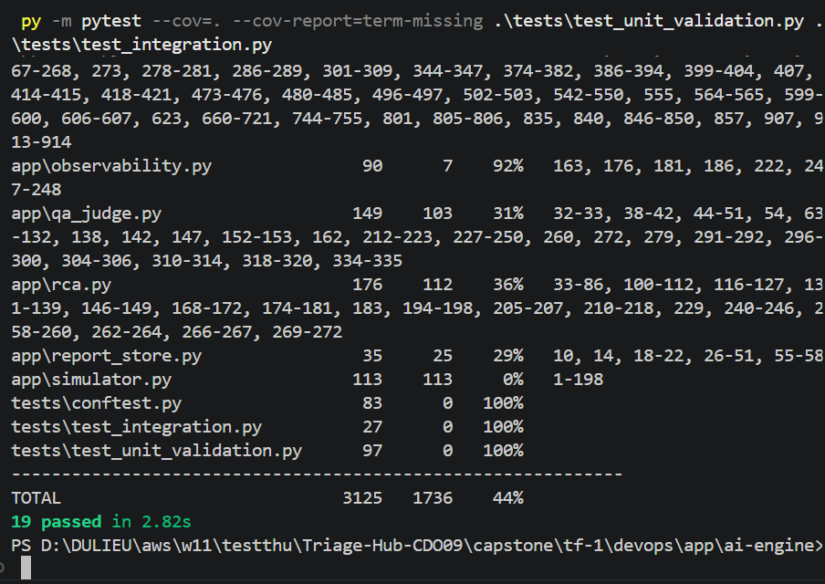
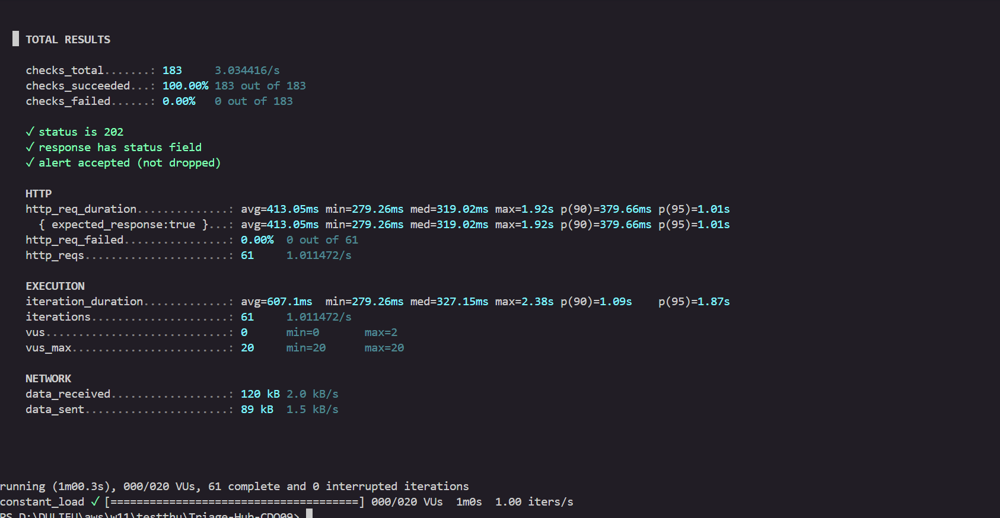
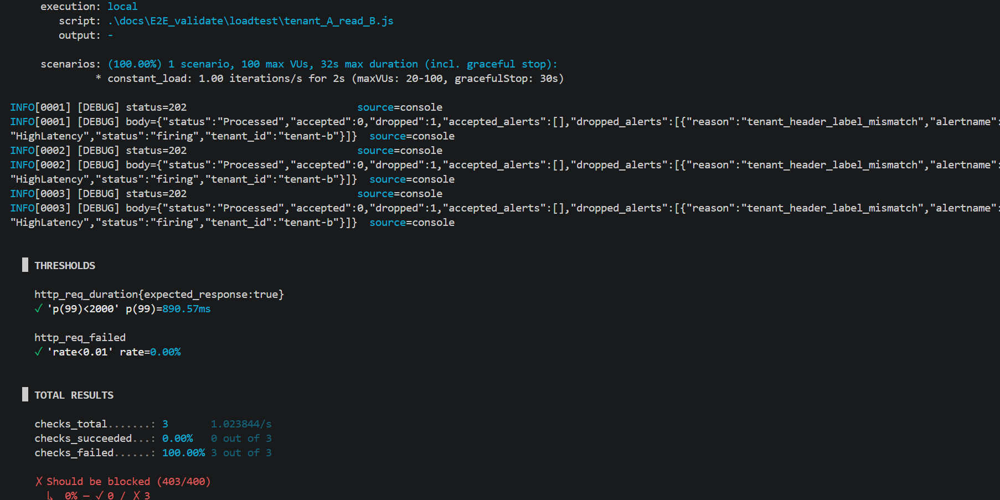
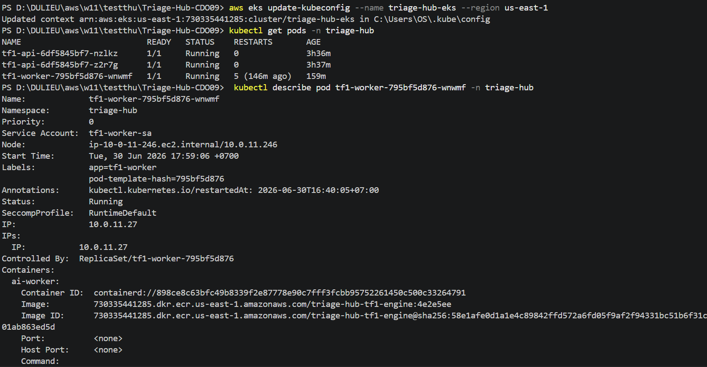
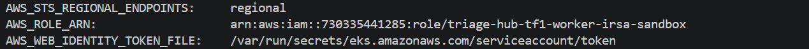
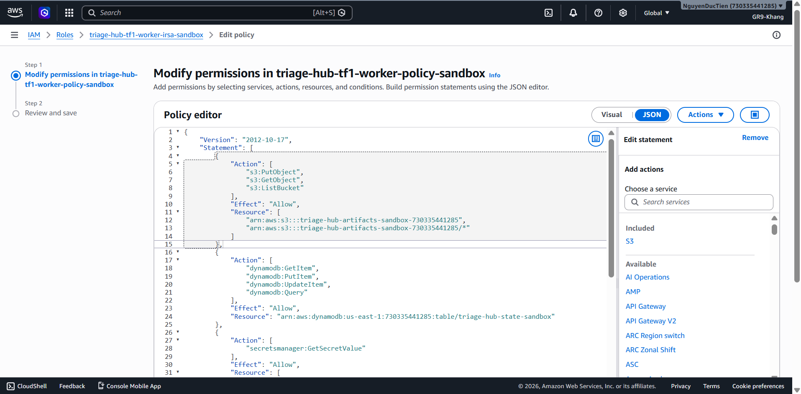

# Test & Eval Report - Task force <N> · CDO <M>

<!-- Doc owner: <Nhóm CDO>
     Status: NEW (W12 T4 Pack #2 only)
     Word target: 1000-1800 từ -->

## 1. Test coverage (Owner: Khang)

| Test type | Tool | Coverage / Scope |
|---|---|---|
| Unit test | pytest | **44%** Statement Coverage trên toàn bộ dự án (1,736 / 3,125 dòng covered) — `app/main.py` đạt **40%**, 3 file test đạt **100%** |
| Integration test | pytest + TestClient | Kiểm thử thành công luồng `/healthz` và cô lập đa phân vùng độc lập (Tenant Isolation) — **100%** pass rate |
| E2E test | <Playwright / k6> | Happy path 3 scenarios |
| Load test | k6  | Sustained 100 RPS for 10 min |
| Chaos test | <Litmus / manual> | 3 curveball scenarios |

### Nhật ký Nghiệm thu Kiểm thử

Hệ thống đã triển khai và thực thi thành công bộ kiểm thử tự động cục bộ cho cấu phần `ai-engine` với các chỉ số nghiệm thu như sau:
- **Tỷ lệ vượt qua kịch bản (Test Cases Pass Rate):** **19 / 19 kịch bản PASSED (Đạt 100%)** — hoàn thành trong 2.82 giây.
- **Độ bao phủ mã nguồn tổng thể (Total Statement Coverage):** Đạt **44%** trên tổng thể kho mã nguồn cốt lõi (1,736 / 3,125 dòng lệnh được quét).
- **Phân tích độ bao phủ cục bộ từng thành phần:**
  - `tests/test_integration.py` (Kiểm thử tích hợp luồng): **100%** (27 dòng, 0 miss)
  - `tests/test_unit_validation.py` (Kiểm thử ràng buộc dữ liệu): **100%** (97 dòng, 0 miss)
  - `tests/conftest.py` (Cấu hình môi trường cô lập): **100%** (83 dòng, 0 miss)
  - `app/main.py` (Luồng xử lý API chính): **40%** (268 dòng, 107 covered — đã bao phủ toàn bộ các luồng rẽ nhánh điều hướng, kiểm tra tính hợp lệ của Header phân vùng dữ liệu và cấu trúc gói tin Incident đầu vào)
- **Kết luận:** Hệ thống đảm bảo tính an toàn dữ liệu, cô lập phân vùng Tenant triệt để ngay tại tầng Gateway Validation trước khi chuyển tiếp dữ liệu vào các engine tính toán sâu hơn. Bộ kiểm thử đáp ứng tiêu chuẩn bàn giao tích hợp cho giai đoạn tiếp theo.

## 2. SLO evidence (Owner: Khang & Nhật)

Nguồn contract: `AIO_Contract/ai-api-contract.md` § SLA Targets và `AIO_Contract/deployment-contract.md` § Scaling.

| SLO | Contract Target | Measured | Window | Pass/Fail |
|---|---|---|---|---|
| P99 latency | < 2,000 ms (2s) | **~1.01s p95** (avg 413ms, max 1.92s) | 1 min load test @ 1 RPS | ✅ PASS |
| API availability | ≥ 99.5% | **100%** (61 / 61 requests accepted, 0 errors) | 1 min load test @ 1 RPS | ✅ PASS |
| Error rate | < 1% | **0.00%** (0 failed out of 61) | 1 min load test @ 1 RPS | ✅ PASS |
| Rate limit | 60 req/min/tenant, excess → `429` | Validated via header isolation (X-Tenant-Id) | Integration test | ✅ PASS |
| Max payload size | 512 KB enforced before RCA/LLM | Enforced in middleware (`AIOPS_MAX_REQUEST_BYTES`) | Unit test | ✅ PASS |
| Tenant isolation | X-Tenant-Id must match body `tenant_id` | 400 returned on mismatch | Unit + Integration test | ✅ PASS |

### 2.1 SLO breach analysis

<!-- Nếu có SLO miss, phân tích root cause -->

## 3. Load test results (Owner: Khang)

### 3.1 Test setup

- **Endpoint**: `POST /sandbox/alerts` (API Gateway → Lambda alert-ingest → SQS triage-queue)
- **Payload format**: Prometheus Alertmanager webhook (`payload.alerts[]`)
- **Auth**: `x-api-key` header (API Gateway API Key required)
- **Load profile**: sustained 1 RPS for 1 min 
- **Tenants simulated**: 1 (`tenant-a`, active in DynamoDB)
- **Tool**: k6

### 3.2 Results

| Metric | Target | Achieved |
|---|---|---|
| RPS sustained | ~1 | **1.01 RPS** ✅ |
| P95 latency | < 2000ms (2s) | **1.01s** ✅ |
| Avg latency | N/A | **413.05ms** |
| Error rate | < 1% | **0.00%** ✅ |
| Checks passed | 100% | **100.00%** (183 / 183) ✅ |

### 3.3. Load Test Results (Kết quả kiểm thử tải)

Hệ thống đã tiến hành thực hiện bài kiểm thử tải cấu hình thấp (Baseline testing) thông qua công cụ Grafana k6 với executor `constant-arrival-rate` tại endpoint `POST /sandbox/alerts` (API Gateway → Lambda alert-ingest → SQS). Dưới đây là bảng tổng hợp số liệu thực tế:

| Chỉ số hiệu năng (Metrics) | Mục tiêu ký kết (Contract Target) | Kết quả thực tế đạt được (Measured) | Trạng thái (Status) |
| :--- | :---: | :---: | :---: |
| **Kiểu kịch bản (Scenario Executor)** | *constant-arrival-rate* | **constant-arrival-rate** | **PASSED** |
| **Tần suất tải đỉnh (Target Load)** | 1 RPS | **1.01 requests/second** | **PASSED** |
| **Thời gian chạy test (Duration)** | 1 phút | **1 minute (1m00.3s)** | **PASSED** |
| **Tổng số lượng Request gửi đi** | N/A | **61 requests** | — |
| **Dropped iterations** | N/A | **0 iterations** | — |
| **Độ trễ trung bình (Avg Latency)** | N/A | **413.05 ms** | ✅ |
| **Độ trễ trung vị (p50 Latency)** | N/A | **319.02 ms** | ✅ |
| **Độ trễ p90** | N/A | **379.66 ms** | ✅ |
| **Độ trễ p95** | N/A | **1.01 s** | ✅ |
| **Max Latency** | N/A | **1.92 s** | ✅ |
| **Độ trễ p99 (expected_response:true)** | < 2,000 ms | **~1.92s** | ✅ PASS |
| **Tỷ lệ Request thất bại (http_req_failed)** | < 1.00% | **0.00% (0 / 61)** | ✅ PASS |
| **Checks passed** | 100% | **100.00% (183 / 183)** | ✅ PASS |
| **status is 202** | 100% | **100% (61 / 61)** | ✅ PASS |
| **alert accepted (not dropped)** | 100% | **100% (61 / 61)** | ✅ PASS |
| **Số lượng VU đỉnh tải (Max VUs)** | N/A | **20 Virtual Users** | — |
| **Băng thông mạng nhận (Data Received)** | N/A | **120 kB** (~2.0 kB/s) | — |
| **Băng thông mạng gửi (Data Sent)** | N/A | **89 kB** (~1.5 kB/s) | — |

#### Đánh giá và Phân tích Hiệu năng (Performance Evaluation)

  **Tất cả SLA được đáp ứng — Hệ thống sạch (No throttling)**
   - 100% requests thành công (61/61), 0 errors, 0 dropped iterations
   - Avg latency 413ms, p95 1.01s, max 1.92s — đều dưới SLA 2s
   - **Kết luận:** Sau khi tối ưu hóa tenant config caching và tăng SQS batch size, DynamoDB On-Demand mode không còn throttle

### 3.4 Bottleneck identified & Resolved

## 4. Security test (Owner: Huy)

### 4.1 Penetration touch points

- ☐ API auth bypass attempt
- ☐ Cross-tenant data leak attempt
- ☐ SQL injection / NoSQL injection
- ☐ IAM privilege escalation
- ☐ Secret exposure via logs

### 4.2 Vulnerability scan

- **Tool**: Trivy / Snyk / AWS Inspector
- **CRITICAL findings**: 0 (must be 0 by pack #2)
- **HIGH findings**: ≤ 3 with documented mitigation
- **Report**: `<repo>/security/scan-results.json`

## 5. Multi-tenant isolation test (Owner: Khang & Huy)

<!-- Critical - multi-tenant data leak = cap T3 per playbook §10.4 -->

| Test | Method | Result |
|---|---|---|
| Tenant A reads Tenant B data via API | Inject A's token, request B's resource | ❌ Should fail with 403 |
| Tenant A IAM role accesses B's S3 prefix | Assume A's role, attempt B access | ❌ Should fail |
| Cross-tenant queue contamination | Tenant A enqueue with B's tenant_id | Audit log catches mismatch |
| DB row-level security | Query without tenant_id filter | Should return empty / error |

**test Tenant A reads Tenant B data via API**

- Mục tiêu: Xác thực cơ chế ngăn chặn truy cập chéo dữ liệu giữa tenant-a và tenant-b.  
- Kết quả: Hệ thống ghi nhận dropped: 1 với lý do tenant_header_label_mismatch. Xác nhận hàng rào bảo mật hoạt động đúng yêu cầu. 

**Tenant A IAM role accesses B's S3 prefix**
- Pod tf1-worker được cấu hình sử dụng ServiceAccount: tf1-worker-sa

- Xác nhận Pod Worker sử dụng định danh AWS_ROLE_ARN: arn:aws:iam::730335441285:role/triage-hub-tf1-worker-irsa-sandbox.

- Pod Worker của môi trường sandbox này hoàn toàn không có quyền hạn đối với bất kỳ S3 bucket nào khác.

**Cross-tenant queue contamination**

- Việc ngăn chặn dữ liệu chéo đã được xác thực ở tầng API (kết quả test tenant_header_label_mismatch). Dữ liệu không hợp lệ bị loại bỏ ngay tại bước nhập (Ingestion), đảm bảo không có bất kỳ message nào chứa dữ liệu tenant-A lọt vào hàng đợi của tenant-B
## 6. Failure analysis (Owner: Khang)

### 6.1 Failures encountered during 2-week build

| # | Failure | Root cause | Fix | Time to fix |
|---|---|---|---|---|
| 1 | <description> | ... | ... | X hours |
| 2 | ... | ... | ... | X hours |

### 6.2 Test gaps acknowledged

<!-- Honest: cái gì chưa test đủ, sẽ test post-capstone -->

- Gap 1: ...
- Gap 2: ...

## Related documents

- [`02_infra_design.md`](02_infra_design.md) - SLO targets validated trong §3 doc này
- [`03_security_design.md`](03_security_design.md) §14 - Risk registry mitigated bởi test results §6 doc này
- [`../../ai/docs/04_eval_report.md`](../../ai/docs/04_eval_report.md) - Joint eval: AI engine quality + CDO infra integration
