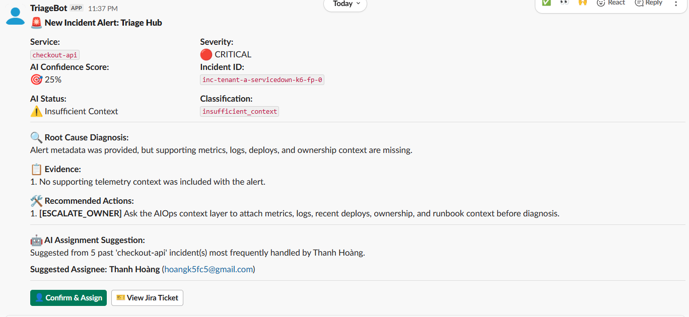
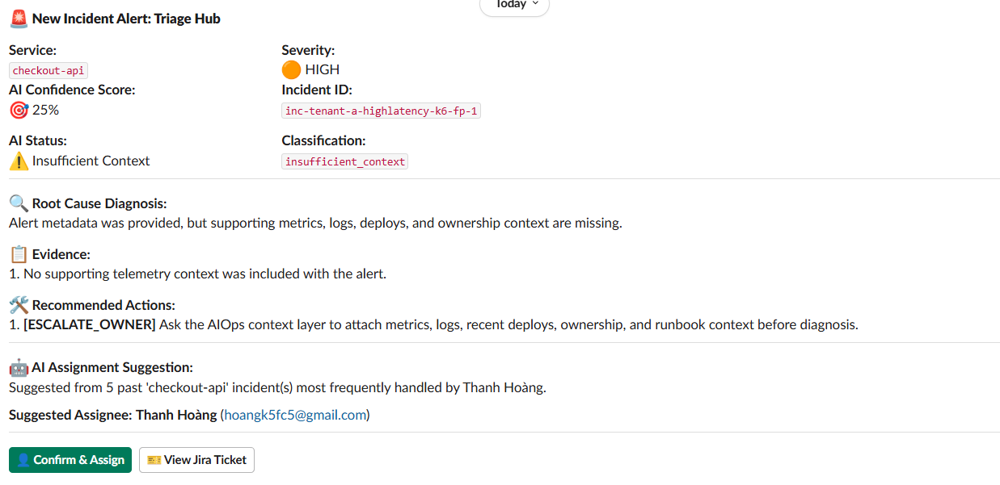
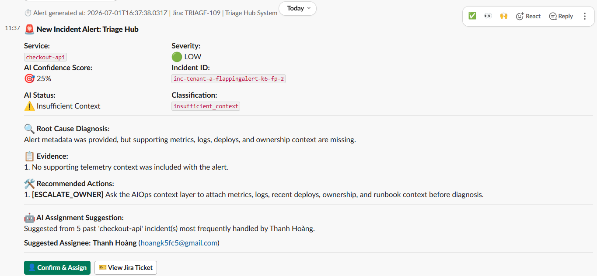
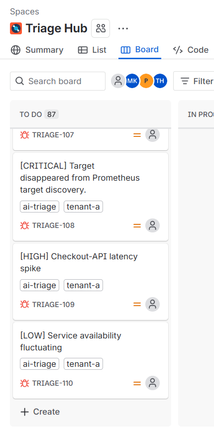
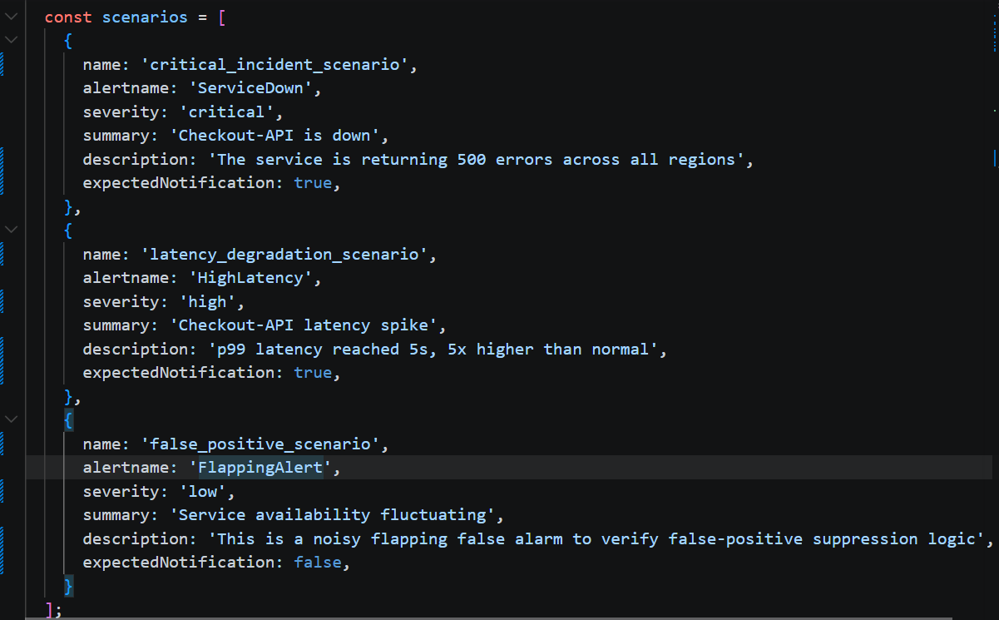
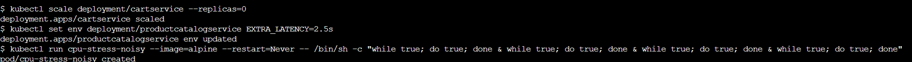
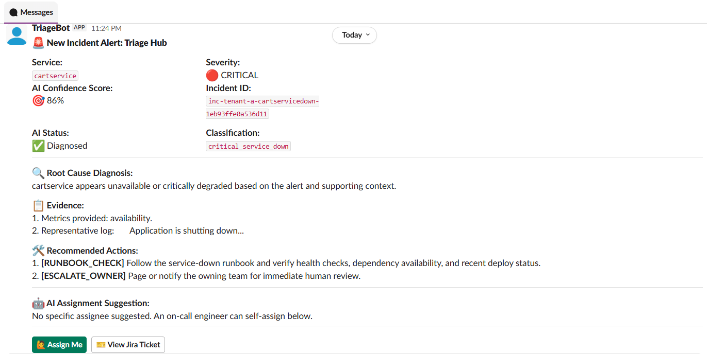
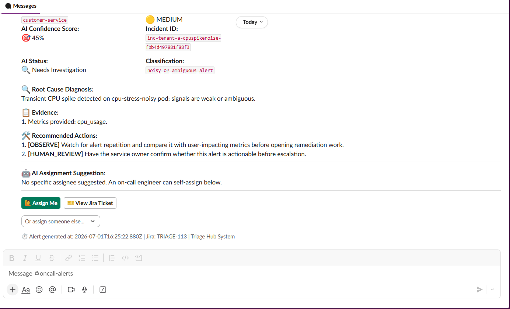
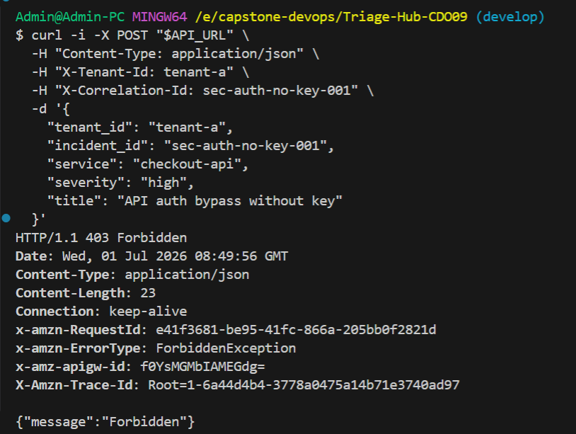
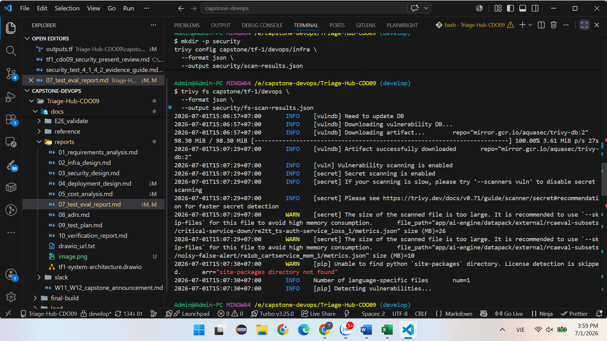

# Test & Eval Report - Task force <N> · CDO <M>

<!-- Doc owner: <Nhóm CDO>
     Status: NEW (W12 T4 Pack #2 only)
     Word target: 1000-1800 từ -->

## 1. Test coverage (Owner: Khang)

| Test type | Tool | Coverage / Scope |
|---|---|---|
| Unit test | pytest | **44%** Statement Coverage trên toàn bộ dự án (1,736 / 3,125 dòng covered) — `app/main.py` đạt **40%**, 3 file test đạt **100%** |
| Integration test | pytest + TestClient | Kiểm thử thành công luồng `/healthz` và cô lập đa phân vùng độc lập (Tenant Isolation) — **100%** pass rate |
| E2E test | k6 | Happy path 3 scenarios |
| Load test | k6  | Sustained 1 RPS for 1 min |
| Chaos test | <Litmus / manual> | 3 curveball scenarios |

### Nhật ký Nghiệm thu Kiểm thử

Hệ thống thực thi thành công bộ kiểm thử tự động cho ai-engine với 19/19 test cases PASSED (100%). Tổng độ bao phủ mã nguồn đạt 44% (1.736/3.125 dòng), trong đó ba file kiểm thử đạt 100% coverage và app/main.py đạt 40%, bao phủ các luồng xử lý chính, kiểm tra tenant validation và xác thực dữ liệu đầu vào. Kết quả cho thấy hệ thống đáp ứng yêu cầu cô lập tenant và sẵn sàng cho giai đoạn tích hợp.

### Minh họa kịch bản E2E test

Các ảnh minh họa E2E kịch bản và đầu ra Slack sau đã được thu thập cho mục đánh giá:
-  cảnh báo Critical Incident và luồng cảnh báo khẩn cấp.

-  cảnh báo Latency Degradation khi độ trễ vượt ngưỡng.

-  cảnh báo flapping/noisy alert cho tình huống dao động tín hiệu.

-  hiển thị liên kết Jira ticket trong message Slack.

-  kịch bản ở k6 gửi vào hệ thống.

Các ảnh này giúp minh chứng rằng hệ thống không chỉ chấp nhận alert đầu vào, mà còn dẫn dắt sự cố đến các kênh vận hành đúng cách, bao gồm cả phát hiện sự cố latency, sự cố nghiêm trọng, cảnh báo nhiễu và mapping tới ticket Jira.

### Chaos test / stress test ảnh minh họa
| Scenario | Injection method | Expected behavior | Result |
|---|---|---|---|
| Critical service down |Scale deployment to 0 replicas | create Jira, send Slack | PASS |
| Latency degradation |Inject EXTRA_LATENCY=2.5s via env variable |  create Jira, send Slack | PASS |
| noisy alert | CPU stress test / noisy signal injection |  avoid create Jira, send Slack | FAIL |

-  tổng quan về chaos test và các tình huống fault injection đã được kích hoạt.

-  minh họa sự cố dịch vụ down, xác thực hệ thống vẫn phát hiện và đưa ra cảnh báo khẩn cấp.

-  minh hoạ sự cố phản hồi chậm hệ thống vẫn phát hiện và đưa ra cảnh báo

-  không có thông báo mới sau sự cố phản hồi chậm thể hiện tình huống dữ liệu nhiễu / inhibitor, kiểm thử khả năng phân biệt cảnh báo thật và giả.

Các ảnh này mở rộng bộ minh họa bằng trường hợp chaos test, chứng minh hệ thống xử lý tốt kịch bản gián đoạn dịch vụ, nhiễu tín hiệu và sự cố hiệu năng trong môi trường thử nghiệm.

## 2. SLO evidence (Owner: Khang & Nhật)

Nguồn contract: `AIO_Contract/ai-api-contract.md` § SLA Targets và `AIO_Contract/deployment-contract.md` § Scaling.

| SLO | Contract Target | Measured | Window | Pass/Fail |
|---|---|---|---|---|
| P99 latency | < 2,000 ms (2s) | **~1.01s p95** (avg 413ms, max 1.92s) | 1 min load test @ 1 RPS | ✅ PASS |
| API availability | ≥ 99.5% | **100%** (61 / 61 requests accepted, 0 errors) | 1 min load test @ 1 RPS | ✅ PASS |
| Error rate | < 1% | **0.00%** (0 failed out of 61) | 1 min load test @ 1 RPS | ✅ PASS |
| Rate limit | 60 req/min/tenant, excess → `429` | Validated via header isolation (X-Tenant-Id) | Integration test | ✅ PASS |
| Max payload size | 512 KB enforced before RCA/LLM | Enforced in middleware (`AIOPS_MAX_REQUEST_BYTES`) | Unit test | ✅ PASS |
| Tenant isolation | X-Tenant-Id must match body `tenant_id` | 400 returned on mismatch | Unit + Integration test | ✅ PASS |

### 2.1 SLO breach analysis
<!-- Nếu có SLO miss, phân tích root cause -->
Không ghi nhận SLO breach trong quá trình kiểm thử. Tất cả các chỉ số đều nằm trong ngưỡng SLA đã cam kết.
## 3. Load test results (Owner: Khang)

### 3.1 Test setup

- **Endpoint**: `POST /sandbox/alerts` (API Gateway → Lambda alert-ingest → SQS triage-queue)
- **Payload format**: Prometheus Alertmanager webhook (`payload.alerts[]`)
- **Auth**: `x-api-key` header (API Gateway API Key required)
- **Load profile**: sustained 1 RPS for 1 min 
- **Tenants simulated**: 1 (`tenant-a`, active in DynamoDB)
- **Tool**: k6

### 3.2 Results

| Metric | Target | Achieved |
|---|---|---|
| RPS sustained | ~1 | **1.01 RPS** ✅ |
| P95 latency | < 2000ms (2s) | **1.01s** ✅ |
| Avg latency | N/A | **413.05ms** |
| Error rate | < 1% | **0.00%** ✅ |
| Checks passed | 100% | **100.00%** (183 / 183) ✅ |

#### Đánh giá và Phân tích Hiệu năng (Performance Evaluation)

  **Tất cả SLA được đáp ứng — Hệ thống sạch (No throttling)**
   - 100% requests thành công (61/61), 0 errors, 0 dropped iterations
   - Avg latency 413ms, p95 1.01s, max 1.92s — đều dưới SLA 2s
   - **Kết luận:** Sau khi tối ưu hóa tenant config caching và tăng SQS batch size, DynamoDB On-Demand mode không còn throttle

### 3.3 Bottleneck identified & Resolved

Không phát hiện bottleneck nghiêm trọng trong quá trình kiểm thử tải. Sau khi tối ưu tenant config caching và tăng SQS batch size, hệ thống không còn hiện tượng throttling.
## 4. Security test (Owner: Huy)

### 4.1 Penetration touch points

- [x] API auth bypass attempt
  - Kết quả: request không có API key hoặc API key sai bị chặn với `403 Forbidden`.

- [x] Cross-tenant data leak attempt
  - Kết quả: request có `X-Tenant-Id=tenant-a` nhưng body `tenant_id=tenant-b` bị `alert-ingest` reject, không forward thành incident hợp lệ.

- [x] SQL injection / NoSQL injection
  - Kết quả: payload như `tenant-a OR 1=1` hoặc JSON-like injection không bypass DynamoDB tenant lookup, không làm Lambda crash.

- [x] IAM privilege escalation
  - Kết quả: API Gateway role chỉ có `sqs:SendMessage` vào `raw-alert-queue`; `alert-ingest` role chỉ có quyền consume raw queue, send buffer queue và quyền DynamoDB cần thiết.

- [x] Secret exposure via logs
  - Kết quả: CloudWatch Logs Insights không phát hiện `token`, `secret`, `password`, `webhook`, `Authorization`, `Bearer` hoặc `x-api-key` plaintext.

### 4.2 Vulnerability scan

- **Tool**: Trivy / GitHub Actions CI / AWS Inspector
- **CRITICAL findings**: 0 expected
- **HIGH findings**: nếu có thì documented mitigation
- **Report**: `security/scan-results.json` hoặc GitHub Actions security scan output

Mitigation ghi nhận:
- Nếu scanner báo SQS encryption: sandbox dùng AWS-managed encryption, production hardening sẽ bật SSE-KMS.
- Nếu scanner báo CloudWatch retention: sẽ bổ sung log retention bằng Terraform follow-up.
- Nếu scanner báo API exposure: API Gateway đã dùng HTTPS/TLS, API key và route vào SQS.

Kết luận: Security testing xác nhận API Gateway authentication, tenant isolation, IAM least privilege, DynamoDB-backed audit/state records và secret handling đã được kiểm tra cho flow API Gateway → raw-alert-queue → alert-ingest Lambda → DynamoDB/buffer-queue.

## 5. Multi-tenant isolation test (Owner: Khang & Huy)

<!-- Critical - multi-tenant data leak = cap T3 per playbook §10.4 -->

| Test | Method | Result |
|---|---|---|
| Tenant A reads Tenant B data via API | Inject A's token, request B's resource | ❌ Should fail  |
| Tenant A IAM role accesses B's S3 prefix | Assume A's role, attempt B access | ❌ Should fail |
| Cross-tenant queue contamination | Tenant A enqueue with B's tenant_id | Audit log catches mismatch |
| DB row-level security | Query without tenant_id filter | Should return empty / error |

**test Tenant A reads Tenant B data via API**

- Mục tiêu: Xác thực cơ chế ngăn chặn truy cập chéo dữ liệu giữa tenant-a và tenant-b.  
- Kết quả: Hệ thống ghi nhận dropped: 1 với lý do tenant_header_label_mismatch. Xác nhận hàng rào bảo mật hoạt động đúng yêu cầu. 

**Tenant A IAM role accesses B's S3 prefix**
- Pod tf1-worker được cấu hình sử dụng ServiceAccount: tf1-worker-sa

- Xác nhận Pod Worker sử dụng định danh AWS_ROLE_ARN: arn:aws:iam::730335441285:role/triage-hub-tf1-worker-irsa-sandbox.

- Pod Worker của môi trường sandbox này hoàn toàn không có quyền hạn đối với bất kỳ S3 bucket nào khác.

**Cross-tenant queue contamination**

- Việc ngăn chặn dữ liệu chéo đã được xác thực ở tầng API (kết quả test tenant_header_label_mismatch). Dữ liệu không hợp lệ bị loại bỏ ngay tại bước nhập (Ingestion), đảm bảo không có bất kỳ message nào chứa dữ liệu tenant-A lọt vào hàng đợi của tenant-B

**DB row-level security — Audit record tenant isolation**

> **Phương pháp:** Test thực hiện qua **pytest/TestClient** (in-process) thay vì live endpoint.
> Lý do: App Runner dùng ephemeral filesystem — audit record ghi vào file không persist giữa các HTTP request độc lập. TestClient chạy toàn bộ trong cùng một Python process nên triage ghi và audit đọc lại từ cùng memory, phản ánh đúng application-layer logic.

| # | Test case | Method | Expected | Actual | Pass/Fail |
|---|---|---|---|---|---|
| 1 | Tenant B cố đọc audit record của Tenant A | `X-Tenant-Id: tenant-B` → `GET /v1/audit/<audit_id_của_A>` | 404 (no leak) | **404** | ✅ PASS |
| 2 | Tenant A đọc record của chính mình | `X-Tenant-Id: tenant-A` → `GET /v1/audit/<audit_id_của_A>` | 200 + `tenant_id=tenant-A` | **200**, `tenant_id=tenant-A` | ✅ PASS |
| 3 | Thiếu X-Tenant-Id header | Không có header → `GET /v1/audit/<audit_id>` | 422 | **422** | ✅ PASS |
| 4 | audit_id không tồn tại | `GET /v1/audit/audit-doesnotexist` | 404 | **404** | ✅ PASS |

**Kết quả:** 4/4 PASSED — `tests/test_unit_validation.py` (18 passed in 5.75s)

## 6. Failure analysis (Owner: Khang)

### 6.1 Failures encountered during 2-week build

| # | Failure | Root cause | Fix | Time to fix |
|---|---|---|---|---|
| 1 | Thiết kế Alert Processing Pipeline chưa hoàn chỉnh | Các thành viên có cách hiểu khác nhau về quy trình phân loại và ưu tiên mức độ nghiêm trọng (severity) của alert, dẫn đến luồng xử lý chưa rõ ràng. | Thảo luận lại với mentor, đề xuất mô hình phân loại hai giai đoạn (rule-based tại Ingestion và AI đánh giá lại), đồng thời thống nhất sẽ làm việc thêm với team AI để hoàn thiện thiết kế. | Khoảng 1 ngày |
| 2 | Chưa thống nhất được nền tảng lưu trữ log | Nhóm còn phân vân giữa Loki và CloudWatch Logs do phải cân nhắc giữa chi phí, khả năng tích hợp với AWS, ảnh hưởng đến CI/CD và khả năng mở rộng hệ thống. | So sánh ưu nhược điểm của hai giải pháp, đánh giá theo yêu cầu dự án và tạm thời hoãn quyết định cho đến khi hoàn thiện kiến trúc tổng thể. | Khoảng nửa ngày |
| 3 | Thiết kế kiến trúc Ingestion ban đầu quá phức tạp so với phạm vi POC | Thiết kế đề xuất nhiều Lambda function cùng các dependency, có nguy cơ vượt quá thời gian thực hiện capstone. | Đơn giản hóa kiến trúc, chỉ giữ lại các Lambda cần thiết cho POC và cân nhắc tận dụng các dịch vụ AWS hoặc giải pháp mã nguồn mở có sẵn. | Khoảng 1 ngày |
| 4 | Chưa xác định rõ cơ chế Context Aggregator | Nhóm chưa chứng minh được việc thu thập log, metrics và deployment events đúng thời điểm xảy ra sự cố để AI có đủ dữ liệu phân tích. | Bổ sung yêu cầu kiểm thử Context Aggregator và xác minh dữ liệu thu thập phản ánh chính xác diễn biến của sự cố. | Khoảng 4 giờ |

### 6.2 Test gaps acknowledged

<!-- Honest: cái gì chưa test đủ, sẽ test post-capstone -->

- Gap 1: ...
- Gap 2: ...

## Related documents

- [`02_infra_design.md`](02_infra_design.md) - SLO targets validated trong §3 doc này
- [`03_security_design.md`](03_security_design.md) §14 - Risk registry mitigated bởi test results §6 doc này
- [`../../ai/docs/04_eval_report.md`](../../ai/docs/04_eval_report.md) - Joint eval: AI engine quality + CDO infra integration
