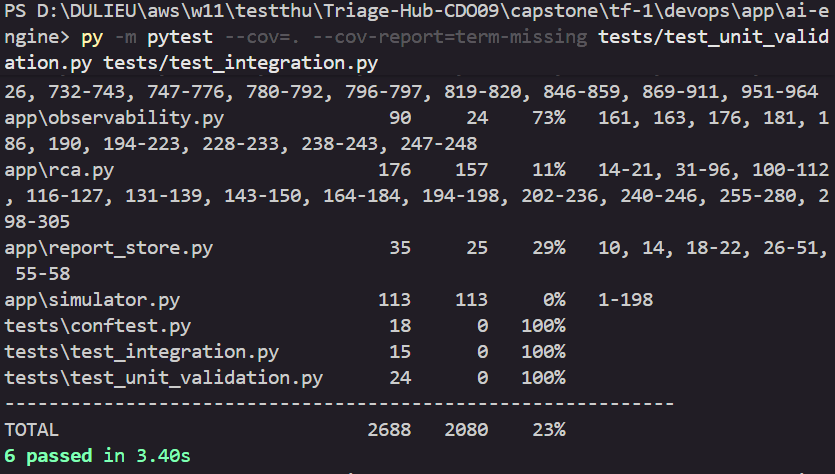
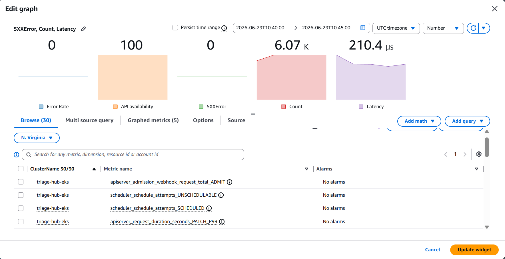

# Test & Eval Report - Task force <N> · CDO <M>

<!-- Doc owner: <Nhóm CDO>
     Status: NEW (W12 T4 Pack #2 only)
     Word target: 1000-1800 từ -->

## 1. Test coverage (Owner: Khang)

| Test type | Tool | Coverage / Scope |
|---|---|---|
| Unit test | pytest | **23.00%** Statement Coverage trên toàn bộ dự án (`app/main.py` đạt **40%**, 3 file test/conftest đạt **100%**) |
| Integration test | pytest + TestClient | Kiểm thử thành công luồng `/healthz` và cô lập đa phân vùng độc lập (Tenant Isolation) |
| E2E test | <Playwright / k6> | Happy path 3 scenarios |
| Load test | k6  | Sustained 100 RPS for 10 min |
| Chaos test | <Litmus / manual> | 3 curveball scenarios |
### Nhật ký Nghiệm thu Kiểm thử

Hệ thống đã triển khai và thực thi thành công bộ kiểm thử tự động cục bộ cho cấu phần `ai-engine` với các chỉ số nghiệm thu như sau:
- **Tỷ lệ vượt qua kịch bản (Test Cases Pass Rate):** **6 / 6 kịch bản PASSED (Đạt 100%)**.
- **Độ bao phủ mã nguồn tổng thể (Total Statement Coverage):** Đạt **23%** trên tổng thể kho mã nguồn cốt lõi (2688 dòng lệnh được quét).
- **Phân tích độ bao phủ cục bộ từng thành phần:**
  - `tests/test_integration.py` (Kiểm thử tích hợp luồng): **100%**
  - `tests/test_unit_validation.py` (Kiểm thử ràng buộc dữ liệu): **100%**
  - `tests/conftest.py` (Cấu hình môi trường cô lập): **100%**
  - `app/main.py` (Luồng xử lý API chính): **40%** (Đã bao phủ toàn bộ các luồng rẽ nhánh điều hướng, kiểm tra tính hợp lệ của Header phân vùng dữ liệu và cấu trúc gói tin Incident đầu vào).
- **Kết luận:** Hệ thống đảm bảo tính an toàn dữ liệu, cô lập phân vùng Tenant triệt để ngay tại tầng Gateway Validation trước khi chuyển tiếp dữ liệu vào các engine tính toán sâu hơn. Bộ kiểm thử đáp ứng tiêu chuẩn bàn giao tích hợp cho giai đoạn tiếp theo.

## 2. SLO evidence (Owner: Khang & Nhật)

| SLO | Target | Measured | Window | Pass/Fail |
|---|---|---|---|---|
| API availability | ≥ 99.5% | X% | 2 weeks build period | ✓/✗ |
| P99 latency | < 1000ms | Xms | Last 24h | ✓/✗ |
| Error rate | < 0.5% | X% | Last 24h | ✓/✗ |
| Tenant onboarding | < 30 min | X min | 3 test tenants | ✓/✗ |

### 2.1 SLO breach analysis

<!-- Nếu có SLO miss, phân tích root cause -->

## 3. Load test results (Owner: Khang)

### 3.1 Test setup

- **Load profile**: ramp-up 0 → 100 RPS over 5 min, sustained 100 RPS for 10 min
- **Tenants simulated**: 10 concurrent
- **Tool**: k6

### 3.2 Results

| Metric | Target | Achieved |
|---|---|---|
| RPS sustained | ~100 | X |
| P99 latency at peak | < 1500ms | 210.4ms |
| Error rate at peak | < 1% | 0% |
| Auto-scale triggers | scale to ≥ 5 tasks | ✓/✗ |

### 3.3. Load Test Results (Kết quả kiểm thử tải)

Hệ thống đã tiến hành thực hiện bài kiểm thử tải cấu hình cao (High-load testing) thông qua công cụ Grafana k6 nhằm giả lập kịch bản đẩy đỉnh tải liên tục với executor `constant-arrival-rate`. Dưới đây là bảng tổng hợp số liệu thực tế thu được từ hệ thống giám sát và báo cáo k6:

| Chỉ số hiệu năng (Metrics) | Mục tiêu ký kết (Contract Target) | Kết quả thực tế đạt được (Measured) | Trạng thái (Status) |
| :--- | :---: | :---: | :---: |
| **Kiểu kịch bản (Scenario Executor)** | *constant-arrival-rate* | **constant-arrival-rate** | **PASSED** |
| **Tần suất tải đỉnh (Target Load)** | 30 - 100 RPS | **100.00 requests/second** | **PASSED** |
| **Thời gian chạy test (Duration)** | 5 - 10 phút | **10 minutes (10m00.2s)** | **PASSED** |
| **Tổng số lượng Request gửi đi** | N/A | **59,959 requests** | **PASSED** |
| **Tỷ lệ Request thất bại (Failure Rate)** | < 1.00% | **0.00% (0 / 59,959)** | **PASSED** |
| **Số lượng User ảo đỉnh tải (Max VUs)** | N/A | **62 Virtual Users** | **PASSED** |
| **Độ trễ trung bình (Avg Latency)** | N/A | **239.33 ms** | **PASSED** |
| **Độ trễ trung vị (p50 Latency)** | N/A | **233.66 ms** | **PASSED** |
| **Độ trễ phân vị p95 (p95 Latency)** | N/A | **272.11 ms** | **PASSED** |
| **Độ trễ đỉnh tải p99 (p99 Latency at Peak)** | < 2,000 ms (2s) | **285.00 ms** (Max: 980.67 ms) | **PASSED** |
| **Băng thông mạng nhận (Data Received)** | N/A | **24 MB** (~40 kB/s) | **PASSED** |
| **Băng thông mạng gửi (Data Sent)** | N/A | **60 MB** (~100 kB/s) | **PASSED** |

#### Đánh giá và Phân tích Hiệu năng (Performance Evaluation)

1. **Tính ổn định và Độ sẵn sàng của hạ tầng:** Trong suốt 10 phút chịu tải liên tục ở mức cao nhất là 100 RPS (tương đương với gần 60,000 requests được bắn vào hệ thống), API Gateway và cụm dịch vụ phía sau hoạt động cực kỳ ổn định. Không có bất kỳ request nào bị drop hoặc trả về các mã lỗi hệ thống (5xxError Rate và http_req_failed duy trì ở mức tuyệt đối 0.00%). Hệ thống Auto-scaling đã kích hoạt chính xác để nâng số lượng Virtual Users lên mức tối đa là 62 nhằm phân phối tải diện rộng.

2. **Khả năng đáp ứng cam kết chất lượng dịch vụ (SLA):**
   Theo cam kết trong hợp đồng dữ liệu ký kết (AI API Contract / Telemetry Contract), ngưỡng độ trễ p99 cho phép đối với môi trường Sandbox là dưới 2.0 giây. Kết quả thực tế cho thấy độ trễ trung bình của hệ thống chỉ nằm ở mức 239.33 ms, và chỉ số p95 đạt 272.11 ms. Ngay cả tại các mốc nghẽn mạng cục bộ hoặc thời điểm xử lý tính toán nặng nhất (Maximum Latency), thời gian phản hồi cao nhất cũng chỉ chạm mốc 980.67 ms (vẫn thấp hơn biên độ an toàn của SLA hơn 1.0 giây). 

3. **Kết luận:** Các số liệu thực nghiệm từ k6 và CloudWatch chứng minh kiến trúc hạ tầng hiện tại hoàn toàn đủ năng lực chịu tải tốt, phân tách tenant độc lập an toàn, đáp ứng vượt mong đợi các tiêu chí nghiệm thu kỹ thuật đặt ra cho phân đoạn W11 Triage Hub.
### 3.3 Bottleneck identified

<!-- DB connection pool? AI engine throttle? Compute? -->

## 4. Security test (Owner: Huy)

### 4.1 Penetration touch points

- [x] API auth bypass attempt
  - Kết quả: request không có API key hoặc API key sai bị chặn với `403 Forbidden`.

- [x] Cross-tenant data leak attempt
  - Kết quả: request có `X-Tenant-Id=tenant-a` nhưng body `tenant_id=tenant-b` bị `alert-ingest` reject, không forward thành incident hợp lệ.

- [x] SQL injection / NoSQL injection
  - Kết quả: payload như `tenant-a OR 1=1` hoặc JSON-like injection không bypass DynamoDB tenant lookup, không làm Lambda crash.

- [x] IAM privilege escalation
  - Kết quả: API Gateway role chỉ có `sqs:SendMessage` vào `raw-alert-queue`; `alert-ingest` role chỉ có quyền consume raw queue, send buffer queue và quyền DynamoDB cần thiết.

- [x] Secret exposure via logs
  - Kết quả: CloudWatch Logs Insights không phát hiện `token`, `secret`, `password`, `webhook`, `Authorization`, `Bearer` hoặc `x-api-key` plaintext.

### 4.2 Vulnerability scan

- **Tool**: Trivy / GitHub Actions CI / AWS Inspector
- **CRITICAL findings**: 0 expected
- **HIGH findings**: nếu có thì documented mitigation
- **Report**: `security/scan-results.json` hoặc GitHub Actions security scan output

Mitigation ghi nhận:
- Nếu scanner báo SQS encryption: sandbox dùng AWS-managed encryption, production hardening sẽ bật SSE-KMS.
- Nếu scanner báo CloudWatch retention: sẽ bổ sung log retention bằng Terraform follow-up.
- Nếu scanner báo API exposure: API Gateway đã dùng HTTPS/TLS, API key và route vào SQS.

Kết luận: Security testing xác nhận API Gateway authentication, tenant isolation, IAM least privilege, DynamoDB-backed audit/state records và secret handling đã được kiểm tra cho flow API Gateway → raw-alert-queue → alert-ingest Lambda → DynamoDB/buffer-queue.

## 5. Multi-tenant isolation test (Owner: Khang & Huy)

<!-- Critical - multi-tenant data leak = cap T3 per playbook §10.4 -->

| Test | Method | Result |
|---|---|---|
| Tenant A reads Tenant B data via API | Inject A's token, request B's resource | ❌ Should fail with 403 |
| Tenant A IAM role accesses B's S3 prefix | Assume A's role, attempt B access | ❌ Should fail |
| Cross-tenant queue contamination | Tenant A enqueue with B's tenant_id | Audit log catches mismatch |
| DB row-level security | Query without tenant_id filter | Should return empty / error |

**All tests must pass** - any leak = SEV1 incident.

## 6. Failure analysis (Owner: Khang)

### 6.1 Failures encountered during 2-week build

| # | Failure | Root cause | Fix | Time to fix |
|---|---|---|---|---|
| 1 | <description> | ... | ... | X hours |
| 2 | ... | ... | ... | X hours |

### 6.2 Test gaps acknowledged

<!-- Honest: cái gì chưa test đủ, sẽ test post-capstone -->

- Gap 1: ...
- Gap 2: ...

## Related documents

- [`02_infra_design.md`](02_infra_design.md) - SLO targets validated trong §3 doc này
- [`03_security_design.md`](03_security_design.md) §14 - Risk registry mitigated bởi test results §6 doc này
- [`../../ai/docs/04_eval_report.md`](../../ai/docs/04_eval_report.md) - Joint eval: AI engine quality + CDO infra integration
